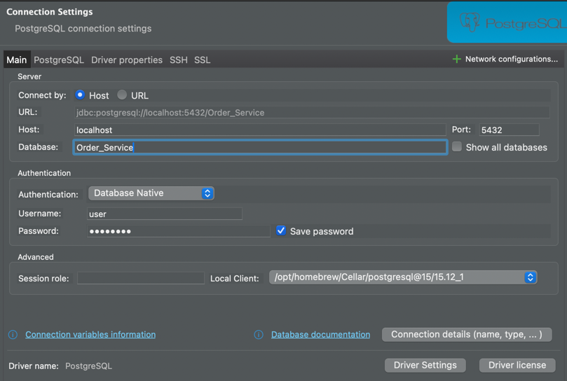
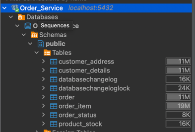
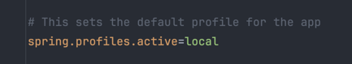
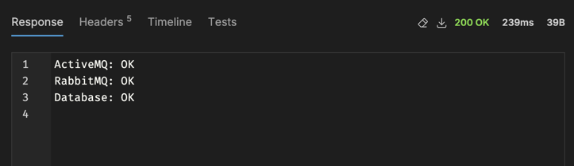
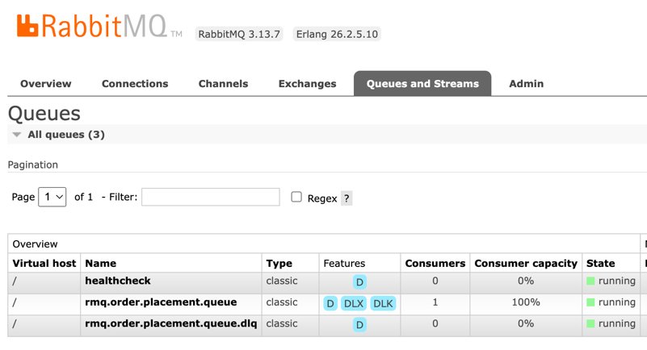
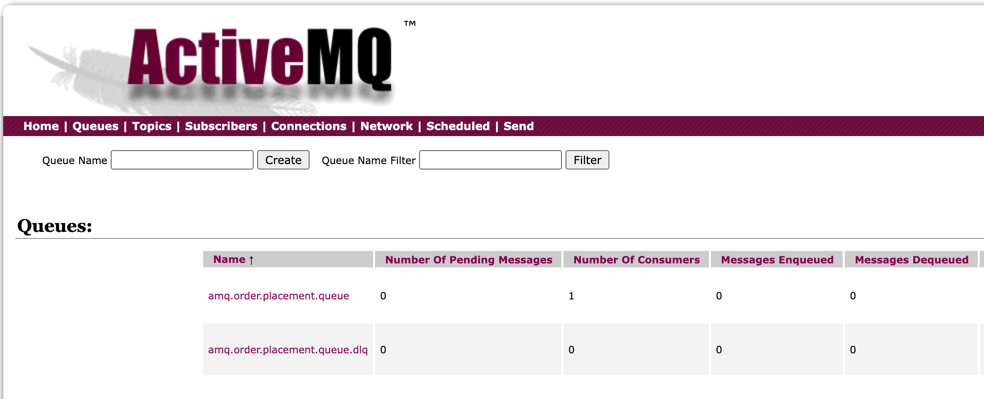

# Task 1 ~ Project Setup

This section includes setup instructions & how to get the app running locally on your device. Let's talk about the pre-requisites and how to set up the project locally. 

- **I'll highly recommend using IntelliJ Idea for this project.**
- **Please read the [README](../README.md) file for pre-requisites.**

---

**_Note:_** _Build a habit to never hardcode credentials for testing & production Environments in your code. Always use
environment variables or configuration files to manage sensitive information. As we go along, we'll see how we can configure those._

---

### **Spin up Database & Messaging Brokers**

Execute following command while you're in root directory of the project. 
```bash
  docker compose up -d
```
This should pull 3 images & spin up 3 containers on your machine i.e **order_service_db**, **activemq_broker** and **rabbitmq_broker**.
The configuration for these containers is stored in [compose.yaml](../compose.yaml) file. This file defines what image to use,
what ports to expose and what environment variables to set.

---

### How to Verify all the containers are up and running?
You can run following command to list all active containers on your machine.
```bash
  docker ps
```

---

### **Stop active containers**
To stop all the running containers, you can do that either through Docker Desktop UI or you can run the following command while in root directory of the project:
```bash
  docker compose down
```


---

### **Create Database Tables using Liquibase**

Once you've verified that the database container is up and running, you need to create the database tables. This can be 
done by simply running
the following command:
```bash
  ./gradlew update
```
This command triggers Liquibase which reads the changelog from [db.changelog-master.xml](../src/main/resources/db/changelog/db.changelog-master.xml) and 
creates the necessary tables in the database. You can see this file contains references to other changelogs which are responsible for creating each table.

---

### **Query PostgreSLQ**

If you're using IntelliJ Idea Ultimate, you can use the built-in database tool to query the database tables. Otherwise,
you can use DBeaver or any other database client of your choice. Simply connect to the database using the following credentials:
- **Database Name**: `Order_Service`
- **Host**: `localhost`
- **Port**: `5432`
- **Username**: `user`
- **Password**: `password`

For this exercise, I'll use DBeaver:



You should be able to view the tables under the `public` schema.




---


### Time to run the application
Now you can now run the application. This can be done in different ways.

**Using IntelliJ Idea**:
   - Navigate to the [SpringBootLearningKitApplication](../src/main/java/com/springboot/learning/kit/SpringBootLearningKitApplication.java) class.
   - Right-click on the class and select `Run 'SpringBootLearningKitApplication.main()'`.

**Using Command Line**:
   - Navigate to the root directory of the project.
   - Run the following command: `./gradlew bootRun`

---

### SpringBoot Property Files 
Spring Boot uses `application.properties` or `application.yml` files to externalize configuration, making it easy to 
manage environment-specific settings like database URLs, ports, and feature toggles. This approach promotes clean, 
flexible practices by separating configuration from business logic. This makes configuration externalized, enabling easy 
changes across environments (dev, test, prod) without modifying code

We've got [application.properties](../src/main/resources/application.properties) which is always loaded by the application,
and it contains properties that are common across all environments. This separation allows you to keep environment-specific
settings isolated while keeping shared config clean and centralized.

Then we've got [application-local.properties](../src/main/resources/application-local.properties) file which is used to store
property values for local environment. You'll see that all URLs are pointing to `localhost` etc.

Then we've [application-prod.properties](../src/main/resources/application-prod.properties) file which is used to store 
property values for production environment. You'll see that all URLs are different from local environment.

While running the app, we can simply pass environment variable to SpringBoot so that I can use the correct property file
for the environment. 

For local development:
```bash
  ./gradlew bootRun -Dspring.profiles.active=local
```
For production: 
```bash
  ./gradlew bootRun -Dspring.profiles.active=prod
```

You can see the selected profile in the second log when springboot application boots up:
```text
[SpringBootLearningKit] [           main] c.s.l.k.SpringBootLearningKitApplication : Starting SpringBootLearningKitApplication using Java 17.0.13 with PID 61942
[SpringBootLearningKit] [           main] c.s.l.k.SpringBootLearningKitApplication : The following 1 profile is active: "local"
[SpringBootLearningKit] [           main] .s.b.d.c.l.DockerComposeLifecycleManager : Using Docker Compose file springboot-learning-kit/compose.yaml
[SpringBootLearningKit] [           main] .s.b.d.c.l.DockerComposeLifecycleManager : There are already Docker Compose services running, skipping startup
```

**⚠️ Note:**
In this project, `local` profile has been set as default in `applicaton.properties`. It means, if you run the application 
without specifying any profile, it'll fallback to `local` profile always.



---

### **Verify the Application is Healthy**

Open the [Bruno Collection](../docs/SpringBoot%20Learning%20Kit%20-%20APIs) into your Bruno API client. You can find instructions [here](https://docs.usebruno.com/get-started/import-export-data/import-collections).

Now, you can hit the HealthCheck API to verify that the application is up and running. You should get following response:



✅ This indicates that application has successfully connected to the database and messaging brokers.

### **Messaging Brokers UI**

#### **RabbitMQ**

You can access the RabbitMQ management UI at [](http://localhost:15672) using the following credentials:
- **Username**: `user`
- **Password**: `password`

You should be able to view a queue & a dlq on the UI. You can also view the active 
consumer (Spring Boot application) by clicking on the queue.



#### **ActiveMQ**
You can access the ActiveMQ management UI at [http://localhost:8161/admin/queues.jsp](http://localhost:8161/admin/queues.jsp) using the following credentials:
- **Username**: `admin`
- **Password**: `admin`

You should be able to view a queue & a dlq on the UI. You should see 1 active consumer under "No. of Consumers" column.




---

### **Useful IntelliJ Plugins**
- **Lombok**: Make sure to install the Lombok plugin in IntelliJ. This will enable code generation for getters, setters, and other annotations.
- **Pretty JSON Log**: This plugin formats JSON logs in a readable format when running your application in IntelliJ.
- **Rainbow Brackets**: This plugin adds rainbow colors to brackets, making it easier to read nested code.
- **SonarQube For IDE**: This plugin provides real-time feedback on code quality and security issues as you write code.
- **Mermaid**: This plugin allows you to create diagrams and flowcharts using a simple markdown-like syntax. You can use it to visualize your database schema or any other diagrams.


### **IntelliJ Shortcuts**

IntelliJ offers a lot of features to make your development experience smoother. Here are a few tips:
- **Find in Project**: Use `Ctrl + Shift + F` (Windows/Linux) or `Cmd + Shift + F` (Mac) to search for text across the entire project.
- **Code Formatting**: Use `Ctrl + Alt + L` (Windows/Linux) or `Cmd + Option + L` (Mac) to format your code.
- **Refactoring**: Use `Shift + F6` to rename a variable or method and automatically update all usages.
- **Version Control**: If you're using Git, IntelliJ has built-in support for version control. You can commit changes, view the history, and resolve merge conflicts directly from the IDE.
- **Terminal**: IntelliJ has a built-in terminal that allows you to run shell commands without leaving the IDE. You can access it by clicking on the `Terminal` tab at the bottom of the window.

---

### Task Complete
Now you have a fully functional Spring Boot application with PostgreSQL and RabbitMQ/ActiveMQ set up. You can start exploring the APIs and the messaging functionality if you like.