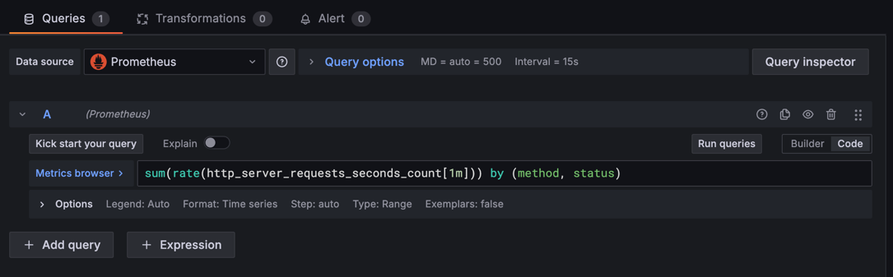

# Task 10 ~ Grafana Integration

Now that we have Prometheus collecting metrics from our Spring Boot application, let's set up [Grafana](https://grafana.com/) 
to create beautiful, interactive dashboards for visualizing these metrics. Grafana is a powerful open-source analytics 
and monitoring platform that excels at creating rich, interactive dashboards from various data sources including Prometheus.

In production environments, Grafana dashboards are essential for:

- **Real-time Monitoring**: Visual representation of application health and performance
- **Alerting**: Visual alerts and notifications for critical issues
- **Historical Analysis**: Track trends and patterns over time
- **Team Collaboration**: Share dashboards across development and operations teams
- **Business Intelligence**: Convert technical metrics into business insights
- **SLA Monitoring**: Ensure application meets service level agreements

---

## How does Grafana work with Prometheus?

Grafana acts as a visualization layer on top of Prometheus. While Prometheus collects and stores time-series data, 
Grafana queries this data using PromQL (Prometheus Query Language) and presents it through customizable dashboards 
with various visualization types like graphs, tables, heatmaps, and single stat panels. This combination provides 
a complete monitoring solution where Prometheus handles data collection and Grafana handles data presentation.

---

## Step 1: Add Grafana to Docker Compose

Update your `compose.yaml` file to include Grafana service alongside Prometheus:

```yaml
  grafana:
    image: grafana/grafana-oss:latest
    container_name: grafana_dashboard
    ports:
      - "3000:3000"   # Grafana web UI port
    environment:
      - GF_SECURITY_ADMIN_PASSWORD=admin
      - GF_USERS_ALLOW_SIGN_UP=false
      - GF_SERVER_DOMAIN=localhost
      - GF_SMTP_ENABLED=false
    volumes:
      - grafana_data:/var/lib/grafana
      - ./grafana/provisioning:/etc/grafana/provisioning
    restart: unless-stopped
    depends_on:
      - prometheus
```

And add the volume to your volumes section:

```yaml
volumes:
  prometheus_data:
  grafana_data:  # Add this line
```

---

## Step 2: Create Grafana Provisioning Configuration

Create a directory structure for Grafana provisioning to automatically configure data sources and dashboards:

```bash
  mkdir -p grafana/provisioning/datasources
  mkdir -p grafana/provisioning/dashboards
```

### **Data Source Configuration**

Create `grafana/provisioning/datasources/prometheus.yml`:

```yaml
apiVersion: 1

datasources:
  - name: Prometheus
    type: prometheus
    access: proxy
    url: http://prometheus:9090
    isDefault: true
    editable: true
```

### **Dashboard Provisioning Configuration**

Create `grafana/provisioning/dashboards/dashboards.yml`:

```yaml
apiVersion: 1

providers:
  - name: 'default'
    orgId: 1
    folder: ''
    type: file
    disableDeletion: false
    editable: true
    updateIntervalSeconds: 10
    allowUiUpdates: true
    options:
      path: /etc/grafana/provisioning/dashboards
```

---

## Step 3: Start All Services

Now start all services including the new Grafana service:

```bash
  docker-compose up -d
```

This will start:
- ✅ PostgreSQL database
- ✅ RabbitMQ message broker  
- ✅ ActiveMQ message broker
- ✅ Prometheus monitoring
- ✅ **Grafana dashboards** (new!)

---

## Step 4: Access Grafana and Configure Dashboards

1. **Start your Spring Boot application**
2. **Access Grafana Web UI**:
   - Open your browser and navigate to: [http://localhost:3000](http://localhost:3000)
   - Login with:
     - **Username**: `admin`
     - **Password**: `admin`

3. **Verify Prometheus Data Source**:
   - Go to `Connections > Data Sources`
   - 
   - You should see Prometheus configured and connected
   - 

---

## Step 5: Create Your First Dashboard

### **Application Overview Dashboard**

**Create New Dashboard**:
   - Click on `+` icon in the left sidebar
   - Select `Dashboard`
   - Click `Add Visualization`
   - 
   - Select `Prometheus` as the data source

---

**Add HTTP Request Rate Panel**:
   ```promql
   sum(rate(http_server_requests_seconds_count[1m])) by (method, status)
   ```
   - 
   - On right panel, set visualization type to `Time series`
   - Title: "HTTP Request Rate (req/sec)"
   - 
   - Unit: "requests/sec"
   - 

---

**Add Response Time Panel**:
   ```promql
   rate(http_server_requests_seconds_sum[1m]) / rate(http_server_requests_seconds_count[1m])
   ```
   - Set visualization type to `Time series`
   - Title: "Average Response Time"
   - Unit: "seconds"

You can also insert custom legends to each panel like this:


It will look like this:


---

**Add JVM Memory Usage Panel**:
   ```promql
   (jvm_memory_used_bytes{area="heap"} / jvm_memory_max_bytes{area="heap"}) * 100
   ```
   - Set visualization type to `Gauge`
   - Title: "JVM Heap Memory Usage"
   - Unit: "percent (0-100)"
   - Set thresholds: Green (0-70), Yellow (70-85), Red (85-100)

---

**Add Database Connection Pool Panel**:
   ```promql
   hikaricp_connections{pool="HikariPool-1"}
   ```
   - Set visualization type to `Stat`
   - Title: "Active DB Connections"
### **Save the Dashboard**:
- Click `Save dashboard` icon
- Name it whatever you like.
- Add tags: `spring-boot`, `monitoring`

Your Dashboard should now look something like this:


---

## Step 6: Add Custom @Timed Annotations for Database Operations

Now let's add specific timing metrics for database READ and WRITE operations using Micrometer's `@Timed` annotation.

### **Update Dependencies**

Ensure your `build.gradle` includes the Micrometer dependency (should already be included with Spring Boot Actuator):

```gradle
implementation 'org.springframework.boot:spring-boot-starter-actuator'
implementation 'io.micrometer:micrometer-registry-prometheus'
```

### **Configure Timer Registry**

The timer registry is automatically configured by Spring Boot, but you can customize it in your application properties:

```yaml
# application.yml
management:
  metrics:
    enable:
      all: true
    export:
      prometheus:
        enabled: true
    distribution:
      percentiles-histogram:
        http.server.requests: true
        database.read.operations: true
        database.write.operations: true
```

### **Create Configuration Class**

You need to create a configuration class to enable the `@Timed` aspect. Create a new class `MetricsConfig.java` in your
`/config` package:

```java
@Configuration
public class MetricsConfig {
    
    @Bean
    public TimedAspect timedAspect(MeterRegistry registry) {
        return new TimedAspect(registry);
    }
}
```

---

## Step 8: Implement @Timed Annotations

Let's add `@Timed` annotations to track database operations in our service layers. I'll update the key service classes to demonstrate READ and WRITE operation timing.

### **Update OrderService for Database Operations Timing**

Add `@Timed` annotation to methods that perform database operations to capture specific metrics.


### **Update OrderStatusService for Read Operations**

Add timing metrics for order status retrieval operation.


### **Update CustomerService for Customer Details Operations**

Add timing for customer-related database operation.


### **Update AddressService for Customer Address Operations**

Add timing for address-related database operation.


---

## Step 9: Create Database Operations Dashboard

After implementing `@Timed` annotations, create a dedicated dashboard for database operations:

### **Database Performance Queries**

1. **Saving Order**:

- This will give you count of orders successfully saved per second.
   ```promql
   rate(save_new_order_seconds_count{exception="none"}[1m])
   ```
- To get order rate per minute, multiply by 60:
   ```promql
   rate(save_new_order_seconds_count{exception="none"}[1m]) * 60
   ```

2. **Saving Customer Details**:
- Use following query:
   ```promql
   rate(save_new_customer_seconds_count{exception="none"}[1m]) * 60
   ```

3. **Saving Customer Address**:
- Use following query:
   ```promql
   rate(save_new_address_seconds_count{exception="none"}[1m]) * 60
   ```


#### ⭐️Your dashboard should look something like this:


---

## Step 10: Pre-built Dashboard Templates

### **Import Community Dashboards**

Grafana has a rich library of community dashboards. Here are some recommended ones for Spring Boot:

1. **Spring Boot 2.1 System Monitor** (Dashboard ID: 11378)
2. **JVM (Micrometer)** (Dashboard ID: 4701)
3. **Spring Boot Statistics** (Dashboard ID: 6756)

**To Import**:
- Go to `+` > `Import`
- Enter dashboard ID
- Select Prometheus as data source
- Click `Import`

For example, I imported the Spring Boot 2.1 System Monitor dashboard (ID: 11378):


---

## Step 11: Best Practices for Dashboard Design

### **Dashboard Organization**

1. **Use Consistent Time Ranges**: Set dashboard time range to last 1 hour by default
2. **Group Related Metrics**: Create separate rows for Application, JVM, Database metrics
3. **Use Meaningful Colors**: Green for healthy, Yellow for warning, Red for critical
4. **Add Descriptions**: Include panel descriptions explaining what each metric means

### **Performance Optimization**

1. **Limit Query Frequency**: Use appropriate scrape intervals (5-15 seconds)
2. **Use Template Variables**: Make dashboards reusable across environments
3. **Set Proper Refresh Rates**: Auto-refresh every 30 seconds for real-time monitoring

---

## **Conclusion**

With Grafana now integrated with your Spring Boot application, you have:

- ✅ **Real-time Dashboards**: Visual monitoring of application performance
- ✅ **Custom Metrics**: @Timed annotations for database operations
- ✅ **Alert Capabilities**: Proactive monitoring and alerting
- ✅ **Historical Analysis**: Trend analysis and capacity planning

Your Spring Boot application now has enterprise-grade monitoring and visualization! 📊📈


