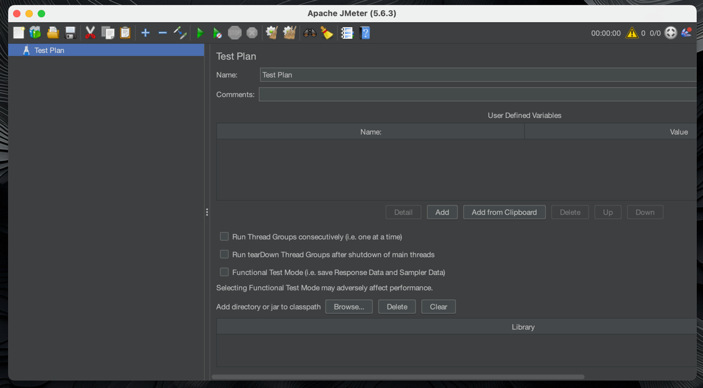
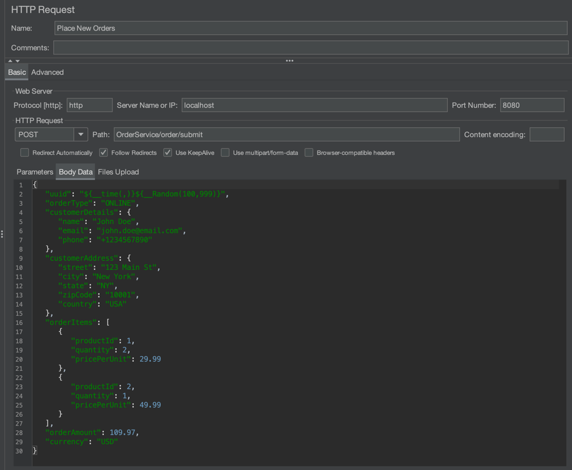
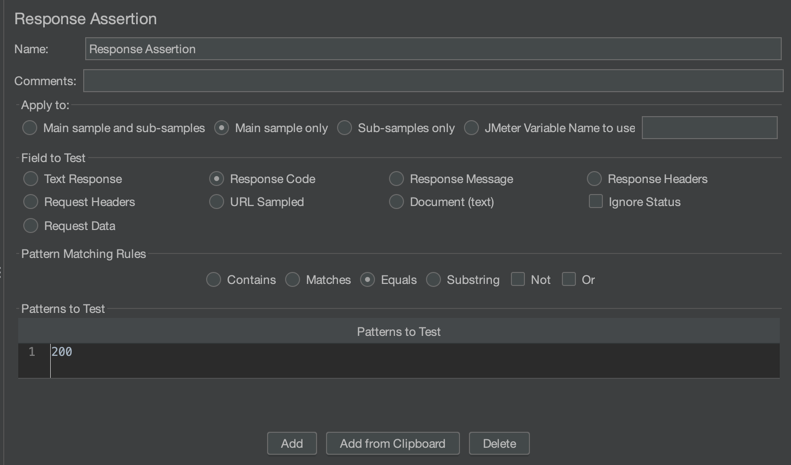
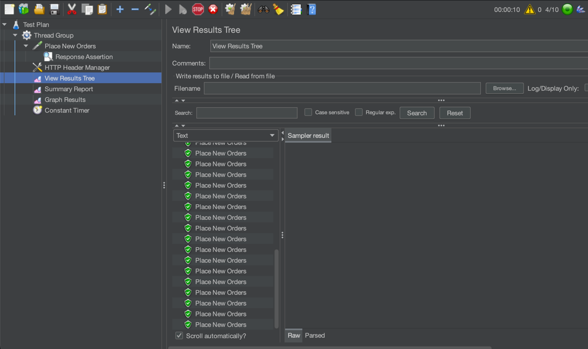
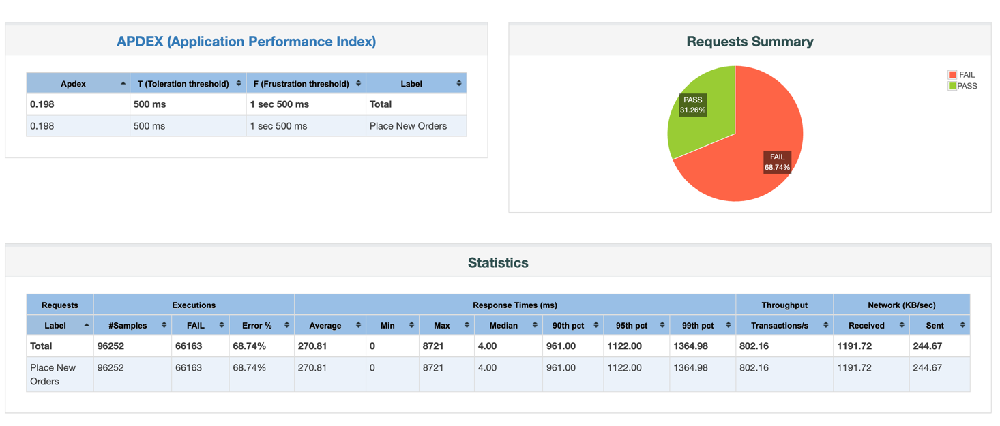
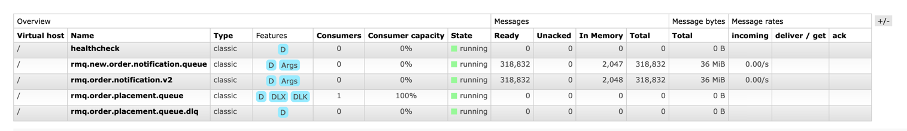
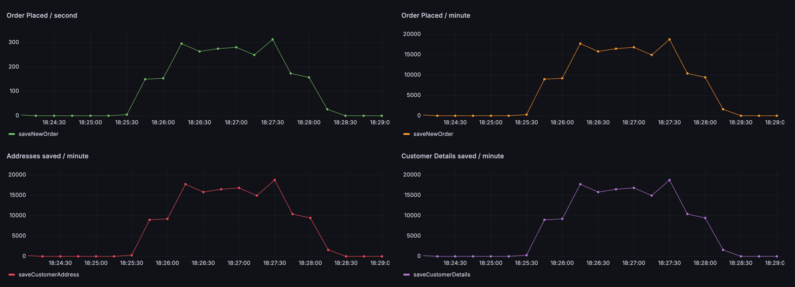
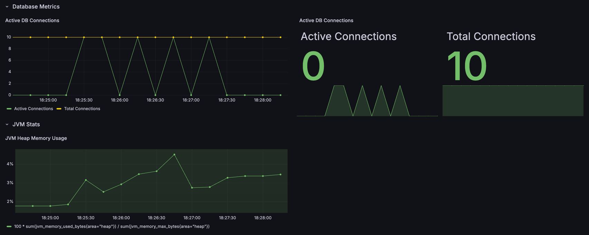

# Task 11 ~ Load Testing Application

Now that we have monitoring and visualization in place with Prometheus and Grafana, it's time to validate our application's 
performance under various load conditions. Load testing is a critical practice that helps ensure our Spring Boot application 
can handle expected traffic volumes and identify potential bottlenecks before they impact users in production.

[Apache JMeter](https://jmeter.apache.org/) is a powerful, open-source load testing tool that can simulate heavy loads 
on servers, networks, or objects to test their strength and analyze overall performance under different load types. 
JMeter is widely used in the industry due to its flexibility, extensive protocol support, and comprehensive reporting capabilities.

In production environments, load testing is essential for:

- **Performance Validation**: Ensure your application meets performance requirements under expected load
- **Capacity Planning**: Determine maximum user capacity and optimal resource allocation
- **Bottleneck Identification**: Discover performance issues before they affect real users
- **Regression Testing**: Verify that new code changes don't degrade performance
- **Infrastructure Sizing**: Right-size your deployment infrastructure for cost optimization
- **Stress Testing**: Understand application behavior at breaking points

---

## Load Testing Tools in the Industry

### Popular Load Testing Tools:

1. **Apache JMeter** - Open-source, Java-based, GUI and command-line support
2. **Gatling** - High-performance, Scala-based, excellent for CI/CD integration
3. **Artillery** - Modern, Node.js-based, cloud-native load testing
4. **K6** - Developer-centric, JavaScript-based, excellent developer experience
5. **LoadRunner** - Enterprise-grade, comprehensive protocol support (Commercial)
6. **Locust** - Python-based, distributed testing, easy to script
7. **NBomber** - .NET-based, reactive load testing framework
8. **WebLOAD** - Enterprise solution with advanced analytics (Commercial)

### Why JMeter for This Tutorial:

- **Zero Cost**: Completely free and open-source
- **Rich GUI**: User-friendly interface for test plan creation
- **Protocol Support**: HTTP, HTTPS, SOAP, REST, FTP, JDBC, and more
- **Extensibility**: Plugin ecosystem and custom scripting capabilities

---

## Step 1: Installing Apache JMeter

### **macOS Installation**

#### Using Homebrew (Recommended)
```bash
# Install Homebrew if not already installed
/bin/bash -c "$(curl -fsSL https://raw.githubusercontent.com/Homebrew/install/HEAD/install.sh)"

# Install JMeter
brew install jmeter
```

### **Windows Installation**

Head over to [this](https://www.simplilearn.com/tutorials/jmeter-tutorial/jmeter-installation) installation guide for JMeter on Windows.

⚠️ _I've not tested this on Windows myself, but it should work fine. You should be able to find
plenty of resources online to help you with the installation._


### **Linux (Ubuntu/Debian) Installation**

#### Option 1: Using Package Manager

Head over to [this](https://dev.to/hitjethva/how-to-install-apache-jmeter-on-ubuntu-20-04-2di9) installation guide for JMeter on Linux.

#### Option 2: Using Snap
```bash
  sudo snap install jmeter
```

### **Verify Installation**
```bash
    # Check JMeter version
    jmeter --version
    
    # Should output something like:
    # Copyright (c) 1999-2023 The Apache Software Foundation
    # Version 5.6.2
```

### **Launch JMeter GUI**

```bash
  jmeter
```

This is how it should look like when you launch JMeter GUI:


---

## Step 2: Understanding JMeter Components

### **Key JMeter Elements:**

1. **Test Plan**: Root container for all test elements
2. **Thread Group**: Simulates users and defines load pattern
3. **Samplers**: Perform actual requests (HTTP, FTP, JDBC, etc.)
4. **Listeners**: Collect and display test results
5. **Timers**: Control timing between requests
6. **Assertions**: Validate response content
7. **Configuration Elements**: Set up variables and defaults
8. **Pre/Post Processors**: Modify requests and responses

---

## Step 3: Creating Your First Load Test

### **Start Your Spring Boot Application**

First, ensure your **Spring Boot application is running!**


### **Step 3.1: Create a Test Plan**

1. JMeter opens with a default Test Plan
2. Right-click on "Test Plan" → Add → Threads (Users) → Thread Group
3. Name it "Order Service Load Test"

### **Step 3.2: Configure Thread Group**

Configure the Thread Group with the following settings:

- **Number of Threads (users)**: 10
- **Ramp-up period (seconds)**: 10
- **Loop Count**: 5

This configuration will:
- Simulate 10 concurrent users
- Gradually increase load over 10 seconds
- Each user will execute the test 5 times

### **Step 3.3: Add HTTP Request Sampler**

1. Right-click on Thread Group → Add → Sampler → HTTP Request
2. Configure the HTTP Request:
   - **Name**: `Place New Orders`
   - **Server Name or IP**: `localhost`
   - **Port Number**: `8080`
   - **HTTP Request Method**: `POST`
   - **Path**: `OrderService/order/submit`
   - **Body Data**:
```json
{
   "uuid": "${__time(,)}${__Random(100,999)}",
   "orderType": "ONLINE",
   "customerDetails": {
      "name": "John Doe",
      "email": "john.doe@email.com",
      "phone": "+1234567890"
   },
   "customerAddress": {
      "street": "123 Main St",
      "city": "New York",
      "state": "NY",
      "zipCode": "10001",
      "country": "USA"
   },
   "orderItems": [
      {
         "productId": 1,
         "quantity": 2,
         "pricePerUnit": 29.99
      },
      {
         "productId": 2,
         "quantity": 1,
         "pricePerUnit": 49.99
      }
   ],
   "orderAmount": 109.97,
   "currency": "USD"
}
```

**N.B** ⚠️ You can see that I've used a JMeter function `${__time(,)}${__Random(100,999)}` to generate a unique UUID for each 
order. This ensures that each request is unique and avoids conflicts.

Your HTTP Request configuration should look like this:


### **Step 3.4: Add HTTP Header Manager**

1. Right-click on Thread Group → Add → Config Element → HTTP Header Manager
2. Add headers:
   - **Name**: Content-Type, **Value**: application/json
   - **Name**: Accept, **Value**: text/plain

### **Step 3.5: Add Listeners for Results**

1. Right-click on Thread Group → Add → Listener → View Results Tree
2. Right-click on Thread Group → Add → Listener → Summary Report
3. Right-click on Thread Group → Add → Listener → Graph Results

Your test plan structure should look like:
```
Test Plan
└── Order Service Load Test (Thread Group)
    ├── HTTP Header Manager
    ├── Place New Orders (HTTP Request)
    ├── View Results Tree
    ├── Summary Report
    └── Graph Results
```

---


### **Step 3.6: Add Response Assertions**

1. Right-click on "Place New Orders" → Add → Assertions → Response Assertion
2. Configure:
   - **Field to Test**: Response Code
   - **Pattern Matching Rules**: Equals
   - **Patterns to Test**: 200

Your config should look like this:



### **Step 4.3: Add Think Time**

1. Right-click on Thread Group → Add → Timer → Constant Timer
2. Set **Thread Delay**: 1000 (milliseconds)

This simulates realistic user behavior with 1-second delays between requests.

---

## Step 5: Running Load Tests

### **GUI Mode (Development/Debugging ONLY)**

1. Click the green "Start" button (🟢) in the toolbar
2. Watch real-time results in the listeners
3. Analyze response times, throughput, and errors

You should be able to see the results in the "View Results Tree" and "Summary Report" listeners as the test runs.


### **Command Line Mode (CI/CD/Production)**

For better performance with higher loads, run JMeter in non-GUI mode:

Head over to the `docs/Jmeter Scripts` directory of the project. I've placed a Jmeter script there named 
`Order_Placement_Script.jmx` that you can use to run the load test. Use the following command to
run the load test in non-GUI mode:

```bash
# Save your test plan as load-test.jmx first
jmeter -n -t Order_Placement_Script.jmx -l results.jtl -e -o report-output/

# Parameters explained:
# -n: Non-GUI mode
# -t: Test plan file
# -l: Results file
# -e: Generate HTML report
# -o: Output folder for HTML report
```

### **Step 5.1: Interpreting Results**

The script will run for 2 minutes, simulating around 500 users placing orders concurrently. You can view
the generated HTML report in the `docs/Jmeter Scripts/report-output/` directory after the test completes.

#### Key Metrics to Monitor:

1. **Response Time**: How long requests take
   - **Average**: Overall average response time
   - **90th Percentile**: 90% of requests complete within this time
   - **95th/99th Percentile**: For identifying outliers

2. **Throughput**: Requests processed per second
   - **Higher is better** for performance
   - **Should remain stable** under consistent load

3. **Error Rate**: Percentage of failed requests
   - **Should be 0%** under normal conditions
   - **Indicates capacity limits** when increasing

4. **Resource Utilization**: Monitor via Grafana
   - **CPU Usage**: Should not exceed 80% sustained
   - **Memory**: Watch for memory leaks
   - **Database Connections**: Monitor connection pool

During my runs, I observed that the application struggled to maintain connections with 
the messaging broker which resulted in 68% of the requests failing. This is not too bad neither too great as 
I'm running this on a local machine with limited resources. 



### Checking Messaging Broker

Head over to either ActiveMQ or RabbitQ management console to check the status of the messaging broker. I have run
multiple tests so you can see that I've got around 318K+ messages sitting in the queue.




---

## Step 6: Integration with Monitoring

### **Correlate with Grafana Dashboards**

While running load tests:

1. Open your Grafana dashboard (http://localhost:3000)
2. Monitor real-time metrics during load test execution
3. Observe correlations between:
   - JMeter load patterns → Application response times
   - Request volume → CPU/Memory usage
   - Error rates → Database connection issues

You should be able to view the order placement rate spike during the load test in your Grafana dashboard:


You can also see that the Active Database Connections maxed out during the load test, which is expected as we are simulating
a large number of users placing orders concurrently. This is a good indication that the application is under stress, 
and we need to monitor how it behaves under these conditions.



### **Best Practices for Load Testing**

1. **Start Small**: Begin with low load and gradually increase
2. **Test Realistic Scenarios**: Use production-like data and user patterns
3. **Monitor System Resources**: CPU, memory, database, network
4. **Test Different Load Patterns**:
   - **Constant Load**: Steady user count
   - **Spike Testing**: Sudden traffic increases
   - **Stress Testing**: Beyond normal capacity
   - **Endurance Testing**: Extended duration tests

5. **Environment Considerations**:
   - Use production-like data volumes
   - Test on similar hardware configurations
   - Consider network latency in distributed systems


---

## Conclusion

Load testing with JMeter provides crucial insights into your application's performance characteristics. By combining 
JMeter load testing with Prometheus metrics and Grafana visualization, you create a comprehensive performance 
monitoring ecosystem that helps ensure your Spring Boot application can handle production workloads reliably.

Regular load testing should be integrated into your development workflow to catch performance regressions early 
and validate that your application scales appropriately with business growth.

**Next Steps:**
- Experiment with different load patterns and user scenarios
- Set up automated performance regression testing in your CI/CD pipeline
- Create custom JMeter plugins for application-specific testing needs
- Explore distributed load testing for higher volume scenarios
