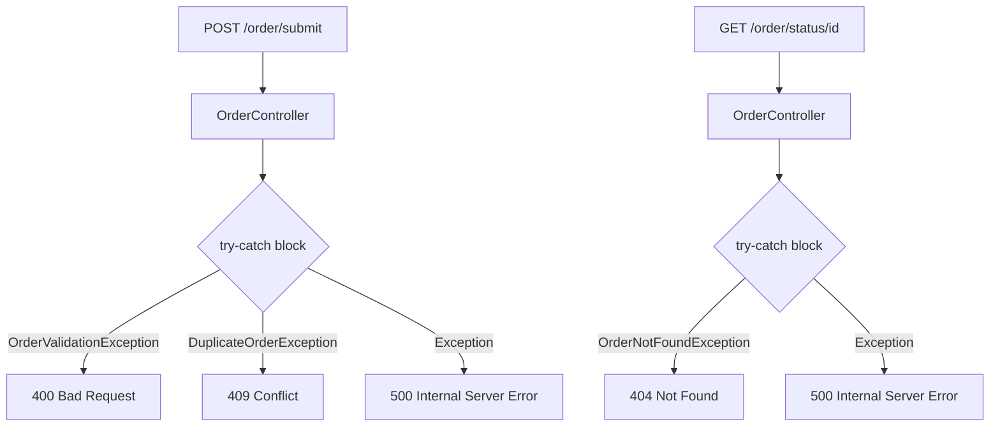
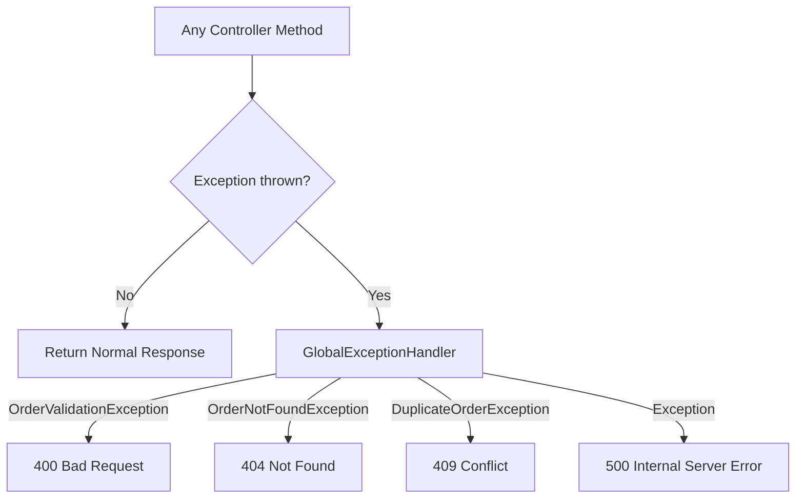
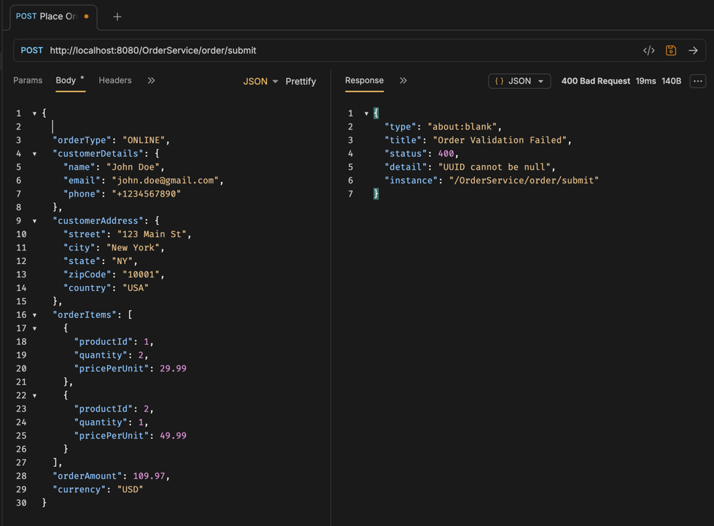
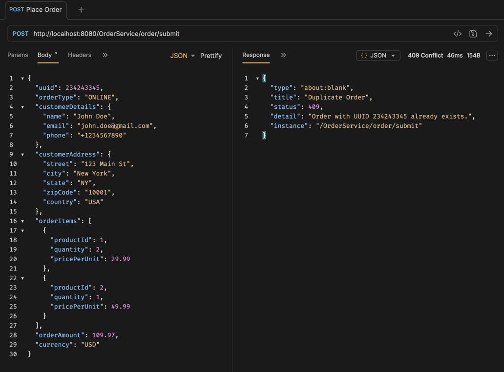
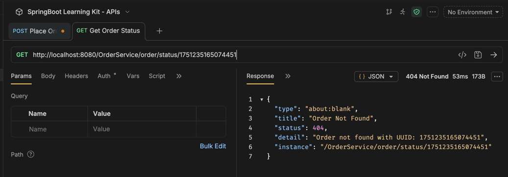

# Task 12 ~ Global Exception Handling with @ControllerAdvice

In Task 2, I mentioned that `@ControllerAdvice` is a more elegant way to handle exceptions across your application
rather than wrapping every controller method in a try-catch block. We didn't implement it at the time because
the focus was on understanding how exceptions propagate through the layers. Now it's time to do it properly.

This task will walk you through replacing the scattered exception handling in `OrderController` with a single,
centralized handler. You'll also learn about **RFC 7807 Problem Details**, which is the industry standard response
format for communicating errors from REST APIs and one that Spring Boot 3 supports out of the box.

---

## The Problem with the Current Approach

Open [OrderController.java](../src/main/java/com/springboot/learning/kit/controller/OrderController.java) and look at both
methods. Each one has its own `try-catch` block that catches the same set of exceptions and manually constructs a
`ResponseEntity` with a `Map.of("message", ...)` body:

```java
@PostMapping("/submit")
public ResponseEntity<?> submitOrder(@RequestBody OrderRequest orderRequest) {
    try {
        orderProcessingService.processNewOrder(orderRequest);
        return ResponseEntity.ok("Order submitted successfully");
    } catch (OrderValidationException e) {
        log.error("Order validation failed: {} ~ ", orderRequest.getUUID(), e);
        return ResponseEntity.status(HttpStatus.BAD_REQUEST).body(Map.of("message", e.getMessage()));
    } catch (DuplicateOrderException e) {
        log.error("Order already exists in the DB: {} ~ ", orderRequest.getUUID(), e);
        return ResponseEntity.status(HttpStatus.CONFLICT).body(Map.of("message", e.getMessage()));
    } catch (Exception e) {
        log.error("Error processing order: {} ~ ", orderRequest.getUUID(), e);
        return ResponseEntity.status(HttpStatus.INTERNAL_SERVER_ERROR)
                .body(Map.of("message", "Encountered error while processing order: " + orderRequest.getUUID()));
    }
}
```

This works, but it has a few problems that compound quickly once the codebase grows.

**The exception-to-status mapping is duplicated.** If tomorrow you decide that `OrderValidationException` should
return a different status or a richer response body, you have to find and update every controller that catches it.
In a real application, that could be dozens of places.

**The error response format is inconsistent.** Right now the body is `{"message": "..."}` which is something we made
up. If you were to add a second field, you'd have to change every place that constructs this map.

**Controllers are polluted with error-handling logic.** A controller's responsibility is to receive a request and
return a response. The exception handling noise makes the actual business logic harder to read.

The flow currently looks like this:



Every controller endpoint is responsible for its own error routing. Now imagine you add five more controllers
you end up maintaining the same catch blocks in every single one of them.

---

## What is @ControllerAdvice?

`@ControllerAdvice` is a Spring annotation that allows you to define exception handler methods in a single class
that apply across all controllers in the application. When an exception propagates out of any controller method,
Spring intercepts it before sending the response and checks if any `@ControllerAdvice` class has a handler for that
exception type.

This completely separates the error-handling logic from the controller logic. The controller just does its work and
throws exceptions when something is wrong. It doesn't need to know what HTTP status code maps to which exception
that is the handler's responsibility.

With a centralized handler in place, the flow becomes:



The important thing to notice is that the exception routing is defined in one class and applies to all controllers
automatically.

---

## RFC 7807 Problem Details

Before writing the handler, it's worth understanding the response format we'll use.

The current error response from this application looks like:
```json
{
  "message": "UUID cannot be null"
}
```

This is informal. If a client needs to programmatically handle this error, they have to parse the message string.
If the wording changes, the client breaks. RFC 7807 ("Problem Details for HTTP APIs") defines a standard structure
for error responses:

```json
{
  "type": "about:blank",
  "title": "Order Validation Failed",
  "status": 400,
  "detail": "UUID cannot be null",
  "instance": "/order/submit"
}
```

- `type` A URI that identifies the problem type. `about:blank` is the default when no specific documentation URI is provided.
- `title` A short, human-readable summary of the problem type. This should not change between occurrences.
- `status` The HTTP status code.
- `detail` A human-readable explanation specific to this occurrence of the problem.
- `instance` A URI that identifies the specific request that caused the error.

Spring Boot 3 ships the `ProblemDetail` class which directly represents this format. You do not need any additional
dependency to use it.

---

## Creating the GlobalExceptionHandler

Create a new class named `GlobalExceptionHandler` in the `exception` package. This is where all exception-to-response
mappings will live.

The class must be annotated with `@RestControllerAdvice`. This is a convenience annotation that combines
`@ControllerAdvice` with `@ResponseBody`, meaning any object you return from a handler method will be serialized
as JSON automatically the same way it works in a `@RestController`.

We'll also extend `ResponseEntityExceptionHandler`, which is a Spring-provided base class that already handles all
standard Spring MVC exceptions (like `HttpMessageNotReadableException` when the request body is malformed) and maps
them to `ProblemDetail` responses. Extending it means we inherit those mappings for free and only need to add
handlers for our own custom exceptions.

```java
package com.springboot.learning.kit.exception;

import jakarta.servlet.http.HttpServletRequest;
import java.net.URI;
import lombok.extern.slf4j.Slf4j;
import org.springframework.http.HttpStatus;
import org.springframework.http.ProblemDetail;
import org.springframework.web.bind.annotation.ExceptionHandler;
import org.springframework.web.bind.annotation.RestControllerAdvice;
import org.springframework.web.servlet.mvc.method.annotation.ResponseEntityExceptionHandler;

@Slf4j
@RestControllerAdvice
public class GlobalExceptionHandler extends ResponseEntityExceptionHandler {

    @ExceptionHandler(OrderValidationException.class)
    public ProblemDetail handleOrderValidationException(OrderValidationException ex, HttpServletRequest request) {
        log.error("Order validation failed: {}", ex.getMessage());
        ProblemDetail problemDetail = ProblemDetail.forStatusAndDetail(HttpStatus.BAD_REQUEST, ex.getMessage());
        problemDetail.setTitle("Order Validation Failed");
        problemDetail.setInstance(URI.create(request.getRequestURI()));
        return problemDetail;
    }

    @ExceptionHandler(OrderNotFoundException.class)
    public ProblemDetail handleOrderNotFoundException(OrderNotFoundException ex, HttpServletRequest request) {
        log.error("Order not found: {}", ex.getMessage());
        ProblemDetail problemDetail = ProblemDetail.forStatusAndDetail(HttpStatus.NOT_FOUND, ex.getMessage());
        problemDetail.setTitle("Order Not Found");
        problemDetail.setInstance(URI.create(request.getRequestURI()));
        return problemDetail;
    }

    @ExceptionHandler(DuplicateOrderException.class)
    public ProblemDetail handleDuplicateOrderException(DuplicateOrderException ex, HttpServletRequest request) {
        log.error("Duplicate order detected: {}", ex.getMessage());
        ProblemDetail problemDetail = ProblemDetail.forStatusAndDetail(HttpStatus.CONFLICT, ex.getMessage());
        problemDetail.setTitle("Duplicate Order");
        problemDetail.setInstance(URI.create(request.getRequestURI()));
        return problemDetail;
    }

    @ExceptionHandler(OrderProcessingException.class)
    public ProblemDetail handleOrderProcessingException(OrderProcessingException ex, HttpServletRequest request) {
        log.error("Order processing failed: {}", ex.getMessage());
        ProblemDetail problemDetail =
                ProblemDetail.forStatusAndDetail(HttpStatus.INTERNAL_SERVER_ERROR, ex.getMessage());
        problemDetail.setTitle("Order Processing Failed");
        problemDetail.setInstance(URI.create(request.getRequestURI()));
        return problemDetail;
    }

    @ExceptionHandler(Exception.class)
    public ProblemDetail handleGenericException(Exception ex, HttpServletRequest request) {
        log.error("Unexpected error at {}: {}", request.getRequestURI(), ex.getMessage(), ex);
        ProblemDetail problemDetail =
                ProblemDetail.forStatusAndDetail(HttpStatus.INTERNAL_SERVER_ERROR, "An unexpected error occurred");
        problemDetail.setTitle("Internal Server Error");
        problemDetail.setInstance(URI.create(request.getRequestURI()));
        return problemDetail;
    }
}
```

A few things to note here:

The `@ExceptionHandler` annotation on each method tells Spring which exception type that method handles. When an
exception of that type propagates out of any controller, Spring routes it to the corresponding method.

The order of handler methods matters when exception types have inheritance relationships. Spring will always match
the most specific exception type first. The `@ExceptionHandler(Exception.class)` method at the bottom acts as a
catch-all for anything not explicitly handled above the same role as the `catch (Exception e)` blocks in the
controller had before.

The `HttpServletRequest` parameter is injected by Spring automatically. You don't need to retrieve it manually.
It gives us the request URI to populate the `instance` field.

The `log.error` call inside each handler is important. These logs are now centralized, which means every unhandled
exception across the entire application is logged consistently in one place.

---

## Enable Problem Details for Spring MVC Exceptions

By default, Spring Boot 3 will use `ProblemDetail` for exceptions handled in your `@ExceptionHandler` methods,
but standard Spring MVC exceptions (such as a missing request parameter or an unsupported HTTP method) still return
a plain error body unless you opt in.

Add the following line to [application.properties](../src/main/resources/application.properties):

```properties
spring.mvc.problemdetails.enabled=true
```

With this enabled, `ResponseEntityExceptionHandler` which `GlobalExceptionHandler` extends will return
`ProblemDetail` for all standard Spring MVC exceptions too. This gives you a consistent error format across the
entire application regardless of where the exception originates.

---

## Refactoring OrderController

Now that the handler is in place, the controller no longer needs to know anything about exception handling. Open
[OrderController.java](../src/main/java/com/springboot/learning/kit/controller/OrderController.java) and remove
all the try-catch blocks. The refactored class should look like this:

```java
package com.springboot.learning.kit.controller;

import com.springboot.learning.kit.dto.request.OrderRequest;
import com.springboot.learning.kit.service.OrderProcessingService;
import com.springboot.learning.kit.service.OrderStatusService;
import lombok.RequiredArgsConstructor;
import lombok.extern.slf4j.Slf4j;
import org.springframework.http.ResponseEntity;
import org.springframework.web.bind.annotation.*;

@Slf4j
@RestController
@RequestMapping("/order")
@RequiredArgsConstructor
public class OrderController {

    private final OrderProcessingService orderProcessingService;
    private final OrderStatusService orderStatusService;

    /**
     * Endpoint to submit an order for processing.
     *
     * @param orderRequest the order to be processed
     * @return a ResponseEntity indicating the result of the operation
     */
    @PostMapping("/submit")
    public ResponseEntity<String> submitOrder(@RequestBody OrderRequest orderRequest) {
        orderProcessingService.processNewOrder(orderRequest);
        return ResponseEntity.ok("Order submitted successfully");
    }

    @GetMapping("/status/{orderId}")
    public ResponseEntity<?> getOrderStatus(@PathVariable Long orderId) {
        return ResponseEntity.ok(orderStatusService.getOrderStatus(orderId));
    }
}
```

The controller now imports only what it needs. The exception imports, the `HttpStatus` import, and the `Map` import
are all gone because none of that belongs here anymore.

Notice that the return type of `submitOrder` has changed from `ResponseEntity<?>` to `ResponseEntity<String>`. This
is now possible because the method always returns a `200 OK` with a string body. The `?` wildcard was only there to
accommodate the different error response types in the catch blocks. 

---

## Testing the Changes

Reboot the application and run the same scenarios you tested in earlier tasks.

**Validation failure (400):**

Submit an order with a null UUID. The response body should now follow the Problem Details format:

```json
{
  "type": "about:blank",
  "title": "Order Validation Failed",
  "status": 400,
  "detail": "UUID cannot be null",
  "instance": "/order/submit"
}
```


**Duplicate order (409):**

Submit the same order twice. You should get:

```json
{
  "type": "about:blank",
  "title": "Duplicate Order",
  "status": 409,
  "detail": "Order already exists with UUID: 1234567",
  "instance": "/order/submit"
}
```



**Order not found (404):**

Call `GET /order/status/{id}` with a UUID that doesn't exist in the database:

```json
{
  "type": "about:blank",
  "title": "Order Not Found",
  "status": 404,
  "detail": "Order not found with UUID: 9999999",
  "instance": "/order/status/9999999"
}
```



The response body is now consistent across all error scenarios. A client consuming this API can always expect the
same fields regardless of what went wrong `status`, `title`, `detail`, and `instance` will always be present.

---

## Summary

Before this task, every controller method was responsible for catching exceptions and deciding what HTTP status code
to return. That logic is now consolidated in a single class. When a new custom exception is added to the project,
there is only one place to register its handler.

The switch to `ProblemDetail` also gives every error response a consistent shape. Clients can
reliably read the `status`, `title`, and `detail` fields without needing to parse varying message strings.

Lastly, the controller itself became simpler. The method signatures are more precise and
the business logic is no longer buried inside catch blocks. Each layer of the application now has a clear, single
responsibility.

