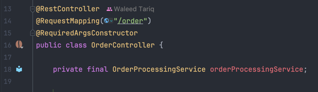
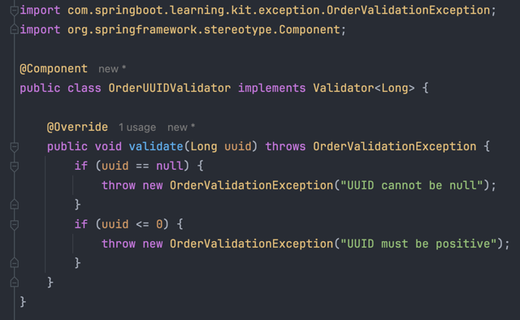
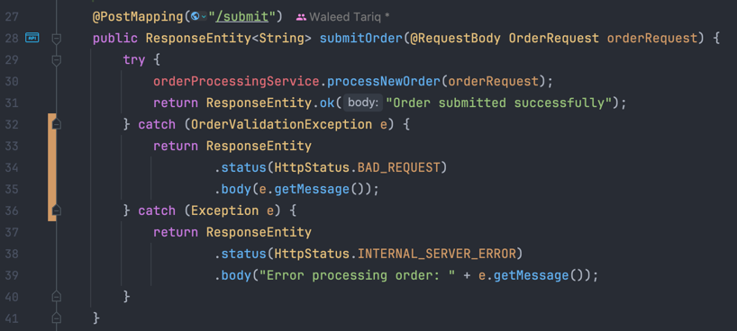

# Task 2 ~ Kicking off development

In this task, we're going to focus on Order Placement flow. We'll review the API that's already been implemented to
place orders, but it's not production ready yet. In this task you'll:

- Implement a news validator for UUID field & Customer Details.
- Update the controller to return 400 status code for invalid payload.
- Implement a new API to retrieve Order Status & return correct responses.
- Understand importance of custom exceptions in production environment.

---

### **Please Read this Section before moving on:**

**Design Decisions**

In this project, I’ve adopted a clean, extensible design by using interfaces and abstract classes to 
handle common and variable order processing logic. The `AbstractOrderProcessor` class defines the shared 
workflow such as saving orders, while leaving methods like `processOrder()` abstract for subclasses to 
implement their specific business logic. We'll have multiple processors for different order types & all of 
them will extend the `AbstractOrderProcessor` class & build upon the shared logic.

This approach aligns with SOLID principles and the Template Method design pattern, making the codebase more 
maintainable, testable, and scalable. By enforcing a consistent structure for all processors and centralizing 
shared behavior, this design ensures that adding new types of processors is straightforward and doesn’t disrupt 
existing functionality—an essential trait in enterprise-level applications.


**Keeping Database Relationships simple**

I’ve intentionally avoided using `@OneToMany`, `@ManyToOne`, and `cascading` relationships to keep 
the data access logic explicit and beginner-friendly. While JPA provides powerful tools for managing entity 
relationships automatically, they often introduce hidden behaviors that can be confusing for those new to Spring 
Boot and JPA. By handling relationships manually—through IDs and separate queries or service-level composition, 
I maintain full control over data loading, updates, and deletions. This approach avoids potential pitfalls like 
unintended cascading operations, lazy loading issues, or bidirectional serialization problems, making the 
application easier to understand, debug, and extend as developers learn the underlying concepts.

_You're welcome to update/remove the existing logic to your liking_


**Using Lombok**

For those who are not familiar with Lombok, it's a Java library that helps to reduce boilerplate code. It offers
some incredible useful annotations such as `@Data`, `@RequiredArgsConstructor`, `@Builder`, `@Slf4j`, etc. You'll
see that I'll be extensively using these annotations throughout the project. Some of my favorite ones are:

- `@Data`: This annotation generates getters, setters, equals, hashCode, and toString methods for the class.
- `@Builder`: This annotation allows you to create objects using the builder pattern. It makes the code cleaner and easier to read.
- `@RequiredArgsConstructor`: This annotation generates a constructor with required arguments (final fields) at compile time.
- `@Slf4j`: This annotation generates a logger for the class. You can use `log.info()`, `log.error()`, etc. to log messages.

---

## **Order Placement Flow**

**Background**

We'll assume that an upstream service (This can be frontend component or another microservice) sends us new order
requests which our application need to handle gracefully. On a very high level, the order placement flow looks like this:


Order placement flow is a critical part of any business’s operations, as it directly impacts customer satisfaction,
inventory management, and revenue recognition. This process typically begins with receiving an order request, 
which may originate from various channels such as an online store, a mobile app, or an internal sales system. 
Once the order is received, the system performs a series of validations to ensure data accuracy and completeness — 
including checking product availability, verifying pricing, and confirming customer details.

---

## **Okay time to code**

### **OrderController**

Navigate to [src/main/](../src/main/java/com/springboot/learning/kit) and this where the main code of the application is located.
Expand the [Controller](../src/main/java/com/springboot/learning/kit/controller) package and open the `OrderController.java` file.

You'll notice that there's no Constructor in this class, that's because we're using the `@ReqiredArgsConstructor` annotation from
Lombok. This annotation generates a constructor with required arguments (final fields) at compile time. This is a great way to
reduce boilerplate code and make your classes cleaner.



Now take a look at the `submitOrder` method which is annotated with `@PostMapping` annotation. This method receives the 
order payload via `@RequestBody` and passes it down to `OrderProcessingService`. 

**Note:** _The Controller class should not contain any business logic or calls to database or external services. As you can see that
we're simply passing the `OrderRequest` to `OrderProcessingService`_

---

### **OrderProcessingService**

Navigate to `OrderProcessingService` now. You'll notice that this class is annotated with `@Service` which indicates that it's a service class in the Spring context.
We're also using `@RequiredArgsConstructor` here to inject the dependencies.

#### **Order Validation**

The first step in the order placement flow is to validate the order. This is done by the `OrderValidationService`. 
If you navigate to `validateOrder` method, you'll see that only OrderType is being validated. You can view the 
[OrderType.java](../src/main/java/com/springboot/learning/kit/domain/OrderType.java) which contains the Enum for different 
type of orders that our service will need to process.

**Quick Tip:**_You can click on a small circular icon shown below & it will take you to the folder where the currently
opened class is located_


Let's add a new Validator class for `uuid` field. This validator will check if the `uuid` is valid.

- Create a new class `OrderUUIDValidator` in the `validator` package.
- Add `@Component` annotation to the class. This will make it a Spring bean and allow it to be injected into other classes.
- Implement the `Validator` interface with `<Long>` as UUID field is of type `Long`. 
- Now the IDE should prompt you to implement the `validate()` method with `@Override` annotation.

**Requirements:**
This validator should check following:
- Check if the UUID is null
- Check if UUID is negative
- Throw the custom `OrderValidationException` with relevant message if any of the above conditions are met.

Your class should look like this:



Now you can inject this validator into `OrderValidationService` class and use it in the `validateOrder` method
just as it's been done for `OrderTypeValidator`.

Great, you've implemented the validator but there's one issue with our `/submit` API. If you look back at controller,
you'll see that it returns a INTERNAL_SERVER_ERROR (500) status upon any failure. Let's fix that so that we send back 
BAD_REQUEST (400) status code instead if the client sends us incorrect payload.

⚠️ **Disclaimer:** _For sake of this exercise, I'll be using try-catch block to handle the custom exceptions. But you can also use 
`@ControllerAdvice` to handle exceptions globally. This is a more elegant way to handle exceptions in Spring Boot applications_

**Implementation:**
- Add a new `catch()` block after the `try{}`.
- This catch block should catch `OrderValidationException` as the validator throws this exception.
- You should return a `ResponseEntity` with `HttpStatus.BAD_REQUEST` status code.
- We also need to return the error message from the exception so that client can understand what went wrong.

**Use of Custom Exceptions:**

Custom exceptions provide a powerful way to handle errors in a more meaningful and structured manner.
It's very common & industry standard to create custom exceptions in enterprise Java applications, 
especially when you're building REST APIs. In our case, [OrderValidationException](../src/main/java/com/springboot/learning/kit/exception/OrderValidationException.java) 
is a custom exception that extends the `RuntimeException` class. All custom exceptions should be stored in the `exception` package.

Following diagram demonstrates the flow of how the custom exception is thrown by our Validator and is caught in the controller.


Once you've done that, your `submitOrder` method should look like this:



**Time to Test:**

Let's run the application & hit the `/submit` API with a negative UUID.


You can see that we got a 400 Response code with the error message we provided in the exception.
**You should now test this API by placing an order without UUID and see if you get expect error response.** 

---

### **Validation Continues..**

Just validating the UUID and OrderType is not sufficient. In an actual production system, you would need to validate most 
fields of the payload, this can include:

- Customer Address
  - Street Address is not empty
  - City is not empty
  - Zip Code is not empty & is valid
  - Country is not empty & is valid
- Customer Details
  - Name is not empty
  - Email is not empty & doesn't contain any special characters
  - Phone number is not empty & doesn't contain any special characters
- Ordered Products & their quantities
- Currency is valid
- Shipping Method & Costs

These components are not implemented ye, but you can start thinking about how you would implement them. 
Each component should have its own Validator class and should be isolated from the rest of the code to maintain cleaner code
that can be easily maintained and tested.

---

### **Validation on Customer Details**

Let's implement another validator which will validate 3 fields inside the `CustomerDetailsRequest` object.
Create a new class `CustomerDetailsValidator` in the `validator` package just as we did previously for UUID.

**Note:**_The new validator needs to implement `Validator<CustomerDetailsRequest>` interface. 
This is because we need to validate the `CustomerDetailsRequest` object._

**Requirements:**
- Name should not be empty
- Email should not be empty & should not contain any special characters
- Email should be in valid format
- Phone Number should not be empty & should not contain any special characters

Let's import a new dependency for email validation. Open the `build.gradle` file and add the following dependency
inside the `dependencies {}` block:

`implementation "com.sun.mail:jakarta.mail:2.0.1"`

_You can find the latest version of this dependency on [Maven Repository](https://mvnrepository.com/artifact/com.sun.mail/jakarta.mail/2.0.1)._

Once, you've added the dependency, you can update the project by clicking on a small Gradle icon that will appear inside your Editor


Gradle will automatically download the dependency and add it to your project.

Now, let's jump back into your CustomerDetailsValidator class and implement the `validate()` method. You should
create 3 privates methods for each of the fields that we need to validate. E.g. 


The name validation part should be simple as we only want to ensure that the name is not empty.
But when it comes to phone & email, we'll be using the `EmailValidator` class from the `jakarta.mail` package &
regex for phone number validation.

**Name:**
We're throwing `OrderValidationException` with relevant message if the name is empty.


**Email:**
Here you can see that we've wrapped the validation logic with a `try-catch` block. If validation fails, we'll throw our
custom `OrderValidationException` with relevant message.


**Phone:**
For phone number validation, we're using regex to check if the phone number contains any special characters.
The regex pattern is `^\+?(\d{1,3})?[-.\s]?(\(?\d{3}\)?[-.\s]?)?(\d[-.\s]?){6,9}\d$`


### **Time to Test these changes**
Now that you've implemented the `CustomerDetailsValidator`, you can inject it into the `OrderValidationService` class.
Once done, you can run the application.

I'll attach screenshots of some failures but you should try to test all scenarios you can think of:


---

## **Order Status**

The order status is another critical part of any order processing application. If you inspect the
[OrderItemService](../src/main/java/com/springboot/learning/kit/service/OrderItemService.java) class, you'll see
that it uses a transformer to convert `OrderItemRequest` (DTO) into `OrderItem` (Entity) object. While doing so,
we're setting the `status` field to `PROCESSING` by default for all newly placed orders. We'll use this field to keep track of
order status and update the status as we receive updates from upstream services.

For now, you'll implement a new API to retrieve the order status from the Database. Treat this task as an actual 
production task.

**Requirements:**
- Implement a new API to retrieve the order status.
- The API should accept the `UUID` as a path variable using `@PathVariable` annotation.
- The API should return the [OrderStatusResponse](../src/main/java/com/springboot/learning/kit/dto/response/OrderStatusResponse.java) object from the database.
- The API should return a 404 status code if the order is not found in the database.
- The API should return a 500 status code if there is any other error.

#### **Implementation Tips:**

- Have a look at `order/submit` API and see how it's implemented.
- Follow that pattern to implement the new API in the `OrderController.java` class.
- Create a new class in service package called `OrderStatusService.java`.
- Inject `OrderStatusRepository` into the new service class.
- The `OrderStatusRepository` should use `@Query` annotation, provide a custom SQL query to retrieve the order status.
- Now inject the new service class into `OrderController` to pull the status from service layer.


_*** 🚧 Try implementing this yourself first before looking at the solution below ***_

### **Solution**

Here's how I handled this task. Firstly, I created a new class `OrderStatusService` in the service package.
This class injected `OrderRepository` & `OrderItemRepository` so that I can extract the `OrderType` field
from `Order` table & `OrderItem` records will be pulled from `OrderItem` table.

**OrderController**

My API returns different response codes based on the scenario. You can see that I'm using a custom ⚡️ exception
`OrderNotFoundException` to handle the case when order is not found in the database. It's important to handle 
such cases gracefully and return meaningful error messages to the client.

_Also, you can see that I'm using `log.error()` from Lombok's `@Slf4j` annotation, inside `catch{}` blocks
to print error messages in the console. These logs can be extremely valuable when working with incidents
on a production environment_


Here's my new method:


**OrderStatusService**

This class contains the business logic to fetch the necessary data from the database & 
builds the response object for our API.

_Note that I'm throwing a custom exception here which I can gracefully catch upstream to
return an accurate response to client_


**OrderItemRepository**

You can see that I had to create a new method in this repository which follows Spring Data JPA's naming 
convention, where it will automatically create a query to find all OrderItem entities where the 
orderId field matches the given parameter. This is a powerful feature of Spring Data JPA that allows you to 
create queries without writing any SQL code.


Under the hood, Spring Data JPA will generate a SQL query similar to this shown below & will collect
the results in a list of `OrderItem` objects.

```sql
SELECT * FROM order_item WHERE order_id = :orderId;
```

---

### **Testing the new API**

Place a new test order using the `/submit` API, add the new API to Bruno collection & hit the new API with 
the `UUID` of the order you just placed. 

For success scenario, your application should return a `200` response code with following
payload:

```json
{
  "orderId": 1234567,
  "orderType": "ONLINE",
  "items": [
    {
      "productId": 1,
      "quantity": 2,
      "status": "PROCESSING"
    },
    {
      "productId": 2,
      "quantity": 1,
      "status": "PROCESSING"
    }
  ]
}
```

If the order doesn't exist in your database, you should get a `404` response code with following payload:

```json
{
  "message": "Order not found with UUID: 123456788"
}
```

If the order doesn't have any items in your database, you should get a `404` response code with following payload:

```json
{
  "message": "No order items found for order with UUID: 123456788"
}
```

If there was any other issue with the database or the application, you should get a `500` response code with following payload:
```json
{
  "message": "Unable to retrieve order status"
}
```

---

### **Task Summary**

This task shed some light onto the order placement flow within the application. We started by implementing new validator
for incoming order request & then we implemented a new API to retrieve the order status. 

We also explored the importance of using custom ⚡️exceptions and how beneficial they can be in a production 
environment for clearer error handling, more specific debugging, and consistent API responses.

By completing this task, you should also have recognized how we’re keeping the controller, service, and 
repository logic cleanly separated in their own layers. This separation helps ensure the codebase remains clean, 
readable, and maintainable as the project grows.