# Task 4 - Working with Apache ActiveMQ

This task will walk you through the process of setting up ActiveMQ in a production ready enterprise application. After that,
we'll look at setting up new consumer & a producer for the ActiveMQ queue.

---

## **Why use ActiveMQ?**
ActiveMQ is an open-source message broker written in Java. It is widely used in enterprise applications for decoupling
components and enabling **asynchronous** communication. It is a popular choice for implementing the publish-subscribe 
pattern and point-to-point messaging.

### **Asynchronous Communication**
I'll illustrate asynchronous communication with a simple mermaid diagram below.

**Producer**

Producing application simply sends a message to the ActiveMQ broker with a destination queue. Once ActiveMQ receives the message,
the transaction is complete and producer does not wait for the consumer to process the message. From this point on, the message 
is stored in the queue until a consumer is available to process it.

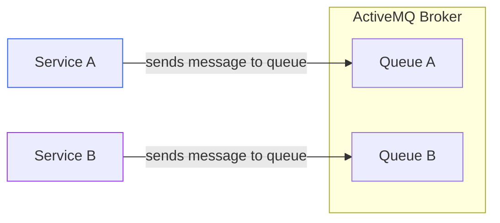

**Consumer**

The consumer application listens to the queue and processes the message. Note that, one application can have multiple consumers,
with each consumer processing messages from the different queues. 

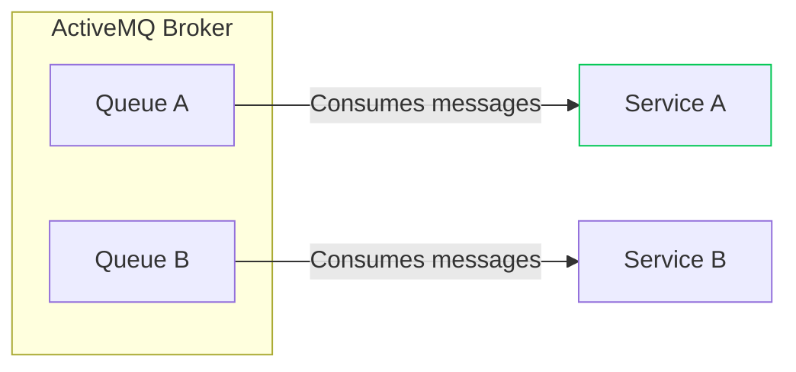


**Queues**

Queues are used for point-to-point communication. In this model, a message is sent from one producer to one consumer. In this project,
an upstream service that listens to events from frontend will send a message to our application via queue. Only our application
should be listening to this queue. This is a one-to-one communication model.

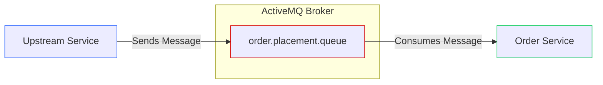

**Virtual Topics**

Topics are used for publish-subscribe communication. In this model, a message is sent from one producer to multiple consumers.
In this project, our `Order Service` application will produce events to a Topic which will have multiple consumers downstream.

_**Note:** that a Virtual Topic in ActiveMQ requires a prefix in order to work: `VirtualTopic.<TopicName>`_
_& in order to subscribe to a VT, you need to create a queue in this format `Consumer.<serviceName>.VirtualTopic.<TopicName>`.
Then your application will consume messages from that specific queue._

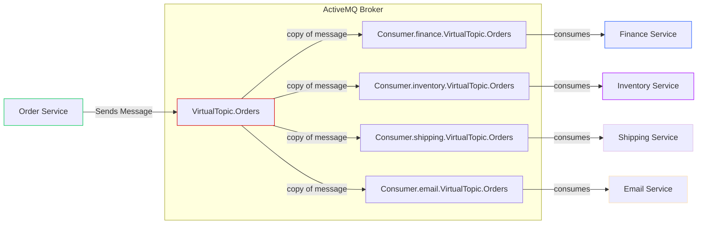

**Dead Letter Queue (DLQ)**

A Dead Letter Queue (DLQ) is a special type of queue that is used to store messages that cannot be processed by the consumer.
This can happen for a variety of reasons, such as the consumer being unavailable or the message being malformed. Typically, no 
application is consuming from this queue. The messages in this queue can be monitored and analyzed to identify the root cause of the issue.

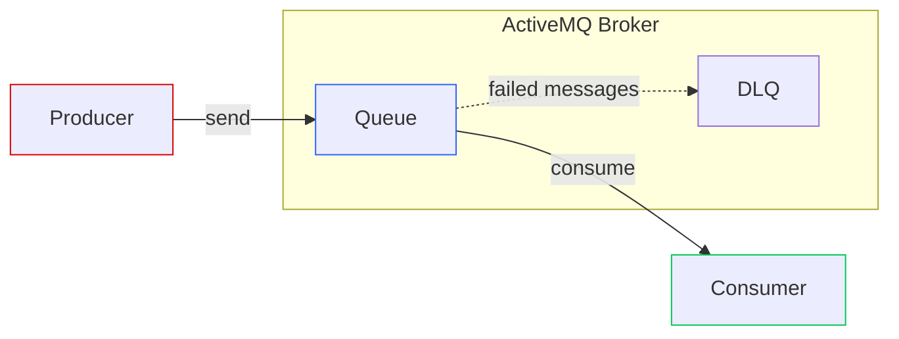

---

## **ActiveMQ Setup** 

### **Properties File**
Let's look at how ActiveMQ is configured in this project. First of all, you need to look at the [application-local.properties](../src/main/resources/application-local.properties) 
file. You'll see that we've defined the URL for ActiveMQ broker alongside the credentials. 


If you look at other property files in same directory, you'll see that the URL is different for each environment. This is because we are using
Spring Profiles to define different properties for different environments.


### **Configuration in Java**
Once we've got the properties defined, we need to create a configuration class that will set up the ActiveMQ connection 
factory. We already have a class called [ActiveMQConfig](../src/main/java/com/springboot/learning/kit/config/ActiveMQConfig.java) 
in the `config` package. This class is annotated with `@Configuration` which tells Spring that this class contains 
configuration information. This class is also annotated with `@EnableJms` which enables the JMS support in Spring.

The broker configs are read from the property file using `@Value` annotation. 


You can also look at two other bean in the same file. That define the `ConnectionFactory`. The 
`ConnectionFactory` is used to create connections to the ActiveMQ broker.

---

### **Routes Configuration using Apache Camel**

Now, let's look at how the routes between the broker & the application are defined. There are different ways to achieve this.
SpringBoot provides different annotations that you can use to bind a consumer to queue. But we have used **Apache Camel** in this 
project. Apache Camel is an open-source integration framework that provides a wide range of components for integrating different systems. 
In context of ActiveMQ, it provides a way to define routes between the broker and the application.

**Why do enterprises use Apache Camel?**

By default, you can configure consumers by using `@JmsListener` annotation. But this is not a good practice in enterprise applications. 
This kind of configuration can spread across multiple classes and can become difficult to manage. In a production ready application, you can
have a large number of consumers and producers. This can make it difficult to manage the configuration and routing of messages.

Apache Camel lets you define clean, centralized routes between the broker and the application. It uses a DSL (Domain Specific Language) to define the routes.
All routes can be configured at one place which makes it easy to manage and maintain an application of large scale. It also 
provides built-in Features like Retries, Error Handling, Filtering. 

**Let's look at the code now!**

The routes for ActiveMQ are defined in [ActiveMQRoutes](../src/main/java/com/springboot/learning/kit/routes/ActiveMQRoutes.java) class
under `routes` package. You can see that this class extends `RouteBuilder` class which is provided by Apache Camel.

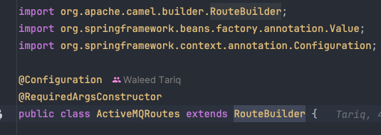


Now, let's look at how each route is defined. The `configure()` method is overridden to define the routes.

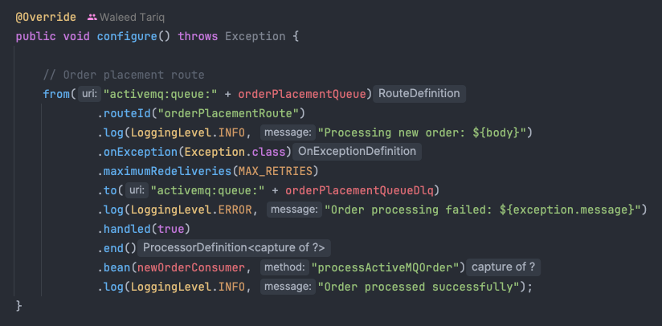
 
- The `from()` method is used to define the source of the messages. In this case, we are using `activemq:queue:amq.order.placement.queue` 
which means that the messages will be consumed from the `amq.order.placement.queue` queue.
- The `routeId()` method is used to define the ID of the route. This must be unique & is used for logging and debugging purposes.
- The `log()` method is used to log the messages that are consumed from the queue. This is useful for debugging purposes.
- The `onException()` method is used to define the error handling for the route. In this case, we have defined a 
`maximumRedeliveries(x)` policy which means that if the consumer encounters any Exception while processing the message, 
it will be retried 'x' times before it is sent to the DLQ (Dead Letter Queue).
- The `to()` method after `maximumRedeliveries(x)` is used to define the DLQ where the failed message should go. In this case,
we're telling Camel to send the message to `amq.order.placement.queue.dlq` queue.
- Then the `log()` method with **ERROR** level is used to log the message that is sent to the DLQ.
- The `handled()` method is used to mark the exception as handled. By default, Camel will keep retrying the message until it is
  successfully processed, or it is sent to the DLQ. By using `handled()`, we are telling Camel that we have handled the exception, 
  and it should not be retried anymore.
- The `end()` method is used to declare the end of `onException()` block.
- The `bean()` method is used to define the bean that will be used to process the message. In this case, we are pointing this route
to [NewOrderConsumer](../src/main/java/com/springboot/learning/kit/consumer/NewOrderConsumer.java) class. The second 
parameter is the method that will be called to process the message. In this case, we are using`processActiveMQOrder()` 
method of the `NewOrderConsumer` class.
- The last `log()` method is used to log the message that is processed by the consumer. This is useful for debugging purposes.


I hope this gives you a good understanding of how a Camel Route is configured for ActiveMQ in this project.


---

## **Order Placement Consumer**

Take a look at [NewOrderConsumer](../src/main/java/com/springboot/learning/kit/consumer/NewOrderConsumer.java) class, you'll see
that it's receiving a message of Type String and then it is converting it to `OrderRequest` object. This is done using
`ObjectMapper` class. We receive the message as a JSON string and then we convert it to `OrderRequest` object.

_**Note:** the `ObjectMapper` bean is configured in `JacksonConfig` class under `config` package. Without it, Spring won't
be able to initialize the `ObjectMapper` bean and you'll get a `NullPointerException`._

This consumer is passing the `OrderRequest` object to `OrderService` class which is responsible for processing the order.
Rest of the flow downstream is same as the one we implemented in `OrderController` class as the Controller & Consumer both
are using the same `OrderService` class.

## **Sending message to a Queue via ActiveMQ Web Console**

### **ActiveMQ Web Console**

Lookup [http://localhost:8161/admin/queues.jsp](http://localhost:8161/admin/queues.jsp) and login using `admin` username & password.
If your application is running currently, you should see a `1` active consumer next to `amq.order.placement.queue`. This means our Camel
Route is active and our application is ready to consume messages from this queue.

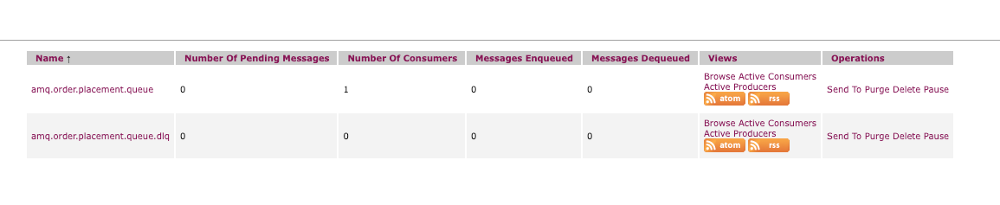

- `Number of Pending Messages` indicates the number of messages that are waiting to be consumed from the queue.
- `Number of Consumers` indicates the number of consumers that are currently consuming messages from the queue.
- `Messages Enqueued` indicates the number of messages that have been sent to the queue but have not yet been consumed.
- `Messages Dequeued` indicates the number of messages that have been consumed from the queue.

### **Sending a Message to the Queue**

On far right side, you should see a button called `Send To` under `Operations` column. Click on it & you'll see a form where you
can enter the message. 

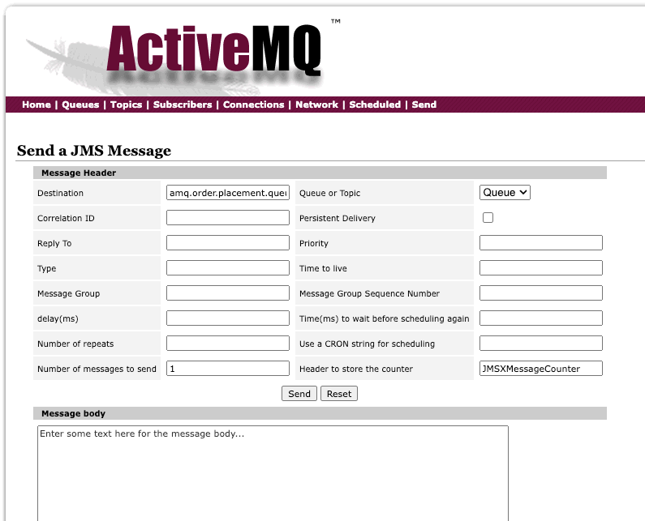

Now, copy the order request JSON from [NewOnlineOrder.json](../src/main/resources/payloads/NewOnlineOrder.json) file and paste it in
the `Message Body` section. Then click on `Send` button. This will send the message to the queue and it will be consumed by our application.

You should see that the `Messages Enqueued` & `Message Dequeued` counts have increased by `1`. This means that the message has been 
successfully consumed by our application.

### **Verifying the Message in Logs**

Open your application logs in IntelliJ and you should see the following logs:

```text
2025-04-18T19:59:21.240+01:00 ERROR 34262 --- [SpringBootLearningKit] [lacement.queue]] c.s.l.kit.consumer.NewOrderConsumer      : Received new ActiveMQ order message
Validating UUID: 12345
2025-04-18T19:59:21.249+01:00  INFO 34262 --- [SpringBootLearningKit] [lacement.queue]] c.s.l.k.processor.OnlineOrderProcessor   : Processing online order: 12345
Hibernate: insert into public.customer_details (email,name,phone) values (?,?,?)
Hibernate: insert into public.customer_address (city,country,state,street,zip_code) values (?,?,?,?,?)
2025-04-18T19:59:21.263+01:00  INFO 34262 --- [SpringBootLearningKit] [lacement.queue]] c.s.learning.kit.service.OrderService    : Saving new order: OrderRequest(UUID=12345, orderType=ONLINE, customerDetails=CustomerDetailsRequest(name=John Doe, email=john.doe@email.com, phone=+1234567890), customerAddress=CustomerAddressRequest(street=123 Main St, city=New York, state=NY, zipCode=10001, country=USA), orderItems=[OrderItemRequest(productId=1, quantity=2, pricePerUnit=29.99), OrderItemRequest(productId=2, quantity=1, pricePerUnit=49.99)], orderAmount=109.97, currency=USD)
Hibernate: insert into public.order (currency,customer_address_id,customer_details_id,order_created,order_type,total_amount,uuid) values (?,?,?,?,?,?,?)
Hibernate: insert into public.order_items (order_id,price_per_unit,product_id,quantity,status) values (?,?,?,?,?)
Hibernate: insert into public.order_items (order_id,price_per_unit,product_id,quantity,status) values (?,?,?,?,?)
2025-04-18T19:59:21.277+01:00  INFO 34262 --- [SpringBootLearningKit] [lacement.queue]] orderPlacementRoute                      : Order processed successfully

```

You can see the `Order processed successfully` log at very end. This log is inserted by Apache Camel as we saw in the route earlier.

### **Verifying the Order Status**

Furthermore, you can verify the order status by hitting the `order/status/{uuid}` endpoint. You should get following response which 
indicates that the order has been successfully processed and is in `PROCESSING` state.

```json
{
  "orderId": 12345,
  "orderType": "ONLINE",
  "items": [
    {
      "productId": 1,
      "quantity": 2,
      "status": "PROCESSING"
    },
    {
      "productId": 2,
      "quantity": 1,
      "status": "PROCESSING"
    }
  ]
}
```

---

## **Testing DLQ Functionality**

### **Simulating a Failure**

We know that our Application now throws a Duplicate Order Exception if we try to place an order with the same UUID. So,
we can use that to test if our DLQ route is correctly configured & working as expected.

We should see following behavior in the application:
- The first message will fail and will be retried `1` times (as configured in the `ActiveMQRoute`).
- After `1` retry, the message will be sent to the DLQ.
- The message will be logged in the application logs with `ERROR` level.
- The message will be removed from the queue and will not be processed again.
- The message will be available in the `amq.order.placement.queue.dlq` DLQ which we can verify through ActiveMQ Web Console.

### **Sending a Duplicate Order**

Once you publish the same payload that you used before, you should see following logs:

```text
2025-04-18T20:17:14.680+01:00 ERROR 34262 --- [SpringBootLearningKit] [lacement.queue]] c.s.l.kit.consumer.NewOrderConsumer      : Received new ActiveMQ order message
Validating UUID: 12345
2025-04-18T20:17:14.715+01:00  INFO 34262 --- [SpringBootLearningKit] [lacement.queue]] c.s.l.k.processor.OnlineOrderProcessor   : Processing online order: 12345
Hibernate: insert into public.customer_details (email,name,phone) values (?,?,?)
Hibernate: insert into public.customer_address (city,country,state,street,zip_code) values (?,?,?,?,?)
2025-04-18T20:17:14.751+01:00  INFO 34262 --- [SpringBootLearningKit] [lacement.queue]] c.s.learning.kit.service.OrderService    : Saving new order: OrderRequest(UUID=12345, orderType=ONLINE, customerDetails=CustomerDetailsRequest(name=John Doe, email=john.doe@email.com, phone=+1234567890), customerAddress=CustomerAddressRequest(street=123 Main St, city=New York, state=NY, zipCode=10001, country=USA), orderItems=[OrderItemRequest(productId=1, quantity=2, pricePerUnit=29.99), OrderItemRequest(productId=2, quantity=1, pricePerUnit=49.99)], orderAmount=109.97, currency=USD)
Hibernate: insert into public.order (currency,customer_address_id,customer_details_id,order_created,order_type,total_amount,uuid) values (?,?,?,?,?,?,?)
2025-04-18T20:17:14.784+01:00  WARN 34262 --- [SpringBootLearningKit] [lacement.queue]] o.h.engine.jdbc.spi.SqlExceptionHelper   : SQL Error: 0, SQLState: 23505
2025-04-18T20:17:14.785+01:00 ERROR 34262 --- [SpringBootLearningKit] [lacement.queue]] o.h.engine.jdbc.spi.SqlExceptionHelper   : ERROR: duplicate key value violates unique constraint "order_pkey"
  Detail: Key (uuid)=(12345) already exists.
2025-04-18T20:17:14.789+01:00 ERROR 34262 --- [SpringBootLearningKit] [lacement.queue]] c.s.learning.kit.service.OrderService    : Error saving order: 

org.hibernate.exception.ConstraintViolationException: could not execute statement [ERROR: duplicate key value violates unique constraint "order_pkey"
  Detail: Key (uuid)=(12345) already exists.] [insert into public.order (currency,customer_address_id,customer_details_id,order_created,order_type,total_amount,uuid) values (?,?,?,?,?,?,?)]
......
......
......
2025-04-18T20:17:14.828+01:00 ERROR 34262 --- [SpringBootLearningKit] [lacement.queue]] c.s.l.kit.consumer.NewOrderConsumer      : Failed to process ActiveMQ order message: {
......
......
......
}
```

After this, you will see same logs once more as the application is retrying the message.

```text
2025-04-18T20:17:15.844+01:00 ERROR 34262 --- [SpringBootLearningKit] [lacement.queue]] c.s.l.kit.consumer.NewOrderConsumer      : Received new ActiveMQ order message
Validating UUID: 12345
2025-04-18T20:17:15.848+01:00  INFO 34262 --- [SpringBootLearningKit] [lacement.queue]] c.s.l.k.processor.OnlineOrderProcessor   : Processing online order: 12345
Hibernate: insert into public.customer_details (email,name,phone) values (?,?,?)
Hibernate: insert into public.customer_address (city,country,state,street,zip_code) values (?,?,?,?,?)
2025-04-18T20:17:15.862+01:00  INFO 34262 --- [SpringBootLearningKit] [lacement.queue]] c.s.learning.kit.service.OrderService    : Saving new order: OrderRequest(UUID=12345, orderType=ONLINE, customerDetails=CustomerDetailsRequest(name=John Doe, email=john.doe@email.com, phone=+1234567890), customerAddress=CustomerAddressRequest(street=123 Main St, city=New York, state=NY, zipCode=10001, country=USA), orderItems=[OrderItemRequest(productId=1, quantity=2, pricePerUnit=29.99), OrderItemRequest(productId=2, quantity=1, pricePerUnit=49.99)], orderAmount=109.97, currency=USD)
Hibernate: insert into public.order (currency,customer_address_id,customer_details_id,order_created,order_type,total_amount,uuid) values (?,?,?,?,?,?,?)
2025-04-18T20:17:15.867+01:00  WARN 34262 --- [SpringBootLearningKit] [lacement.queue]] o.h.engine.jdbc.spi.SqlExceptionHelper   : SQL Error: 0, SQLState: 23505
2025-04-18T20:17:15.867+01:00 ERROR 34262 --- [SpringBootLearningKit] [lacement.queue]] o.h.engine.jdbc.spi.SqlExceptionHelper   : ERROR: duplicate key value violates unique constraint "order_pkey"
Detail: Key (uuid)=(12345) already exists.
2025-04-18T20:17:15.868+01:00 ERROR 34262 --- [SpringBootLearningKit] [lacement.queue]] c.s.learning.kit.service.OrderService    : Error saving order:

org.hibernate.exception.ConstraintViolationException: could not execute statement [ERROR: duplicate key value violates unique constraint "order_pkey"
.....
.....
.....
```

After this, you should see `1` `Number of Pending Messages` in the `amq.order.placement.queue.dlq`:

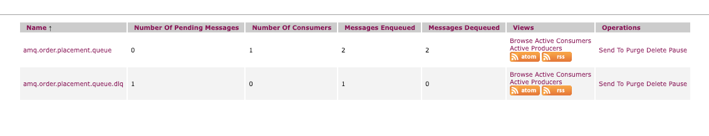

---

## **Creating a New Producer**

Now, let's look at how to create a new producer for the ActiveMQ. When it comes to producers, we do not need to create any
explicit routes like we did for the consumer.

### **Requirements**
Let's extend our order placement flow by adding a new producer which will send an event to a Virtual Topic to inform
downstream services that a new order has been placed. 

- Send a new order placed event when an `ONLINE` order is placed.
- The new producer should send an event to a Virtual Topic called `VirtualTopic.amq.new.order.placed.event`.
- Use `org.apache.camel.ProducerTemplate` to send the message to the Virtual Topic instead of `JmsTemplate`.
- The message should be sent once the order is saved successfully in the database & processed by our app.
- The event should look like this:
```json
{
  "orderId": 12345,
  "orderType": "ONLINE",
  "eventType": "ORDER_PLACED",
  "timestamp": "2025-04-18T20:17:15.868+01:00"
}
```

### **Implementation**
 
_**🚧 Try to implement all the requirements mentioned above on your own first**_

=======================================================================================

I'm going to share my approach with you now. First of all, I created a new package called `event` under `kit` package &
then created an `Enum` class called `OrderEventType` inside the new package. This enum will be used to define the event types
that we will be sending to the Virtual Topic. I've then created a new class called `OrderPlacedEvent.java` inside the same package.

**OrderEventType**

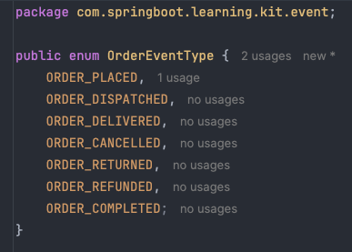

**OrderPlacedEvent**

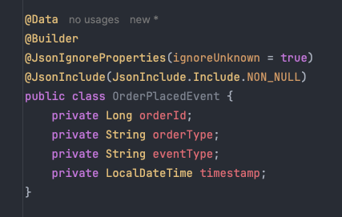


**Property File**

Then I added new property to `application.properties` file to define the Virtual Topic name which will be used by the new Producer

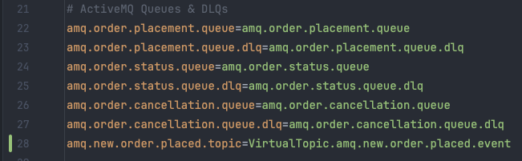


**OrderEventProducer**

_Note that I've used `ProducerTemplate` here and concatenated the `activemq:topic` in front of VirtualTopic name. This allows us
to send the message to the Virtual Topic using Apache Camel._

The `ProducerTemplate` works in following manner for a queue & topic:
- For Queue: `activemq:queue:<queueName>`
- For Topic: `activemq:topic:<VirtualTopic.topicName>`


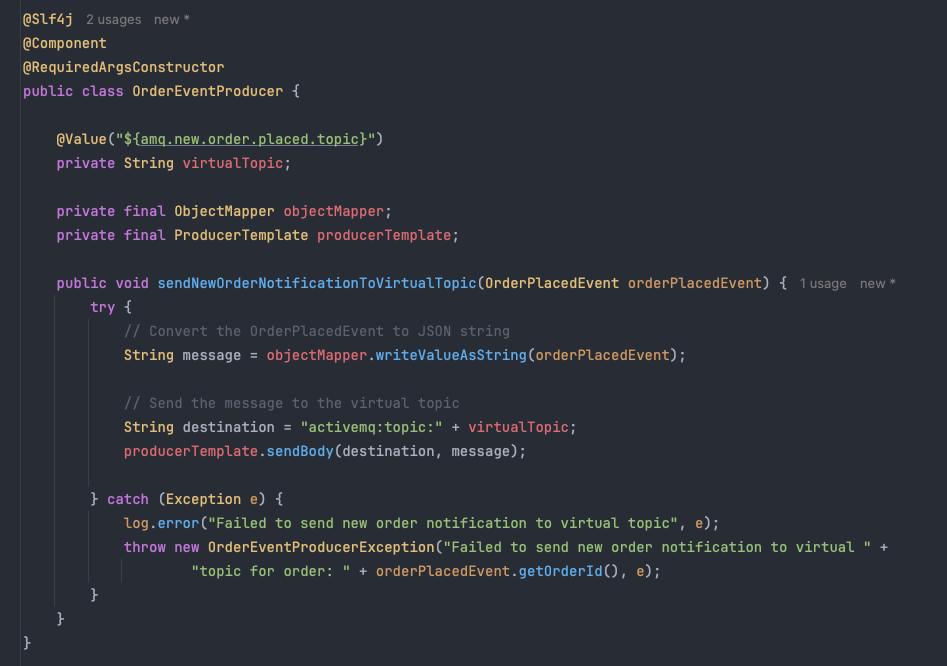

**OrderEventProducerException**

In the screenshot above, You can see that I've also created a new custom exception `OrderEventProducerException` for 
this producer. Right now, I'm not catching it anywhere, but it's good practice to have a custom exception to make 
error stack trace meaningful. 

**OrderEventTransformer**

Then I created a new class called `OrderEventTransformer` in `transformer` package which will be used to transform the `OrderRequest` object to `OrderPlacedEvent`.
This class will also be used to transform all sort of events for any other producer.

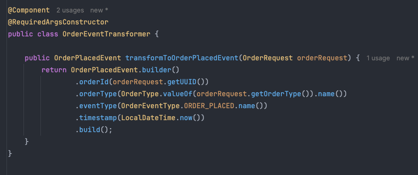

**OrderService**

Then, I added a new method in existing `OrderService` class which calls the new producer to send the event to the Virtual Topic.
This method uses the new transfomer class to generate the `OrderPlacedEvent` object and passes it down to the new Producer.


---

## **Time to Test**

Let's now test our new producer. You can use the same payload that we used before to place an order.

**Create the new Virtual Topic**

We'll need to manually create the Virtual Topic via ActiveMQ Web Console. Click on `Topics` tab and then use the `Create`
option to create the new Topic:

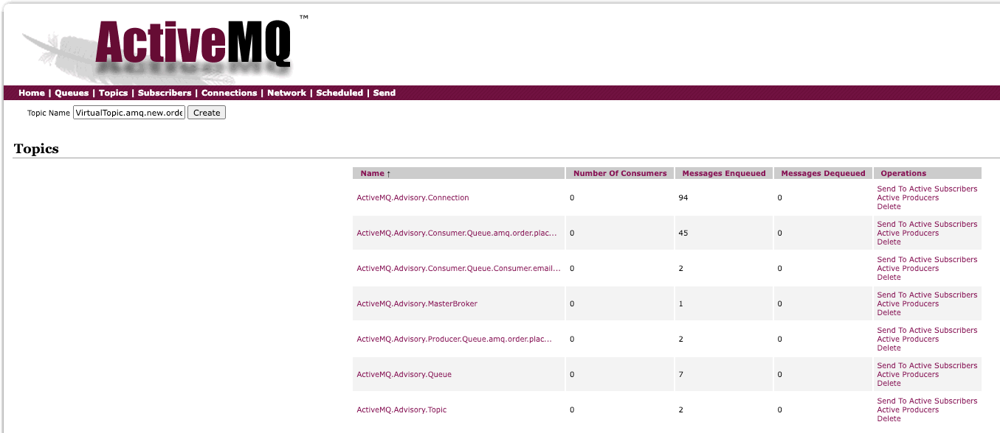

**Create the new queue**

For this test run, we'll manually create a queue called `Consumer.emailservice.VirtualTopic.amq.new.order.placed.event` 
in ActiveMQ Web Console.

You can use the `Create` option from the UI to do so:

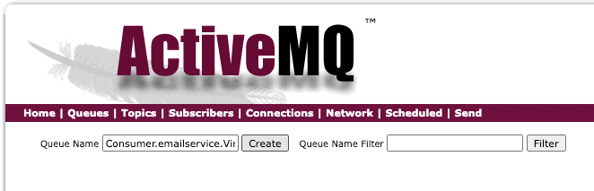

**Send the message to the queue**

Let's place a new order to trigger the OrderPlaced event. You can either do this via `order/submit` endpoint or by 
sending the message to order placement queue via ActiveMQ Web Console.

You should see that a new message have landed in our Queue which is listening to the Virtual Topic.

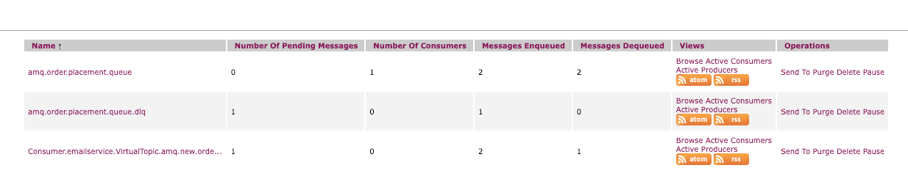

If you click on that queue, you can then open the message to view the payload to verify that the message is sent correctly.

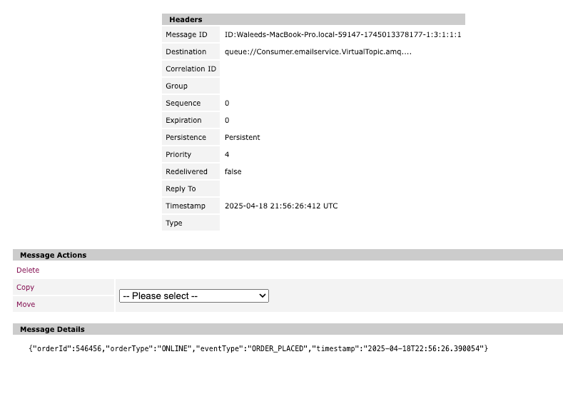


**Tada! You have successfully created a new producer for ActiveMQ using Apache Camel which publishes an update upon receiving 
a new message**.

---

## **Summary**

In this task, we have learned how to set up ActiveMQ in a production ready enterprise application. We have also learned how to
configure Camel Routes for ActiveMQ and how to consume messages from the queue. We have also learned how to send messages to a queue & topic
and how to test the DLQ functionality. 

_**Note:** In a Production Environment, it's possible that company have implemented restrictions on READ/WRITE access. So your
application will only be able to READ or WRITE messages to a queue for which it has access. ActiveMQ broker can be configured in
various different ways & it comes down to each enterprise on how they want to use it._
