# Task 5 ~ Working with RabbitMQ

This task will walk you through the process of setting up RabbitMQ for consumers & producers. There'll be some issues with 
the configuration that we will need to fix.

---

## ActiveMQ vs RabbitMQ

**Conceptual Difference**
- **ActiveMQ** follows a JMS-style model — queues for point-to-point, topics for pub-sub. Routing is simpler and abstracted.
- **RabbitMQ** uses Exchanges, which allow precise control over how messages are routed to queues.

Here's a simple diagram to illustrate the difference:

**ActiveMQ**
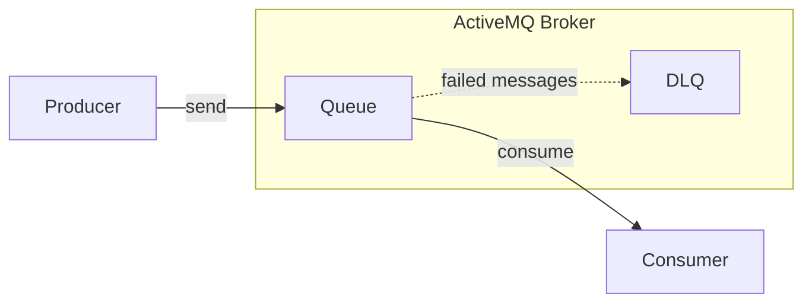

**RabbitMQ**

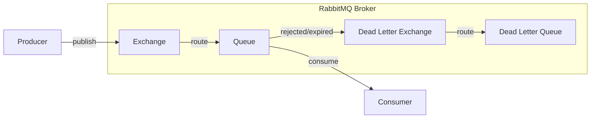

### **Why Exchanges are used in RabbitMQ?**

If you have not googled the Exchange in RabbitMQ yet, I'll give a simple explanation. An exchange in RabbitMQ is a
routing component that receives messages from producers and determines how to route them to queues. It uses routing
rules and bindings to decide where each message should go.

- **Flexibility**: Exchanges allow you to define complex routing rules. You can have multiple queues bound to the same 
exchange with different routing keys.
- **Decoupling**: Producers and consumers can be decoupled. Producers send messages to exchanges without knowing about the queues.
- **Multiple Routing Options**: RabbitMQ supports different types of exchanges (direct, topic, fanout, headers) for various routing needs.
- **Load Balancing**: Multiple consumers can consume from the same queue, allowing for load balancing.

---

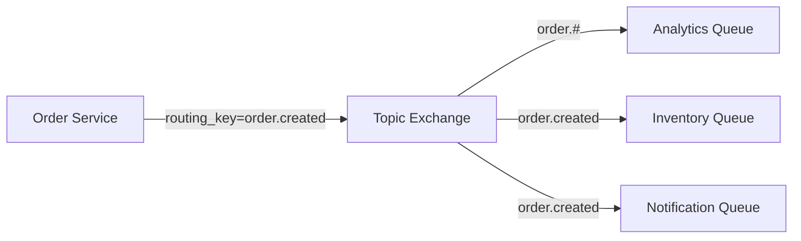

## **RabbitMQ Setup**

In previous task, we went through ActiveMQ setup with Apache Camel. RabbitMQ can also be
configured using Apache Camel. But for RabbitMQ, it has been configured using SpringBoot. The [RabbitMQConfig](../src/main/java/com/springboot/learning/kit/config/RabbitMQConfig.java) class is responsible for 
configuring RabbitMQ Connection. 

You can now look at [RabbitMQRoutes](../src/main/java/com/springboot/learning/kit/routes/RabbitMQRoutes.java) 
class to see how RabbitMQ is configured.  Currently, we've got one queue that is used by our application for HealthCheck purpose & another queue that is configured
for receiving new orders. Look at processRabbitMQOrder() method in [NewOrderConsumer](../src/main/java/com/springboot/learning/kit/consumer/NewOrderConsumer.java) 
class to see how the queue is configured with the method.

## **Consuming Order from RabbitMQ**

Now boot up the application and head over to the [RabbitMQ Management Console](http://localhost:15672/). You should be able
to see a single active consumer next to `rmq.order.placement.queue` queue. 


Click on the order placement queue to open the queue details. You should be able to see `Publish Message` section.
Paste the order json in the `Payload` and click on `Publish Message` button. This will publish the message to the queue.


You should be able to see following logs in your console. Your application should have consumed the message from the queue
and persist it into the Database. The consumer directs the message to same Order Processor that is used by the ActiveMQ
consumer.

```
2025-05-23T19:34:27.616+01:00 ERROR 66821 --- [SpringBootLearningKit] [ntContainer#0-1] c.s.l.kit.consumer.NewOrderConsumer      : Received new RabbitMQ order message
Validating UUID: 1234569999
2025-05-23T19:34:27.647+01:00  INFO 66821 --- [SpringBootLearningKit] [ntContainer#0-1] c.s.l.k.processor.OnlineOrderProcessor   : Processing online order: 1234569999
```

## **Fixing a bug in current RabbitMQ Configuration**

Goto RabbitMQ Management Console and place a duplicate order with same UUID. You will see that
your application threw an exception and fell into an infinite loop of retrying the duplicate order.

🔧 **You are encouraged to go ahead, find the bug in RabbitMQ configuration & fix it. I'll share a walkthrough of it below.**

Let's look at the RabbitMQRoutes class because that's where our binding for queue & dlq are defined. If you look closely at 
the method that binds the order placement queue, you'll see that we are using `EXCHANGE` variable for dead letter exchange.
This means, that when our consumer throws an exception, the message will be sent to a queue which is binded to the same exchange.

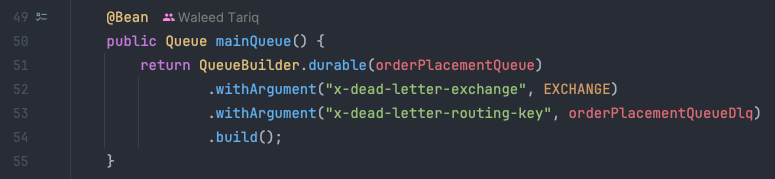

I can illustrate the problem with a simple diagram. You can see that the failed message will infinitely loop between the
application and the exchange. 
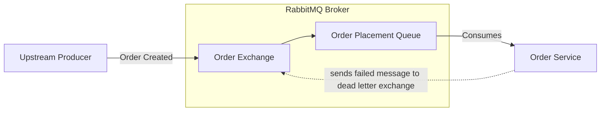

### **Solution**

We need to break this loop by pointing the message to correct dead letter exchange. Let's create a new variable in the
RabbitMQRoutes class.

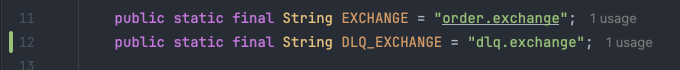

Now fix the incorrect binding in the method.

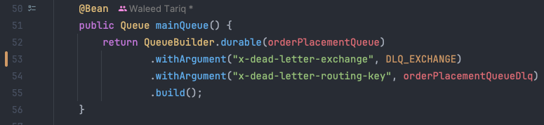

Now if you look at the `dlqBinding` method, you will see that we are binding the DLQ to the order `exchange`. This is wrong,
as it should be bound to the `dlqExchange` defined by the @Bean created above.

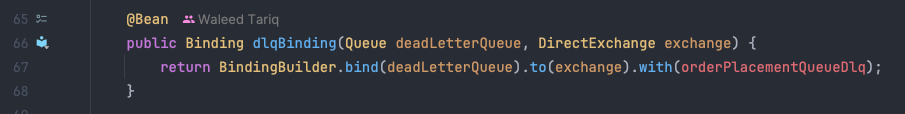

Let's change that to `dlqExchange` as well. Your config should look like this now.

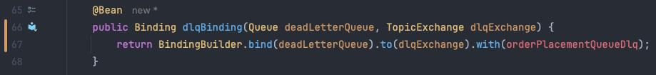


### **Time to Test our Changes**

1. Delete the existing `rmq.order.placement.queue` & `rmq.order.placement.queue.dlq`  from RabbitMQ Management Console.
   - This will also delete the exchanges defined for the queues.
2. Restart the application.
3. View your order placement queue and dlq on RabbitMQ Management Console. You should see the queues created with the correct bindings
   - 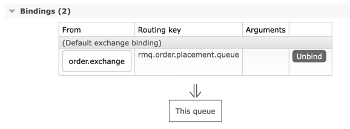 
   - 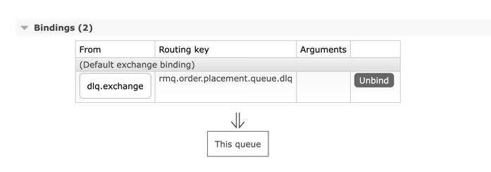
4. Publish a new order message with same UUID as before.
5. Check your logs.

Your problem is still not fixed, unfortunately. The message is still being sent to the same exchange. Let me explain why
this is happening despite the fact that we fixed the exchange mappings.

### **Automatic Re-queueing in RabbitMQ**
RabbitMQ has a feature called automatic re-queueing. This means that when a message is rejected or not acknowledged by 
a consumer, RabbitMQ will automatically re-queue the message and send it back to the original queue. 
This can lead to infinite loops if the consumer keeps rejecting the same message. 

**So, how do we fix this?**

There are two main ways to prevent infinite redelivery of failed messages in a Spring Boot RabbitMQ consumer:

1. **Throw `AmqpRejectAndDontRequeueException`** in your `@RabbitListener` method when processing fails.
   This signals to Spring and RabbitMQ that the message should be rejected and **not re-queued**.
   If the queue is configured with a Dead Letter Exchange (DLX), the message will be routed there.

2. **Use manual acknowledgment mode (`autoAck = false`) in low-level consumers**.
   This allows you to explicitly `ack()`, `nack()`, or `reject()` messages in your code.
   To send failed messages to the DLX, you must `nack()` or `reject()` them with `requeue = false`. 

For this task, we will use the first approach as it is simpler and more straightforward. Let's wrap the method body in 
a try-catch block and throw `AmqpRejectAndDontRequeueException` in the catch block. 

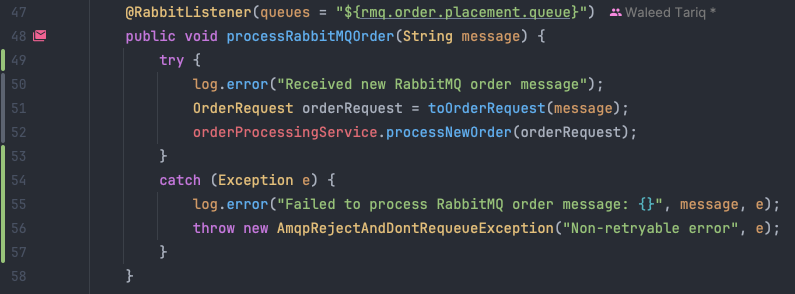

You can read more about this in the RabbitMQ documentation [Automatic Re-queueing](https://www.rabbitmq.com/docs/confirms#automatic-requeueing).

### **Let's Test Again**

1. Restart the application.
2. Publish a new order message with same UUID as before.
3. Check your logs. You should see error logs indicating that the message was rejected.
   
4. This time, you should see the message has been sent to the DLQ.
   - 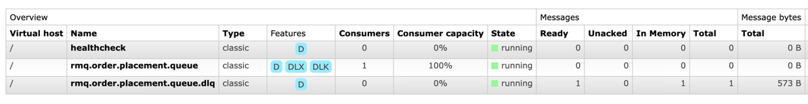


**Now we have a working RabbitMQ configuration with a dead letter exchange 🎉**

---

## **Publishing message to RabbitMQ**

Let's now look at how to publish messages to RabbitMQ. In case of ActiveMQ, we sent the message to a 
Virtual Topic so that multiple consumers can consume the same message. In RabbitMQ, we can achieve this by
sending the message to an exchange which is attached to multiple queues. It'll look something like this:

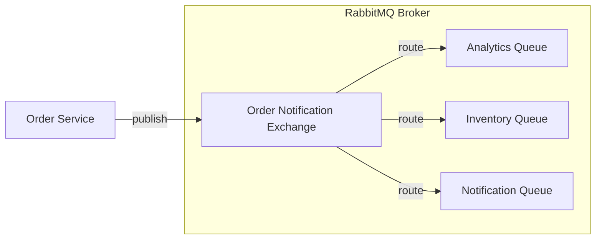

**This is what you need to do:**
1. Create a new `classic` queue called `rmq.new.order.notification.queue` through RabbitMQ Management Console. 
   - 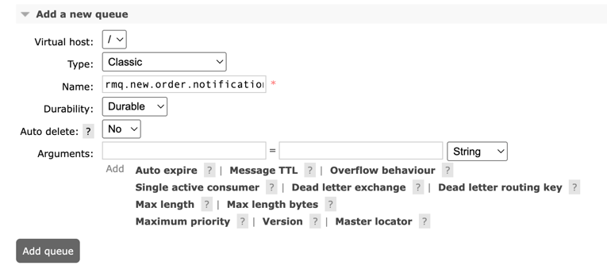
2. Open the queue and scroll down to the `Bindings` section. 
   - Enter the exchange `amq.topic` and routing key `order.notification` & hit the `Bind` button.
   - 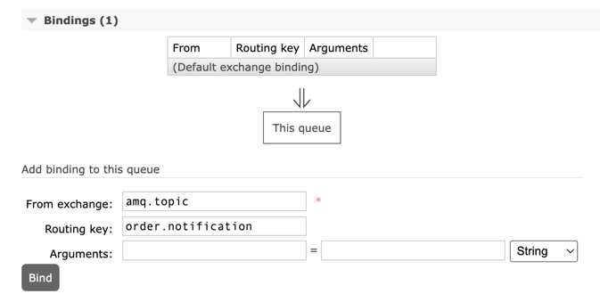
3. Create & import from `application.properties` in the `OrderEventProducer` class.
   - 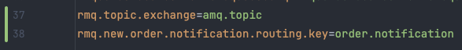
4. Create a new method in OrderEventProducer class that will publish messages to RabbitMQ.
   - 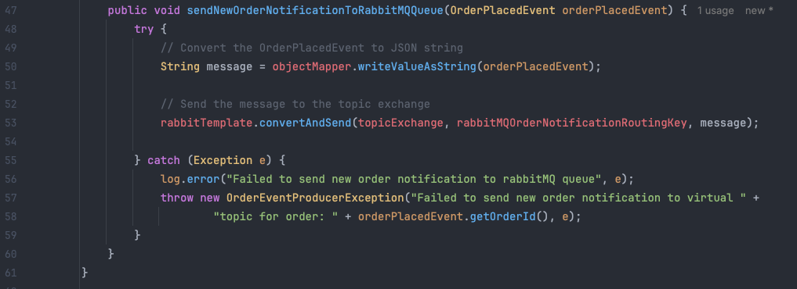
5. Call the producer method in `OrderService::PublishOrderPlacedEvent` as we did for ActiveMQ.
6. Hit the Order Placement endpoint with a new order.
7. Verify that the event is published to RabbitMQ and the message reaches the newly created queue.
   - 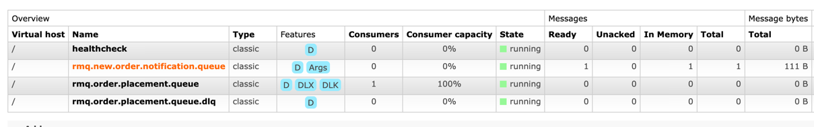
   - This is the message that was published to the queue.
   - 

### **Decoupling the Producer from the Consumer**
What we have just done is a very important concept in RabbitMQ. The producer does not need to know about the queues or consumers.
Our application is simply publishing the message to the exchange with a routing key. The exchange is responsible for 
routing the message to the correct queues based on the routing key.

You can go ahead and create as many queues as you want and bind them to same `amq.topic` exchange with `order.notification`
routing key. One message published by the application will be distributed to all the queues that you would have set up.

## **Bonus Task**
The RabbitMQ Routes are currently configured in not an optimal way. Imagine if we need to add few more
queues, it would become an absolute mess. You can refactor the routes to use a single method which will
remove redundancy and make it easier to add new queues. If you'd like to, you can go ahead and do it.

## **Conclusion**
In this task, we went through the process of setting up RabbitMQ for consumers & producers. 
We also fixed a bug in the configuration that was causing infinite redelivery of failed messages.
We also created a new queue and published messages to it. I hope that this task has helped you understand
RabbitMQ better and how it works with Spring Boot.

