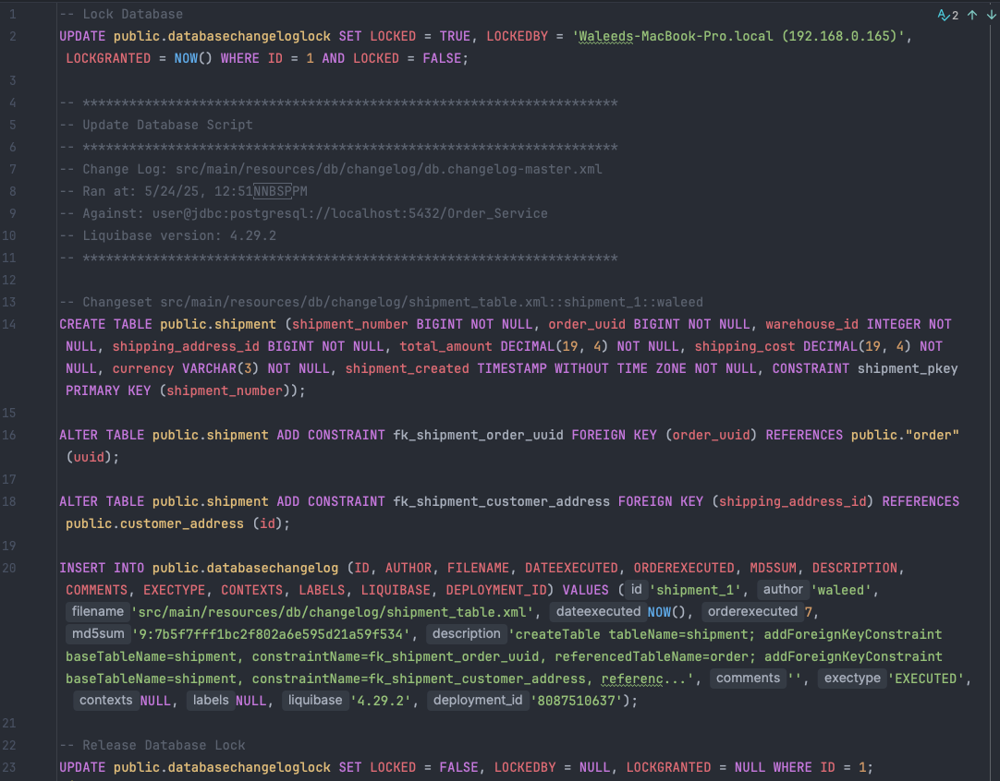

# Task 5 ~ Database Schema Migration

Flyway and Liquibase are two industry standard tools for database schema migration. In this task, we will be using 
Liquibase to manage our database schema changes.

This task will walk you through the process of adding new tables or making changes to existing tables in a 
production database. You will also learn how to use Liquibase to roll back changes. Lastly,
we'll also look into how we can optimise our application to ensure minimum calls to the database.

---

## **Task 1: Adding a New Table**

Let's start by creating a new table in our database. This table will be used to store information about shipments. Head over
to [changelog](../src/main/resources/db/changelog) and create a new file named `shipment_table.xml`. This file
will contain the changeset for creating the shipment table that Liquibase will apply to the database.

```xml
<?xml version="1.0" encoding="UTF-8"?>
<databaseChangeLog
        xmlns="http://www.liquibase.org/xml/ns/dbchangelog"
        xmlns:xsi="http://www.w3.org/2001/XMLSchema-instance"
        xsi:schemaLocation="http://www.liquibase.org/xml/ns/dbchangelog
        http://www.liquibase.org/xml/ns/dbchangelog/dbchangelog-4.17.xsd">

    <changeSet id="shipment_1" author="waleed">
        <createTable tableName="shipment">
            <column name="shipment_number" type="BIGINT">
                <constraints primaryKey="true" nullable="false"/>
            </column>
            <column name="order_uuid" type="BIGINT">
                <constraints nullable="false"/>
            </column>
            <column name="warehouse_id" type="INT">
                <constraints nullable="false"/>
            </column>
            <column name="shipping_address_id" type="BIGINT">
                <constraints nullable="false"/>
            </column>
            <column name="total_amount" type="DECIMAL(19,4)">
                <constraints nullable="false"/>
            </column>
            <column name="shipping_cost" type="DECIMAL(19,4)">
                <constraints nullable="false"/>
            </column>
            <column name="currency" type="VARCHAR(3)">
                <constraints nullable="false"/>
            </column>
            <column name="shipment_created" type="TIMESTAMP">
                <constraints nullable="false"/>
            </column>
        </createTable>

        <addForeignKeyConstraint
                baseTableName="shipment"
                baseColumnNames="order_uuid"
                referencedTableName="order"
                referencedColumnNames="uuid"
                constraintName="fk_shipment_order_uuid"/>

        <addForeignKeyConstraint
                baseTableName="shipment"
                baseColumnNames="shipping_address_id"
                referencedTableName="customer_address"
                referencedColumnNames="id"
                constraintName="fk_shipment_customer_address"/>

        <!--   This section helps Liquibase generate rollback SQL  -->
        <rollback>
            <dropTable tableName="shipment"/>
        </rollback>
        
    </changeSet>

</databaseChangeLog>
```

This changeset will result in following changes to the database:
- Creates a table named shipment.
- Columns in shipment:
  - `shipment_number` (BIGINT, primary key, not null)
  - `order_uuid` (BIGINT, not null, foreign key to order.uuid)
  - `warehouse_id` (INT, not null)
  - `shipping_address_id` (BIGINT, not null, foreign key to customer_address.id)
  - `total_amount` (DECIMAL(19,4), not null)
  - `shipping_cost` (DECIMAL(19,4), not null)
  - `currency` (VARCHAR(3), not null)
  - `shipment_created` (TIMESTAMP, not null)
- Adds foreign key constraints:
  - `order_uuid` references `order(uuid)`
  - `shipping_address_id` references `customer_address(id)`


### Import new changeset to Changelog Master

To apply this changeset, you need to import it into the [db.changelog-master.xml](../src/main/resources/db/changelog/db.changelog-master.xml) 
file. Open the file and add the following line:


### Generate SQL using Liquibase

First, we'll generate the SQL to create new table using Liquibase.

1. Make sure your database instance is running locally.
2. Open a terminal and navigate to the root directory of the project.
3. Run the following command to generate the SQL:
   - `./gradlew updateSQL`
   - Look at your terminal & see if you can see following log:
   - `[2025-05-24 12:51:50] INFO [liquibase.ui] Output saved to src/main/resources/db/Migrate.sql`
   - Most likely you cannot find it in your terminal because we are missing a configuration in our `build.gradle` file.
4. Scroll down to `liquibase` section and insert the `outputFile` property as shown below:
```groovy
// This configures Liquibase for our Project. Without this, ./gradlew update commands will not work 
liquibase {
	activities {
		main {
			changeLogFile 'src/main/resources/db/changelog/db.changelog-master.xml'
			url 'jdbc:postgresql://localhost:5432/Order_Service'
			username 'user'
			password 'password'
			driver 'org.postgresql.Driver'
			outputFile 'src/main/resources/db/Migrate.sql'
		}
	}
	runList = 'main'
}
```
5. Now, run the command again:
   - `./gradlew updateSQL`
   - You should see following log in your terminal:
   - `[2025-05-24 12:51:50] INFO [liquibase.ui] Output saved to src/main/resources/db/Migrate.sql`

** Verify the SQL file **

Your [Migrate.sql](../src/main/resources/db/Migrate.sql) file should now contain the SQL statements to create the
shipment table 🎉. Open the file and verify that it contains the following SQL.




### Create Rollback SQL 

We also need to create a rollback SQL so that in case if things go wrong, we can roll back the schema changes that
we have made in our database. 

---

## **Task 2: Adding a New Column**


---

## **Task 3: Optimising existing code**


---

## **Bonus Task**


---


## **Conclusion**


---