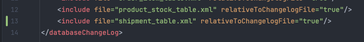
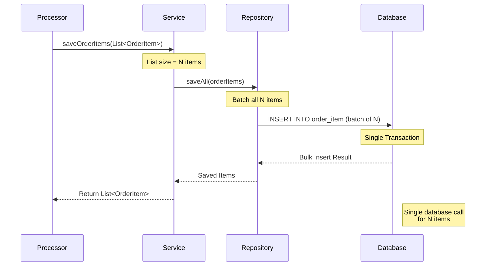

# Task 5 ~ Database Schema Migration

Flyway and Liquibase are two industry standard tools for database schema migration. In this task, we will be using 
Liquibase to manage our database schema changes.

This task will walk you through the process of adding new tables or making changes to existing tables in a 
production database. You will also learn how to use Liquibase to roll back changes. Lastly,
we'll also look into how we can optimise our application to ensure minimum calls to the database.

---

## **Task 1: Adding a New Table**

Let's start by creating a new table in our database. This table will be used to store information about shipments. Head over
to [changelog](../src/main/resources/db/changelog) and create a new file named `shipment_table.xml`. This file
will contain the changeset for creating the shipment table that Liquibase will apply to the database.

```xml
<?xml version="1.0" encoding="UTF-8"?>
<databaseChangeLog
        xmlns="http://www.liquibase.org/xml/ns/dbchangelog"
        xmlns:xsi="http://www.w3.org/2001/XMLSchema-instance"
        xsi:schemaLocation="http://www.liquibase.org/xml/ns/dbchangelog
        http://www.liquibase.org/xml/ns/dbchangelog/dbchangelog-4.17.xsd">

    <changeSet id="shipment_1" author="waleed">
        <createTable tableName="shipment">
            <column name="shipment_number" type="BIGINT">
                <constraints primaryKey="true" nullable="false"/>
            </column>
            <column name="order_uuid" type="BIGINT">
                <constraints nullable="false"/>
            </column>
            <column name="warehouse_id" type="INT">
                <constraints nullable="false"/>
            </column>
            <column name="shipping_address_id" type="BIGINT">
                <constraints nullable="false"/>
            </column>
            <column name="total_amount" type="DECIMAL(19,4)">
                <constraints nullable="false"/>
            </column>
            <column name="shipping_cost" type="DECIMAL(19,4)">
                <constraints nullable="false"/>
            </column>
            <column name="currency" type="VARCHAR(3)">
                <constraints nullable="false"/>
            </column>
            <column name="shipment_created" type="TIMESTAMP">
                <constraints nullable="false"/>
            </column>
        </createTable>

        <addForeignKeyConstraint
                baseTableName="shipment"
                baseColumnNames="order_uuid"
                referencedTableName="order"
                referencedColumnNames="uuid"
                constraintName="fk_shipment_order_uuid"/>

        <addForeignKeyConstraint
                baseTableName="shipment"
                baseColumnNames="shipping_address_id"
                referencedTableName="customer_address"
                referencedColumnNames="id"
                constraintName="fk_shipment_customer_address"/>

        <!--   This section helps Liquibase generate rollback SQL  -->
        <rollback>
            <dropTable tableName="shipment"/>
        </rollback>
        
    </changeSet>

</databaseChangeLog>
```

This changeset will result in following changes to the database:
- Creates a table named shipment.
- Columns in shipment:
  - `shipment_number` (BIGINT, primary key, not null)
  - `order_uuid` (BIGINT, not null, foreign key to order.uuid)
  - `warehouse_id` (INT, not null)
  - `shipping_address_id` (BIGINT, not null, foreign key to customer_address.id)
  - `total_amount` (DECIMAL(19,4), not null)
  - `shipping_cost` (DECIMAL(19,4), not null)
  - `currency` (VARCHAR(3), not null)
  - `shipment_created` (TIMESTAMP, not null)
- Adds foreign key constraints:
  - `order_uuid` references `order(uuid)`
  - `shipping_address_id` references `customer_address(id)`


### Import new changeset to Changelog Master

To apply this changeset, you need to import it into the [db.changelog-master.xml](../src/main/resources/db/changelog/db.changelog-master.xml) 
file. Open the file and add the following line:



### Generate SQL using Liquibase

First, we'll generate the SQL to create new table using Liquibase.

1. Make sure your database instance is running locally.
2. Open a terminal and navigate to the root directory of the project.
3. Run the following command to generate the SQL:
   - `./gradlew updateSQL`
   - Look at your terminal & see if you can see following log:
   - `[2025-05-24 12:51:50] INFO [liquibase.ui] Output saved to src/main/resources/db/Migrate.sql`
   - Most likely you cannot find it in your terminal because we are missing a configuration in our `build.gradle` file.
4. Scroll down to `liquibase` section and insert the `outputFile` property as shown below:
```groovy
// This configures Liquibase for our Project. Without this, ./gradlew update commands will not work 
liquibase {
	activities {
		main {
			changeLogFile 'src/main/resources/db/changelog/db.changelog-master.xml'
			url 'jdbc:postgresql://localhost:5432/Order_Service'
			username 'user'
			password 'password'
			driver 'org.postgresql.Driver'
			outputFile 'src/main/resources/db/Migrate.sql'
		}
	}
	runList = 'main'
}
```
5. Now, run the command again:
   - `./gradlew updateSQL`
   - You should see following log in your terminal:
   - `[2025-05-24 12:51:50] INFO [liquibase.ui] Output saved to src/main/resources/db/Migrate.sql`


**Verify the SQL file**

Your [Migrate.sql](../src/main/resources/db/Migrate.sql) file should now contain the SQL statements to create the
shipment table 🎉. Open the file and verify that it contains the following SQL.

```sql
-- Lock Database
UPDATE public.databasechangeloglock SET LOCKED = TRUE, LOCKEDBY = 'localhost (192.168.0.165)', LOCKGRANTED = NOW() WHERE ID = 1 AND LOCKED = FALSE;

-- *********************************************************************
-- Update Database Script
-- *********************************************************************
-- Change Log: src/main/resources/db/changelog/db.changelog-master.xml
-- Ran at: 5/25/25, 8:06 PM
-- Against: user@jdbc:postgresql://localhost:5432/Order_Service
-- Liquibase version: 4.29.2
-- *********************************************************************

-- Changeset src/main/resources/db/changelog/shipment_table.xml::shipment_1::waleed
CREATE TABLE public.shipment (shipment_number BIGINT NOT NULL, order_uuid BIGINT NOT NULL, warehouse_id INTEGER NOT NULL, shipping_address_id BIGINT NOT NULL, total_amount DECIMAL(19, 4) NOT NULL, shipping_cost DECIMAL(19, 4) NOT NULL, currency VARCHAR(3) NOT NULL, shipment_created TIMESTAMP WITHOUT TIME ZONE NOT NULL, CONSTRAINT shipment_pkey PRIMARY KEY (shipment_number));

ALTER TABLE public.shipment ADD CONSTRAINT fk_shipment_order_uuid FOREIGN KEY (order_uuid) REFERENCES public."order" (uuid);

ALTER TABLE public.shipment ADD CONSTRAINT fk_shipment_customer_address FOREIGN KEY (shipping_address_id) REFERENCES public.customer_address (id);

INSERT INTO public.databasechangelog (ID, AUTHOR, FILENAME, DATEEXECUTED, ORDEREXECUTED, MD5SUM, DESCRIPTION, COMMENTS, EXECTYPE, CONTEXTS, LABELS, LIQUIBASE, DEPLOYMENT_ID) VALUES ('shipment_1', 'waleed', 'src/main/resources/db/changelog/shipment_table.xml', NOW(), 7, '9:7b5f7fff1bc2f802a6e595d21a59f534', 'createTable tableName=shipment; addForeignKeyConstraint baseTableName=shipment, constraintName=fk_shipment_order_uuid, referencedTableName=order; addForeignKeyConstraint baseTableName=shipment, constraintName=fk_shipment_customer_address, referenc...', '', 'EXECUTED', NULL, NULL, '4.29.2', '8199962613');

-- Release Database Lock
UPDATE public.databasechangeloglock SET LOCKED = FALSE, LOCKEDBY = NULL, LOCKGRANTED = NULL WHERE ID = 1;


```


### 🔄 Create Rollback SQL 

We also need to create a rollback SQL so that in case if things go wrong, we can roll back the schema changes that
we have made in our database. 

1. Run the following command to generate the rollback SQL for most recent changeset count specified:
   - `./gradlew rollbackCountSQL -PliquibaseCommandValue=1`
2. Your `Migrate.sql` file should now contain the rollback SQL which you can run on test & production databases to 
    safely roll back the changes made by the most recent changeset.
```sql
-- Lock Database
UPDATE public.databasechangeloglock SET LOCKED = TRUE, LOCKEDBY = 'localhost (192.168.0.165)', LOCKGRANTED = NOW() WHERE ID = 1 AND LOCKED = FALSE;

-- *********************************************************************
-- Rollback 1 Change(s) Script
-- *********************************************************************
-- Change Log: src/main/resources/db/changelog/db.changelog-master.xml
-- Ran at: 5/25/25, 7:58 PM
-- Against: user@jdbc:postgresql://localhost:5432/Order_Service
-- Liquibase version: 4.29.2
-- *********************************************************************

-- Rolling Back ChangeSet: src/main/resources/db/changelog/shipment_table.xml::shipment_1::waleed
DROP TABLE public.shipment;

DELETE FROM public.databasechangelog WHERE ID = 'shipment_1' AND AUTHOR = 'waleed' AND FILENAME = 'src/main/resources/db/changelog/shipment_table.xml';

-- Release Database Lock
UPDATE public.databasechangeloglock SET LOCKED = FALSE, LOCKEDBY = NULL, LOCKGRANTED = NULL WHERE ID = 1;
```

---

## **Task 2: Improving Liquibase Configuration**

Currently, the liquibase configuration is stored in the `build.gradle` file. This is not ideal for production environments, 
as it can lead to issues with version control and deployment. We can move this config to its dedicated file i.e.
`liquibase.properties`. This file will contain the configuration for Liquibase, including the database connection details.

1. Create a new file named `liquibase.properties` in the `src/main/resources/liquibase` directory.
2. Add the following configuration to the `liquibase.properties` file:

```properties
# Database connection settings
changelog-file=src/main/resources/db/changelog/db.changelog-master.xml
url=jdbc:postgresql://localhost:5432/Order_Service
username=user
password=password
driver=org.postgresql.Driver

# Output file locations
outputFile=src/main/resources/db/Migrate.sql
```
3. Now, we need to update the `build.gradle` file to use this new configuration file. 
   Replace the properties from `liquibase` section with following line:

```groovy
liquibase {
    activities {
        main {
            defaultsFile 'src/main/resources/liquibase/liquibase.properties'
        }
    }
    runList = 'main'
}
```

4. Now run `./gradlew updateSQL` command again and verify that the SQL file is generated successfully.

** _You can also create each liquibase.properties file per environment but make sure that you do not
hardcode the credentials for test & production environment_ **

---

## **Task 3: Optimising existing code**

Enough with the new table and configuration, let's now look into how we can optimise our existing code to ensure that 
we are not making unnecessary calls to the database. When working in a high traffic production environment, we need to ensure
that we are processing the requests quickly and efficiently. Sometimes, we might end up making unnecessary calls to the 
database which can lead to performance issues.

### **Fixing the existing code**

Navigate to [AbstractOrderProcessor](../src/main/java/com/springboot/learning/kit/processor/AbstractOrderProcessor.java) class. 
The `saveOrder()` method is responsible for saving the order details to the database. If you look at the code for persisting
order items, you will see that we are making a call to the database for each order item. (IntelliJ is probably 
showing you a warning ⚠️ for this too)

The issue with this code is that, if the customer places an order with hundred or thousand items, we will end up making
hundred or thousand calls to the database to save each order item. This is not efficient and can lead to performance issues.

```java
public void saveOrderItems(List<OrderItemRequest> orderItem, long orderUUID) {
        List<OrderItem> orderItemEntities = orderTransformer.transformOrderItemRequestToDomain(orderItem, orderUUID);
        for (OrderItem orderItemEntity : orderItemEntities) {
            orderItemRepository.save(orderItemEntity);
        }
    }
```

This problem can be visualised in the following sequence diagram:

```mermaid
sequenceDiagram
    participant C as Processor
    participant S as Service
    participant R as Repository
    participant DB as Database

    C->>S: saveOrderItems(List<OrderItem>)
    Note over S: List size = N items

    rect rgb(0, 0, 0)
        Note right of S: Loop N times
        S->>R: save(orderItem1)
        R->>DB: INSERT INTO order_item
        DB-->>R: Result
        R-->>S: Saved Item
        
        S->>R: save(orderItem2)
        R->>DB: INSERT INTO order_item
        DB-->>R: Result
        R-->>S: Saved Item

        Note over S,DB: ... N more calls ...

        S->>R: save(orderItemN)
        R->>DB: INSERT INTO order_item
        DB-->>R: Result
        R-->>S: Saved Item
    end

    S-->>C: Saved Items List
```




**🔨 Solution**

As we are using Spring Data JPA, we can use the `saveAll()` method to save all the order items in a single call to the database.
This will create a batch `insert` query which is much more efficient than making individual calls for each order item. While this
might not seem like a big deal at first, I've seen this issue in production where the application was hammering the database
with thousands of calls to save each order item, leading to performance issues and timeouts. 

```java
    public void saveOrderItems(List<OrderItemRequest> orderItem, long orderUUID) {
        List<OrderItem> orderItemEntities = orderTransformer.transformOrderItemRequestToDomain(orderItem, orderUUID);
        orderItemRepository.saveAll(orderItemEntities);
    }
```

Following is the updated sequence diagram which shows how we are now making a single call to the database to save all 
the order items.




---

## **Bonus Task**

- Create a new ChangeSet in Shipment Table to add a new column `tracking_number` of type `VARCHAR(50)` to the shipment table.

---


## **Conclusion**

In this task, we learned how liquibase is configured in a SpringBoot Application with Gradle & how developers use 
Liquibase to manage database schemas & rollout and rollback these changes safely on production environments. We created
a new table, generated SQL for the changes, and created rollback SQL. 
We also improved the Liquibase configuration by moving it to a dedicated properties file. 
Lastly, we fixed the existing code to ensure that we are not making unnecessary calls to the database.

---