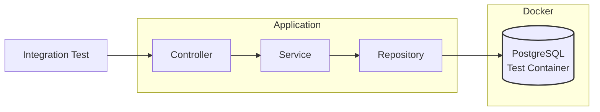

# Task 7 ~ Unit and Integration Tests

Unit and integration tests are fundamental pillars for building production-ready applications. 
Unit tests verify individual components in isolation, ensuring each service, controller, or utility class functions 
correctly at the most granular level. Integration tests, on the other hand, validate how different components interact 
within the Spring context, including database operations, REST endpoints, and message queues. In a production 
environment, where downtime can lead to significant business impact

In this task, we'll work with following tools & techniques:

- **JUnit**: A widely used testing framework for Java applications.
- **Mockito**: A mocking framework that allows you to create mock objects for testing.
- **Spring Test**: Provides support for testing Spring components, including loading the application context and 
injecting dependencies.
- **TestContainers**: A library that allows you to run Docker containers for integration tests, ensuring a consistent
environment.
- **Snapshot Testing**: A technique for capturing the output of a component and comparing it against a stored snapshot to 
ensure consistency.
- **AssertJ**: A fluent assertion library that provides a rich set of assertions for testing.

---

## Test Folder Structure

Our test structure follows a clear separation between unit tests, integration tests, and shared test configurations:

```
src/
└── test/
    ├── java/
    │   └── com/springboot/learning/kit/
    │       ├── config/               # Shared test configurations
    │       │   └── TestContainersConfig.java
    │       ├── integration/          # Integration tests
    │       │   └── HealthCheckIT.java
    │       └── unit/                # Unit tests
    │           └── SampleUnitTest.java
    └── resources/
        └── application-test.properties   # Test-specific properties
```

---

## Unit Tests

Unit tests focus on verifying individual components of the application—such as services, controllers, or utility 
classes—in complete isolation from their dependencies. By using mocking frameworks like Mockito, unit tests replace 
real dependencies with mock objects, ensuring that only the logic within the component under test is exercised. This 
approach helps quickly identify logic errors, enforces correct behavior at the smallest level, and provides fast 
feedback during development.

**Unit tests are essential for:**

- Validating business logic in isolation
- Catching regressions early
- Enabling safe refactoring
- Ensuring high code quality


---

## Integration Tests

Integration tests verify how different parts of the application work together in a real or production-like environment. 
While unit tests focus on isolated components, integration tests ensure that multiple components (controllers, services, 
repositories, and external systems) interact correctly as a whole.


### Integration Test Request Flow
This diagram illustrates how integration tests interact with the Spring application context and real dependencies
(like databases or message brokers) provisioned by Testcontainers during test execution.



---


## **Conclusion**


---
