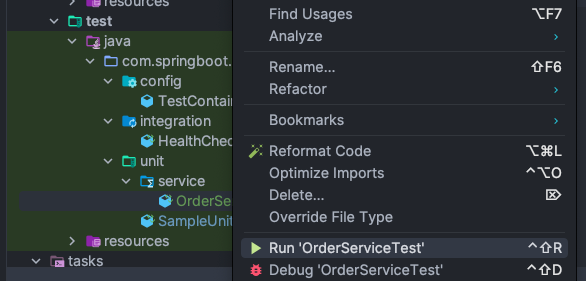
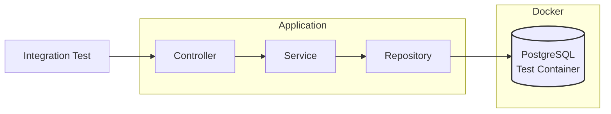

# Task 7 ~ Unit and Integration Tests

Unit and integration tests are fundamental pillars for building production-ready applications. 
Unit tests verify individual components in isolation, ensuring each service, controller, or utility class functions 
correctly at the most granular level. Integration tests, on the other hand, validate how different components interact 
within the Spring context, including database operations, REST endpoints, and message queues. In a production 
environment, where downtime can lead to significant business impact

In this task, we'll work with following tools & techniques:

- **JUnit**: A widely used testing framework for Java applications.
- **Mockito**: A mocking framework that allows you to create mock objects for testing.
- **Spring Test**: Provides support for testing Spring components, including loading the application context and 
injecting dependencies.
- **TestContainers**: A library that allows you to run Docker containers for integration tests, ensuring a consistent
environment.
- **Snapshot Testing**: A technique for capturing the output of a component and comparing it against a stored snapshot to 
ensure consistency.
- **AssertJ**: A fluent assertion library that provides a rich set of assertions for testing.

---

## Test Folder Structure

I've already added some basic unit & integration tests, the TestContainers are also configured in [TestContainersConfig.java](../src/test/java/com/springboot/learning/kit/config/TestContainersConfig.java) class.
Our test structure follows a clear separation between unit tests, integration tests, and shared test configurations:

```
src/
└── test/
    ├── java/
    │   └── com/springboot/learning/kit/
    │       ├── config/               # Shared test configurations
    │       │   └── TestContainersConfig.java
    │       ├── integration/          # Integration tests
    │       │   └── HealthCheckIT.java
    │       └── unit/                # Unit tests
    │           └── SampleUnitTest.java
    └── resources/
        └── application-test.properties   # Test-specific properties
```

---

## Unit Tests

Unit tests focus on verifying individual components of the application—such as services, controllers, or utility 
classes—in complete isolation from their dependencies. By using mocking frameworks like Mockito, unit tests replace 
real dependencies with mock objects, ensuring that only the logic within the component under test is exercised. This 
approach helps quickly identify logic errors, enforces correct behavior at the smallest level, and provides fast 
feedback during development.

**Unit tests are essential for:**

- Validating business logic in isolation
- Catching regressions early
- Enabling safe refactoring
- Ensuring high code quality

### Time to write a Unit Test

**Creating Test Class:**
1. Create a new package named `service` under `src/test/java/com/springboot/learning/kit/unit`.
2. Create a new class named `OrderServiceTest.java` under the new package.
3. We'll write a unit test for the `saveNewOrder()` method in the `OrderService` class.
4. You can use `SampleUnitTest.java` as a reference but we'll need to add a lot more stuff for this one.

**Injecting Dependencies:**
1. Navigate to [OrderService.java](../src/main/java/com/springboot/learning/kit/service/OrderService.java).
2. You'll see that the `saveNewOrder()` is using instances of `OrderTransformer` and `EntityManager` to perform its 
   operations.
3. To test `OrderService`, we need to mock these dependencies using Mockito.
4. Add the following annotations to your test class:
   ```java
    @ExtendWith(MockitoExtension.class) // Enables Mockito annotations
    ```
5. Use `@Mock` to create mock instances of `OrderTransformer` and `EntityManager`, and use `@InjectMocks` 
   to inject these mocked instances into the `OrderService` instance.
6. Your class should look something like this:
    ```java
    @ExtendWith(MockitoExtension.class)
    class OrderServiceTest {
    
        @Mock
        private OrderTransformer orderTransformer;
        
        @Mock
        private EntityManager entityManager;
        
        @InjectMocks
        private OrderService orderService;
        
        @Test
        void saveNewOrder_success() {
            
        }
    }
    ```
   
**Writing the Test Method:**
1. Inside the `testSaveNewOrder()` method, we will:
   - Create a mock `OrderRequest` object.
   - Mock the behavior of `orderTransformer.transformOrderRequestToDomain()` to return a new `Order` entity.
   - Mock the behavior of `entityManager.persist()` to do nothing (void method).
   - Call the `saveNewOrder()` method on the `orderService`.
   - Verify that the `orderTransformer.toEntity()` and `entityManager.persist()` methods were called with the correct 
     parameters.
2. You're encouraged to write the test method yourself, but here's a reference implementation:
   
    ⚠️ **Note:** You do not need to use `public` modifier for test classes & methods when using JUnit 5.
    ```java
    @Test
    void saveNewOrder_success() {
        long customerId = 1L;
        long addressId = 2L;
        OrderRequest orderRequest = new OrderRequest();
        Order order = new Order();
        
        // when
        when(orderTransformer.transformOrderRequestToDomain(orderRequest)).thenReturn(order);
        
        // Act
        orderService.saveNewOrder(orderRequest);
        
        // Assert
        verify(orderTransformer).transformOrderRequestToDomain(orderRequest);
        verify(entityManager).persist(order);
    }
    ```
3. You can either run the test using IntelliJ by right-clicking on the test class & hit 🟢 `run` 




### 📸 Let's write a different kind of Unit Test
In addition to the standard unit tests, we can also implement snapshot tests. Snapshot tests capture the output of a component
and compare it against a stored snapshot to ensure consistency. This is particularly useful for testing complex objects or
data structures where the output can be large or complex.

### Snapshot Tests


---

## Integration Tests

Integration tests verify how different parts of the application work together in a real or production-like environment. 
While unit tests focus on isolated components, integration tests ensure that multiple components (controllers, services, 
repositories, and external systems) interact correctly as a whole.


### Integration Test Request Flow
This diagram illustrates how integration tests interact with the Spring application context and real dependencies
(like databases or message brokers) provisioned by Testcontainers during test execution.



---


## **Conclusion**


---
