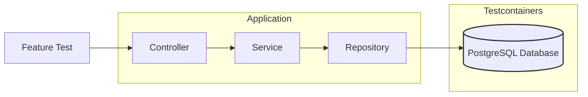

# Task 7 ~ Unit and Integration Tests

Unit and integration tests are fundamental pillars for building production-ready applications. 
Unit tests verify individual components in isolation, ensuring each service, controller, or utility class functions 
correctly at the most granular level. Integration tests, on the other hand, validate how different components interact 
within the Spring context, including database operations, REST endpoints, and message queues. In a production 
environment, where downtime can lead to significant business impact

In this task, we'll work with following tools & techniques:

- **JUnit**: A widely used testing framework for Java applications.
- **Mockito**: A mocking framework that allows you to create mock objects for testing.
- **Spring Test**: Provides support for testing Spring components, including loading the application context and 
injecting dependencies.
- **Testcontainers**: A library that allows you to run Docker containers for integration tests, ensuring a consistent
environment.
- **WebMVC Test**: A Spring module that provides support for testing web applications, including REST controllers.
- **Snapshot Testing**: A technique for capturing the output of a component and comparing it against a stored snapshot to 
ensure consistency.
- **AssertJ**: A fluent assertion library that provides a rich set of assertions for testing.

---

## Unit Tests

---

## Integration / Feature Tests

Integration (or feature) tests verify how different parts of the application work together in a real or production-like 
environment. Unlike unit tests, which focus on isolated components, integration tests ensure that components such as 
controllers, services, repositories, and external systems interact correctly. Using tools like Testcontainers, these 
tests can run with real dependencies (e.g., databases, message brokers) inside Docker containers, providing a consistent
and reproducible environment. This approach helps catch issues related to configuration, data flow, and external 
integrations, giving greater confidence that the application will function as expected when deployed.

This diagram illustrates how feature/integration tests interact with the Spring application context and real 
dependencies (like databases or message brokers) provisioned by Testcontainers during test execution.

### Feature Test Request Flow

---

## **Bonus Task**

---

## **Conclusion**

---
