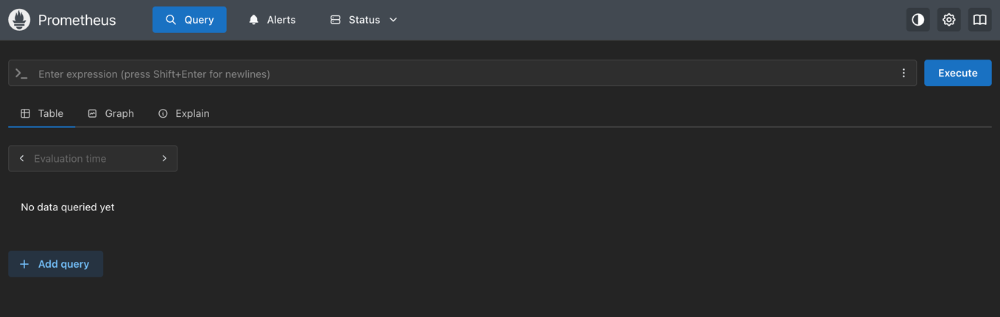
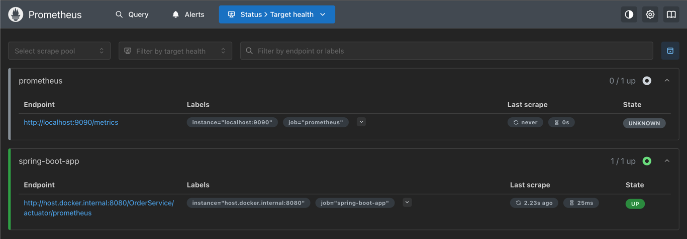
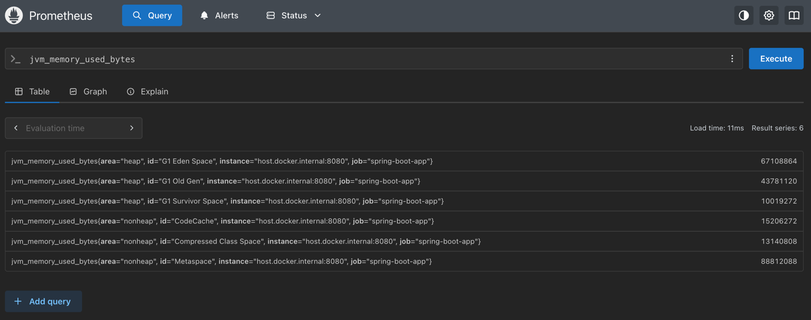

# Task 9 ~ Prometheus Metrics Integration

Let's look at how we can expose our application's metrics using Prometheus. [Prometheus](https://prometheus.io/) is an 
open-source monitoring and alerting toolkit designed for reliability and scalability. This will allow us to monitor the performance 
and health of our application in real-time. In a production-ready application, metrics are crucial for following reasons:

- **Performance Monitoring**: Track response times, error rates, and throughput
- **Resource Utilization**: Monitor CPU, memory, and database usage
- **Alerting**: Set up alerts for critical issues like high error rates or slow response times
- **Debugging**: Identify bottlenecks and performance issues
- **Capacity Planning**: Analyze trends to plan for future resource needs
- **Compliance**: Ensure application meets performance SLAs

---

## How does Prometheus work?

It works by scraping metrics from configured targets at specified intervals, storing them in a time-series database, and
providing a powerful query language (PromQL) for analysis. Prometheus operates on a pull model, where it periodically
fetches metrics from configured endpoints. This is different from push-based systems where the application sends metrics 
to a central server. Prometheus is designed to be highly reliable and scalable, making it suitable for both small 
applications and large distributed systems.

---

## Step 1: Docker Compose Configuration

You need to update the `docker-compose.yml` file to include Prometheus. Here's what you'd need to add:

```yaml
prometheus:
  image: prom/prometheus:latest
  container_name: prometheus_monitoring
  ports:
    - "9090:9090"   # Prometheus web UI port
  volumes:
    - ./prometheus.yml:/etc/prometheus/prometheus.yml:ro
    - prometheus_data:/prometheus
  command:
    - '--config.file=/etc/prometheus/prometheus.yml'
    - '--storage.tsdb.path=/prometheus'
    - '--web.console.libraries=/etc/prometheus/console_libraries'
    - '--web.console.templates=/etc/prometheus/consoles'
    - '--storage.tsdb.retention.time=200h'
    - '--web.enable-lifecycle'
  restart: unless-stopped

volumes:
  prometheus_data:
```

---

## Step 2: Prometheus Configuration File

You can see above that I've defined a command `--config.file` in docker compose file
which instructs prometheus to use that `yml` config file. Let's create a `prometheus.yml` configuration file 
in our root directory which defines how Prometheus scrapes metrics from our Spring Boot application.

```yaml
global:
  scrape_interval: 15s
  evaluation_interval: 15s

scrape_configs:
  - job_name: 'prometheus'
    static_configs:
      - targets: ['localhost:9090']

  - job_name: 'spring-boot-app'
    metrics_path: 'OrderService/actuator/prometheus'
    scrape_interval: 5s
    static_configs:
      - targets: ['host.docker.internal:8080']
    scrape_timeout: 3s
```

### **Scrape Configuration Explained**

**Global Settings:**
- **Scrape Interval**: Collects metrics every 15 seconds by default
- **Evaluation Interval**: Evaluates alerting rules every 15 seconds

**Target Jobs:**

1. **Prometheus Self-Monitoring** (`prometheus` job):
   - Monitors Prometheus itself
   - Target: `localhost:9090`
   - Uses default metrics path (`/metrics`)

2. **Spring Boot Application** (`spring-boot-app` job):
   - **Metrics Path**: `OrderService/actuator/prometheus` (Spring Boot Actuator endpoint)
   - **Target**: `host.docker.internal:8080` (allows Docker container to reach host)
   - **Scrape Interval**: 5 seconds (faster than default for real-time monitoring)
   - **Timeout**: 3 seconds to prevent hanging requests

---

## Step 3: Start the Services

Now you can start all services including Prometheus:

```bash
  docker-compose up -d
```

This will start:
- ✅ PostgreSQL database
- ✅ RabbitMQ message broker  
- ✅ ActiveMQ message broker
- ✅ **Prometheus monitoring** (new!)

## Step 4: Verify Prometheus Setup

1. **Start your Spring Boot application**:
   ```bash
   ./gradlew bootRun
   ```

2. **Access Prometheus Web UI**:
   - Open your browser and navigate to: [http://localhost:9090](http://localhost:9090)
   - You should see the Prometheus dashboard
   - 


3. **Check Targets**:
   - Go to `Status > Targets` in the Prometheus UI
   - You should see both `prometheus` and `spring-boot-app` targets
   - Both should show as "UP" with green status
   - 

4. **Query Metrics**:
   - In the Prometheus query interface, try searching for:
     - `jvm_memory_used_bytes` (JVM memory usage)
     - `http_server_requests_seconds_count` (HTTP request count)
     - `system_cpu_usage` (CPU usage)

This will verify that Prometheus is successfully scraping metrics from your Spring Boot application.


---

## Step 5: Understanding the Metrics

Your Spring Boot application automatically exposes dozens of useful metrics through the `/actuator/prometheus` endpoint:

### **Key Metric Categories**

**📈 Application Metrics:**
- `http_server_requests_*` - HTTP request metrics (count, duration, status)
- `jvm_*` - JVM memory, garbage collection, thread metrics
- `system_*` - System CPU, memory, disk usage
- `tomcat_*` - Embedded Tomcat server metrics

**🗄️ Database Metrics:**
- `hikaricp_*` - Connection pool metrics
- `jdbc_*` - Database connection and query metrics

**📨 Message Queue Metrics:**
- `rabbitmq_*` - RabbitMQ connection and queue metrics
- `jms_*` - JMS/ActiveMQ message processing metrics

---

### **Sample Queries to Try**

Click on the "Graph" tab in the Prometheus UI and try these queries to visualize metrics:

```promql
# Average response time for all HTTP requests
rate(http_server_requests_seconds_sum[5m]) / rate(http_server_requests_seconds_count[5m])

# Request rate per second
rate(http_server_requests_seconds_count[1m])

# JVM memory usage percentage
(jvm_memory_used_bytes / jvm_memory_max_bytes) * 100

# CPU usage percentage
system_cpu_usage * 100
```

---

## 🚀 **Next Steps**

- Explore the Prometheus query language (PromQL)
- Set up Grafana for advanced dashboards (see [Task 10](../tasks/Task%2010%20-%20Grafana.md))
- Configure alerting rules for critical metrics
- Add custom application metrics using Micrometer

Your application is now fully instrumented with Prometheus monitoring! 📊
