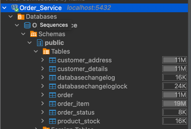
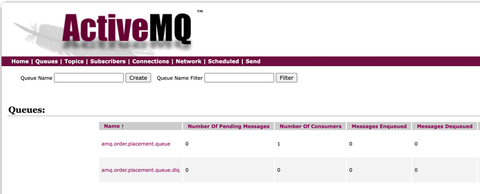

# Task 1 ~ Project Setup

This section includes setup instructions & how to get the app running locally on your device. Let's talk about the pre-requisites and how to set up the project locally. 

- **I'll highly recommend using IntelliJ Idea for this project.**
- **Please read the [README](../README.md) file for pre-requisites.**

---

### **Spin up Database & Messaging Brokers**

Execute following command while you're in root directory of the project. 
```bash
  docker compose up -d
```
This should spin up 3 containers on your machine i.e **order_service_db**, **activemq_broker** and **rabbitmq_broker**.
The configuration for these containers is in [compose.yaml](../compose.yaml) file. This file defines what image to use,
what ports to expose and what environment variables to set.

---

### How to Verify all the containers are up and running?
You can run following command to list all active containers on your machine.
```bash
  docker ps
```

---

### **Create Database Tables using Liquibase**

Once you've verified that the database container is up and running, you need to create the database tables. This can be 
done by simply running
the following command:
```bash
  ./gradlew update
```
This command triggers Liquibase which reads the changelog from [db.changelog-master.xml](../src/main/resources/db/changelog/db.changelog-master.xml) and 
creates the necessary tables in the database. You can see this file contains references to other changelogs which are responsible for creating each table.

---

### **Query PostgreSLQ**

If you're using IntelliJ Idea Ultimate, you can use the built-in database tool to query the database tables. Otherwise,
you can use DBeaver or any other database client of your choice. Simply connect to the database using the following credentials:
- **Database Name**: `Order_Service`
- **Host**: `localhost`
- **Port**: `5432`
- **Username**: `user`
- **Password**: `password`

For this exercise, I'll use DBeaver:


You should be able to view the tables under the `public` schema.




---

**_Note:_** _Build a habit to never hardcode credentials for testing & production Environments in your code. Always use 
environment variables or configuration files to manage sensitive information. As we go along, we'll see how we can configure those._

---

### Time to run the application
Now you can now run the application. This can be done in different ways.
1. **Using IntelliJ Idea**:
   - Navigate to the [SpringBootLearningKitApplication](../src/main/java/com/springboot/learning/kit/SpringBootLearningKitApplication.java) class.
   - Right-click on the class and select `Run 'SpringBootLearningKitApplication.main()'`.
2. **Using Command Line**:
   - Navigate to the root directory of the project.
   - Run the following command: `./gradlew bootRun`

### **Verify the Application is Healthy**

Import the [Bruno Collection](../docs/SpringBoot%20Learning%20Kit%20-%20APIs) into your Bruno API client. You can find instructions [here](https://docs.usebruno.com/get-started/import-export-data/import-collections).

Now, you can hit the HealthCheck API to verify that the application is up and running. You should get following response:


✅ This indicates that application has successfully connected to the database and messaging brokers.

### **Messaging Brokers UI**

#### **RabbitMQ**

You can access the RabbitMQ management UI at [http://localhost:15672](http://localhost:15672) using the following credentials:
- **Username**: `user`
- **Password**: `password`

You should be able to view a queue & a dlq on the UI. You can also view the active 
consumer (Spring Boot application) by clicking on the queue.


#### **ActiveMQ**
You can access the ActiveMQ management UI at [http://localhost:8161](http://localhost:8161) using the following credentials:
- **Username**: `admin`
- **Password**: `admin`

You should be able to view a queue & a dlq on the UI. You should see 1 active consumer under "No. of Consumers" column.



