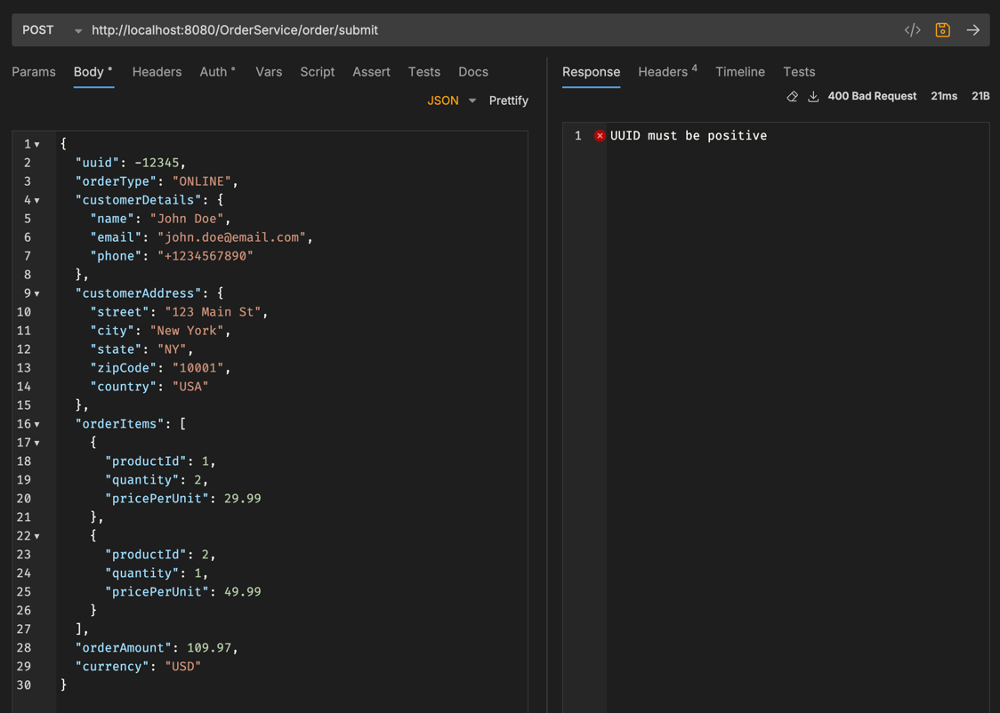
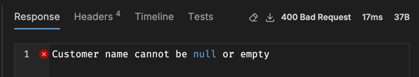
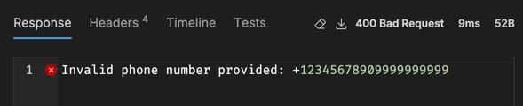

# Task 2 ~ Kicking off development

In this task, we're going to focus on Order Placement flow. We'll review the API that's already been implemented to
place orders but it's not production ready yet. In this task you'll:

- ✅Implement a news validator for UUID field & Customer Details.
- ✅Update the controller to return 400 status code for invalid payload.
- X Update Order Processor to save Order Status in the Database.
- X Implement a new API to retrieve Order Status.

---

## **Order Placement Flow**

**Background**

We'll assume that an upstream service (This can be frontend component or another microservice) sends us new order
requests which our application need to handle gracefully. 

The order placement flow is a critical part of any business’s operations, as it directly impacts customer satisfaction,
inventory management, and revenue recognition. This process typically begins with receiving an order request, 
which may originate from various channels such as an online store, a mobile app, or an internal sales system. 
Once the order is received, the system performs a series of validations to ensure data accuracy and completeness — 
including checking product availability, verifying pricing, and confirming customer details.

---

### **OrderController**

Navigate to [src/main/](../src/main/java/com/springboot/learning/kit) and this where the main code of the application is located.
Expand the [Controller](../src/main/java/com/springboot/learning/kit/controller) package and open the `OrderController.java` file.

You'll notice that there's no Constructor in this class, that's because we're using the `@ReqiredArgsConstructor` annotation from
Lombok. This annotation generates a constructor with required arguments (final fields) at compile time. This is a great way to
reduce boilerplate code and make your classes cleaner.

Now take a look at the `submitOrder` method which is annotated with `@PostMapping` annotation. This method receives the 
order payload via `@RequestBody` and passes it down to `OrderProcessingService`. 

**Note:** _The Controller class should not contain any business logic or calls to database or external services. As you can see that
we're simply passing the `OrderRequest` to `OrderProcessingService`_

---

### **OrderProcessingService**

Navigate to `OrderProcessingService` now. You'll notice that this class is annotated with `@Service` which indicates that it's a service class in the Spring context.
We're also using `@RequiredArgsConstructor` here to inject the dependencies.

#### **Order Validation**

The first step in the order placement flow is to validate the order. This is done by the `OrderValidationService`. 
If you navigate to `validateOrder` method, you'll see that only OrderType is being validated. You can view the 
[OrderType.java](../src/main/java/com/springboot/learning/kit/domain/OrderType.java) which contains the Enum for different 
type of orders that our service will need to process.

**Quick Tip:**_You can click on a small circular icon shown below & it will take you to the folder where the currently
opened class is located_

Let's add a new Validator class for `uuid` field. This validator will check if the `uuid` is valid.

- Create a new class `OrderUUIDValidator` in the `validator` package.
- Add `@Component` annotation to the class. This will make it a Spring bean and allow it to be injected into other classes.
- Implement the `Validator` interface with `<Long>` as UUID field is of type `Long`. 
- Now the IDE should prompt you to implement the `validate()` method with `@Override` annotation.

**Requirements:**
This validator should check following:
- Check if the UUID is null
- Check if UUID is negative
- Throw the custom `OrderValidationException` with relevant message if any of the above conditions are met.

Your class should look like this:

Now you can inject this validator into `OrderValidationService` class and use it in the `validateOrder` method
just as it's been done for `OrderTypeValidator`.

Great, you've implemented the validator but there's one issue with our `/submit` API. If you look back at controller,
you'll see that it returns a INTERNAL_SERVER_ERROR (500) status upon any failure. Let's fix that so that we send back 
BAD_REQUEST (400) status code instead if the client sends us incorrect payload.

**Implementation:**
- Add a new `catch()` block after the `try{}`.
- This catch block should catch `OrderValidationException` as the validator throws this exception.
- You should return a `ResponseEntity` with `HttpStatus.BAD_REQUEST` status code.
- We also need to return the error message from the exception so that client can understand what went wrong.

**Use of Custom Exceptions:**

Custom exceptions provide a powerful way to handle errors in a more meaningful and structured manner.
It's very common & industry standard to create custom exceptions in enterprise Java applications, 
especially when you're building REST APIs. In our case, [OrderValidationException](../src/main/java/com/springboot/learning/kit/exception/OrderValidationException.java) 
is a custom exception that extends the `RuntimeException` class. All custom exceptions should be stored in the `exception` package.

Following diagram demonstrates the flow of how the custom exception is thrown by our Validator and is caught in the controller.

Once you've done that, your `submitOrder` method should look like this:

**Time to Test:**

Let's run the application & hit the `/submit` API with a negative UUID.

✅You can see that we got a 400 Response code with the error message we provided in the exception.
**You should now test this API by placing an order without UUID and see if you get expect error response.** 

---

### **Validation Continues..**

Just validating the UUID and OrderType is not sufficient. In an actual production system, you would need to validate most 
fields of the payload, this can include:

- Customer Address
  - Street Address is not empty
  - City is not empty
  - Zip Code is not empty & is valid
  - Country is not empty & is valid
- Customer Details
  - Name is not empty
  - Email is not empty & doesn't contain any special characters
  - Phone number is not empty & doesn't contain any special characters
- Ordered Products & their quantities
- Currency is valid
- Shipping Method & Costs

These components are not implemented ye, but you can start thinking about how you would implement them. 
Each component should have its own Validator class and should be isolated from the rest of the code to maintain cleaner code
that can be easily maintained and tested.

---

### **Validation on Customer Details**

Let's implement another validator which will validate 3 fields inside the `CustomerDetailsRequest` object.
Create a new class `CustomerDetailsValidator` in the `validator` package just as we did previously for UUID.

**Note:**_The new validator needs to implement `Validator<CustomerDetailsRequest>` interface. 
This is because we need to validate the `CustomerDetailsRequest` object._

**Requirements:**
- Name should not be empty
- Email should not be empty & should not contain any special characters
- Email should be in valid format
- Phone Number should not be empty & should not contain any special characters

Let's import a new dependency for email validation. Open the `build.gradle` file and add the following dependency
inside the `dependencies {}` block:

`implementation "com.sun.mail:jakarta.mail:2.0.1"`

_You can find the latest version of this dependency on [Maven Repository](https://mvnrepository.com/artifact/com.sun.mail/jakarta.mail/2.0.1)._

Once, you've added the dependency, you can update the project by clicking on a small Gradle icon that will appear inside your Editor

Gradle will automatically download the dependency and add it to your project.

Now, let's jump back into your CustomerDetailsValidator class and implement the `validate()` method. You should
create 3 privates methods for each of the fields that we need to validate. E.g. 

The name validation part should be simple as we only want to ensure that the name is not empty.
But when it comes to phone & email, we'll be using the `EmailValidator` class from the `jakarta.mail` package &
regex for phone number validation.

**Name:**
We're throwing `OrderValidationException` with relevant message if the name is empty.

**Email:**
Here you can see that we've wrapped the validation logic inside a `try-catch` block. If validation fails, we'll throw our
custom `OrderValidationException` with relevant message.

**Phone:**
For phone number validation, we're using regex to check if the phone number contains any special characters.
The regex pattern is `^\+?(\d{1,3})?[-.\s]?(\(?\d{3}\)?[-.\s]?)?(\d[-.\s]?){6,9}\d$`

### **Time to Test these changes**
Now that you've implemented the `CustomerDetailsValidator`, you can inject it into the `OrderValidationService` class.
Once done, you can run the application.

I'll attach screenshots of some failures but you should try to test all scenarios you can think of:

---

## **Order Status**

The order status is another critical part of the order placement flow. It allows the system to 
track the progress of an order & provide latest order status to the client. We'll also implement 
a new API to retrieve the order status from the Database.

**Requirements:**
