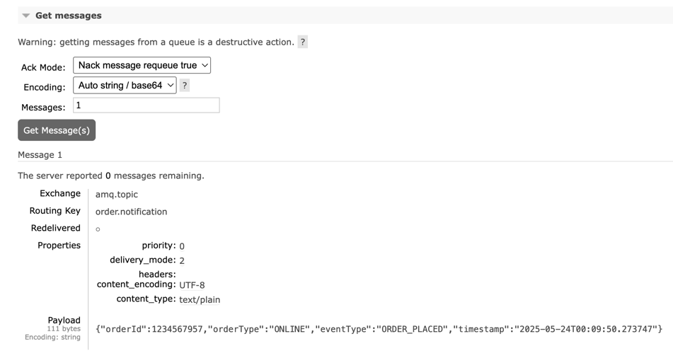

# Task 2 ~ Kicking off development

In this task, we're going to focus on Order Placement flow. We'll review the API that's already been implemented to
place orders but it's not production ready yet. 

---

## **Order Placement Flow**
The order placement flow is a critical part of the application. It involves several steps, including validating the order,
finding the correct type of Processor to handle the order, and processing the order through the appropriate channels.

### **OrderController**

Navigate to [src/main/](../src/main/java/com/springboot/learning/kit) and this where the main code of the application is located.
Expand the [Controller](../src/main/java/com/springboot/learning/kit/controller) package and open the `OrderController.java` file.

You'll notice that there's no Constructor in this class, that's because we're using the `@ReqiredArgsConstructor` annotation from
Lombok. This annotation generates a constructor with required arguments (final fields) at compile time. This is a great way to
reduce boilerplate code and make your classes cleaner.

Now take a look at the `submitOrder` method which is annotated with `@PostMapping` annotation. This method receives the 
order payload via `@RequestBody` and passes it down to `OrderProcessingService`. 

**Note:** _The Controller class should not contain any business logic or calls to database or external services. As you can see that
we're simply passing the `OrderRequest` to `OrderProcessingService`_

### **OrderProcessingService**

Navigate to `OrderProcessingService` now. You'll notice that this class is annotated with `@Service` which indicates that it's a service class in the Spring context.
We're also using `@RequiredArgsConstructor` here to inject the dependencies.

#### **Order Validation**

The first step in the order placement flow is to validate the order. This is done by the `OrderValidationService`. 
If you navigate to `validateOrder` method, you'll see that only OrderType is being validated.  

**Quick Tip:**_You can click on a small circular icon shown below & it will take you to the folder where the currently
opened class is located_

Let's add a new Validator class for `uuid` field. This validator will check if the `uuid` is valid.

- Create a new class `OrderUUIDValidator` in the `validator` package.
- Add `@Component` annotation to the class. This will make it a Spring bean and allow it to be injected into other classes.
- Implement the `Validator` interface with `<Long>` as UUID field is of type `Long`. 
- Now the IDE should prompt you to implement the `validate()` method with `@Override` annotation.

**Requirements:**
This validator should check following:
- Check if the UUID is null
- Check if UUID is negative
- Throw the custom `OrderValidationException` with relevant message if any of the above conditions are met.

Your class should look like this:

Now you can inject this validator into `OrderValidationService` class and use it in the `validateOrder` method
just as it's been done for `OrderTypeValidator`.

Great, you've implemented the validator but there's one issue with our `/submit` API. If you look back at controller,
you'll see that it returns a INTERNAL_SERVER_ERROR (500) status upon any failure. Let's fix that so that we send back 
BAD_REQUEST (400) status code instead if the client sends us incorrect payload.

**Implementation:**
- Add a new `catch()` block after the `try{}`.
- This catch block should catch `OrderValidationException` as the validator throws this exception.
- You should return a `ResponseEntity` with `HttpStatus.BAD_REQUEST` status code.
- We also need to return the error message from the exception so that client can understand what went wrong.

Once you've done that, your `submitOrder` method should look like this:

**Time to Test:**

Let's run the application & hit the `/submit` API with a negative UUID.

✅You can see that we got a 400 Response code with the error message we provided in the exception.
You should now test this API by providing 0 as UUID and see how it behaves. 

---

