# Task 3 ~ Debug & Fix Critical Bug

In this task, we'll address a critical bug that applications often face when working with Databases.
Have you noticed anything strange when placing orders? If not, let me show you.

### **Debugging the Application**

Boot up the application & use Bruno to hit the `/order/submit` endpoint multiple times with same
payload. You will notice that the application returns a 200 response code indicating that the orders
were placed successfully. Now this shouldn't be happening because the `UUID` of the order should be unique.
So, if an upstream service tries to place an order with same `UUID`, our application should return 
`409 - Conflict` error response indicating that the order already exists.

You should also look into the [order_table.xml](../src/main/resources/db/changelog/order_table.xml) file to see 
how the `UUID` column is defined. The constraint shown below ensures that the `UUID` column is a primary key 
& should always be unique.

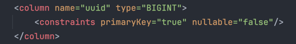

You should also verify if the `UUID` column is created correctly by Liquibase. Navigate to
`order` table under `public` schema on DBeaver & expand the `Constraints` section. You should see a constraint with
`order_pkey` name. If you double-click on it, you should see the details of the constraint. `uuid` column should come
up as the primary key. Please ensure that your primary key matches the one in the image below.

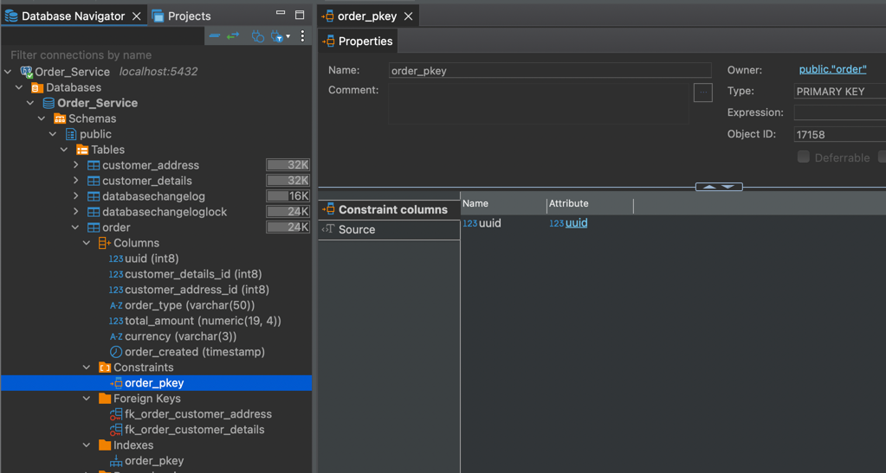

It's not possible to save multiple orders with same `UUID` in the database. This indicates that something is wrong at
application level. Let's investigate the code to find out what's going on.

### **Querying the Database**

Let's dive into the Database to understand what's happening there. Before that, I'll share the current database 
diagram with you to help you understand the relationships between the tables. This shows that the `order` table has a one-to-one relationship with the `customer` and `address` tables,
and a one-to-many relationship with the `order_item` table.


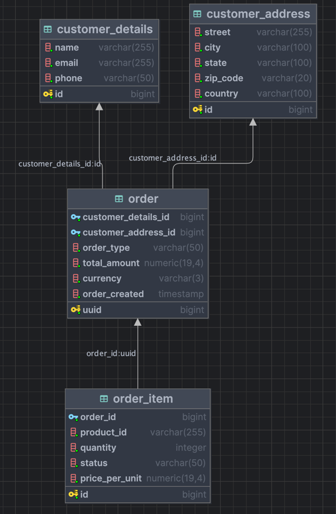


Now Grab the `UUID` you used in the payload while hitting the `order/submit` endpoint. 
In Dbeaver, right click on `Order_Service -> SQL Editor -> New SQL Script` to open editor to run SQL queries.
Now run the following query with your `UUID`:
```sql
SELECT * FROM public.order WHERE uuid = 1234567;
```

You should see a single record against that `UUID` in the `order` table. E.g. 

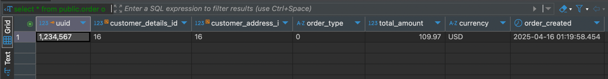

Now, let's run some more queries to see how records in other tables are looking.

```sql
SELECT * FROM public.order_item WHERE order_id = 1234567;
```

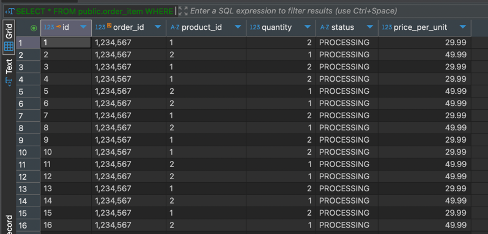

You should see more than two records against the same `order_id` in the `order_item` table. 
This indicates that the application is indeed trying to insert orders into the database. While it only 
inserted 1 record in `order` table, it inserted multiple records in `order_item` table.

_Grab the customer details & address Ids and query those tables & see if you can find multiple records_

**Verify through the status API**

If you hit the `order/status/{orderId}` endpoint that we implemented in the previous task, you should see that
it's returning many more items than expected.

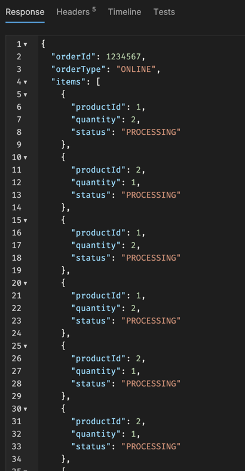

### **Debugging the Code**

Now, let's debug the code to see what's going on. As we've been placing `ONLINE` orders, so navigate to 
[OnlineOrderProcessor.java](../src/main/java/com/springboot/learning/kit/processor/OnlineOrderProcessor.java) class. This processor uses the `saveOrder()` method from `AbstractOrderProcessor` class
as you can see `this.saveOrder(order)` in the method.

The OrderRequest data is transformed into Entity objects and then saved to the database using different
repository classes. You should open all the entity objects and see how they are defined. You'll see that all classes
are using `@GeneratedValue(strategy = GenerationType.IDENTITY)` annotation for their primary keys except
`Order` class. This is because we don't want the application to auto-generate the `UUID` for the order as it is sent to us
by upstream service. 

So, what's the problem? The problem in this case is that, we're using `save()` method of `JpaRepository` to save the order,
which can only do two things:
- If the entity doesn't exist, it will create a new record
- If the entity already exists, it will update the existing record

Now, there are two ways to handle this kind of problem in a production system. 
- Before saving the order, we can check if the order already exists in the database. If it does, we can throw an exception.
The downside of this approach is that it will add an extra call to the database, which can slow down the application. **This solution
can work in a production system where we don't have a lot of traffic. But as the traffic increases, this will become a bottleneck.**

OR

- We solve this problem at database level and let database reject the insert operation if the record already exists. 
**This is a better approach as it will not add any extra calls to the database. For high traffic applications, this is the best
solution.**


### **Solution**

As we want to throw an exception if the entity already exists. So, instead of using `save()`, we should use
`persist()` method of `EntityManager` class. This method will throw an exception if the entity already exists in the database.

Import `jakarta.persistence.EntityManager;` in `OrderService` class, remove the `OrderRepository` dependency and 
add the `EntityManager` dependency instead. Replace `orderRepository.save(order)` with `entityManager.persist(order)`.

This is how the save method in `OrderService` class should look like:

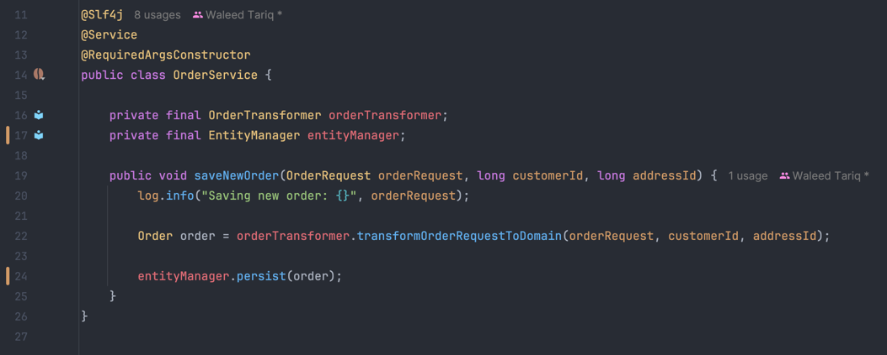


### **Testing the Fix**

Now, reboot your application & let's try placing orders again with the same `UUID`. You should get an error response back
like shown below:

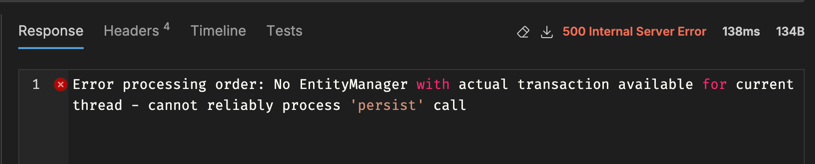

This error occurs because EntityManager.persist() requires an active transaction, but none is available on the current 
thread. In Spring, transactions are applied via proxies. If you call a @Transactional method from within the same 
class or via super.method(), the proxy is bypassed, and the transaction is never started, leading to this error. You can read more
about this [here](https://docs.spring.io/spring-framework/reference/data-access/transaction/declarative/annotations.html).

We are using polymorphism, so the `OnlineOrderProcessor` directly calls the method defined in a superclass `AbstractOrderProcessor`
with @Transactional, the call bypasses the Spring proxy. As a result, the transaction is not applied.

**Reason for using @Transactional**

Some background for those who are not sure why we're using `@Transactional` annotation. When you're processing an event, which
involves making multiple calls to the database to update various tables, you want to make sure that all the changes are saved
to database only if all the operations are successful. If any of the operations fail, you want to rollback all the changes made to the database.

E.g. this application executes WRITE operations when processing a new order on following tables:
- customer_details
- customer_address
- order
- order_item

If the application fails to INSERT data for `order_item` table, we want to rollback all the WRITE operations that we
just did for previous tables. This is where `@Transactional` annotation comes in. It tells Spring to start a transaction 
before executing the method and commit the transaction after the method is executed. If any exception occurs, Spring will 
rollback all the changes made to the database.

**Fix for our problem**

We can remove the `@Transactional` annotation from the `saveOrder()` method in `AbstractOrderProcessor` class and add it to
the `processNewOrder()` method of `OrderProcessingService` class. This sets the transaction boundary at the highest appropriate level & 
will correctly wrap the complete order processing in a transaction. Now there should only be one @Transactional annotation in
our order placement flow.

Let's reboot the application and try placing orders again with the same `UUID`. You should get a `500` error response back
which is exactly what we wanted!

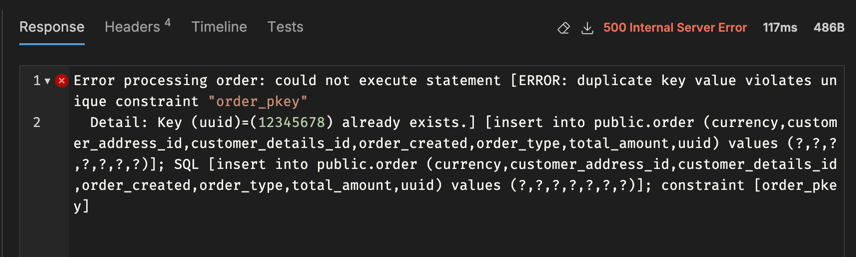


### **Improving Error Handling for Duplicate Orders**

Our application is now throwing an error when a duplicate order is placed. But the error message is not something that should 
be exposed to the end user. We should always return a brief & meaningful error message to the end user while keeping the
technical details hidden. This is a good practice to follow in production systems.

We can do this by creating a custom exception class just like we did for `OrderNotFoundException` in the previous task.
Once, you've created the custom exception class, navigate to the `OrderService` class. Wrap the entityManager.persist() method
in a try-catch block. If the exception is thrown, we can throw our custom exception class instead.

Okay so your save method might be looking something like this now:

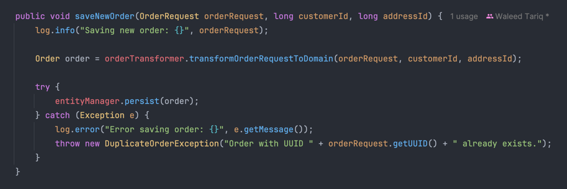

But there's an issue with this implementation. Your `catch` block is catching all the exceptions that are thrown by the 
`entityManager.persist()` method. This means, our code will always throw `DuplicateOrderException` even if the exception is not
related to duplicate order. This is not a good practice as it can lead to confusion and make it difficult to debug the application.

We should only catch the exception that is thrown when a duplicate order is placed. But how can you find out which exact
exception to catch? We can figure this out by printing the complete stack trace of the exception.

Add `log.error("Error while placing order", e)` in the catch block of `order/submit` api. This will print the complete stack 
trace of the exception. You should see `org.hibernate.exception.ConstraintViolationException` on top of the stack trace. This is the exception 
that is thrown when a duplicate order is placed.

So now your code should look like this:

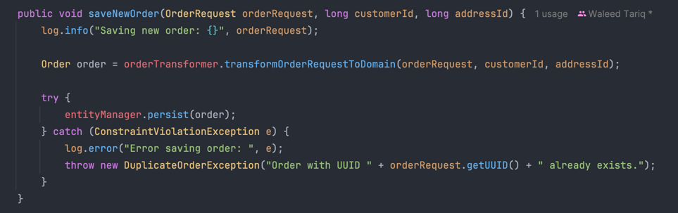

If you hit the `order/submit` endpoint again with the same payload, you should see the same error response as before even 
though we have implemented logic to handle duplicate orders. This is because we are not flushing the entity manager after
persisting the order. The `flush()` method is used to synchronize the persistence context to the underlying database.
This means that the changes made to the entity manager are not written to the database until the `flush()` method is called.
So, we need to call the `flush()` method after persisting the order. This will ensure that the changes made to the entity manager
are written to the database and the exception is thrown if the order already exists.

So, your final code should look like this:

`OrderService`

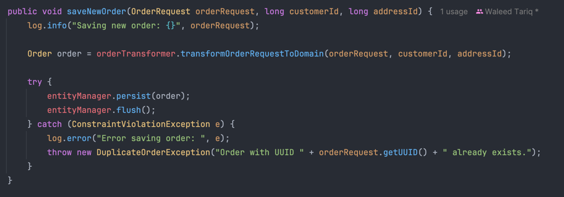

`OrderController`

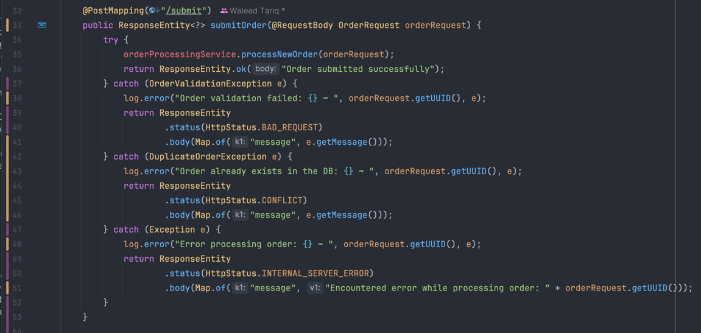

Reboot the application and try placing orders again with the same `UUID`. You should get a `409` error response back:

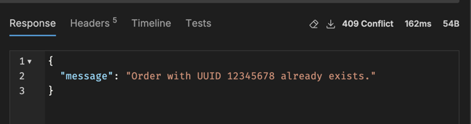


### **Summary**

I hope this task provided you an insight on how to debug such error in an application & what possible options we can have.
We should always try to evaluate pros & cons of each approach before implementing a solution. A short & quick fix doesn't always 
mean it's the best solution in the long run.