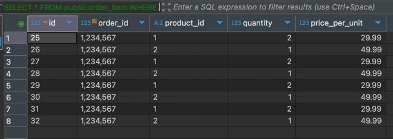

# Task 3 ~ Debug & Fix Critical Bug

### **Overview**
- Fix a critical bug in the application
- Add Integration Tests to verify the fix
- 

In this task, we'll address a critical bug that applications often face when working with Databases.
Have you noticed anything strange when placing orders? If not, let me show you.

### **Debugging the Application**

Boot up the application & use Bruno to hit the `/order/submit` endpoint multiple times with same
payload. You will notice that the application returns a 200 response code indicating that the order
was placed successfully. Now this shouldn't be happening because the `UUID` of the order should be unique.
So, if an upstream service tries to place an order with same `UUID`, our application should return 
`409 - Conflict` error response indicating that the order already exists.

You should also look into the [order_table.xml](../src/main/resources/db/changelog/order_table.xml) file to see 
how the `UUID` column is defined. The constraint shown below ensures that the `UUID` column is a primary key 
& should always be unique.


You should also verify if the `UUID` column is created correctly by Liquibase. Navigate to
`order` table under `public` schema on DBeaver & expand the `Constraints` section. You should see a constraint with
`order_pkey` name. If you double-click on it, you should see the details of the constraint. `uuid` column should come
up as the primary key. Please ensure that your primary key matches the one in the image below.


It's not possible to save multiple orders with same `UUID` in the database. This indicates that something is wrong at
application level. Let's investigate the code to find out what's going on.

### **Querying the Database**

Let's dive into the Database to understand what's happening there. Before that, I'll share the current database 
diagram with you to help you understand the relationships between the tables.


Now Grab the `UUID` you used in the payload while hitting the `order/submit` endpoint. 
In Dbeaver, right click on `Order_Service -> SQL Editor -> New SQL Script` to open editor to run SQL queries.
Now run the following query with your `UUID`:
```sql
SELECT * FROM public.order WHERE uuid = 1234567;
```

You should see a single record against that `UUID` in the `order` table. E.g. 


Now, let's run some more queries to see how records in other tables are looking.

```sql
SELECT * FROM public.order_item WHERE order_id = 1234567;
```



You should see more than two records against the same `order_id` in the `order_item` table. 
This indicates that the application is indeed trying to insert orders into the database. While it only 
inserted 1 record in `order` table, it inserted multiple records in `order_item` table.

_Grab the customer details & address Ids and query those tables & see if you can find multiple records_

### **Debugging the Code**

Now, let's debug the code to see what's going on. As we've been placing `ONLINE` orders, so navigate to 
[OnlineOrderProcessor.java](../src/main/java/com/springboot/learning/kit/processor/OnlineOrderProcessor.java) class.


### **Solution**


### **Integration Tests**


### **Testing the Fix**