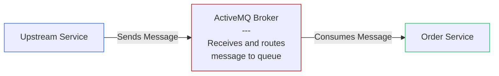
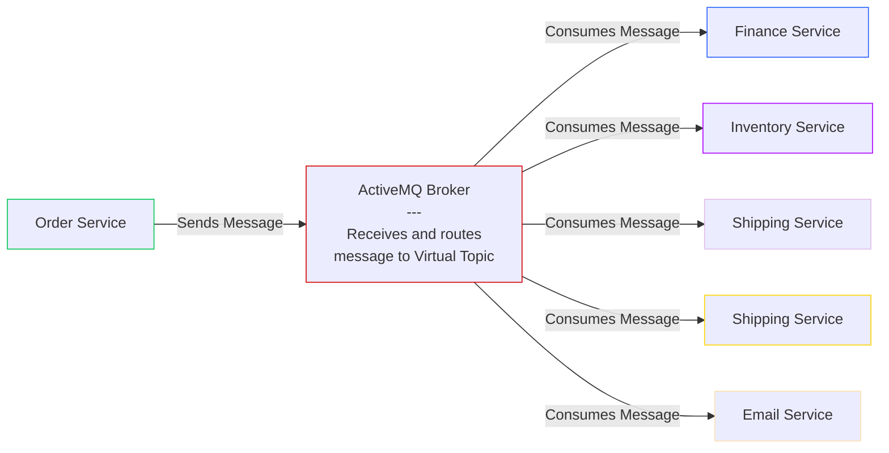
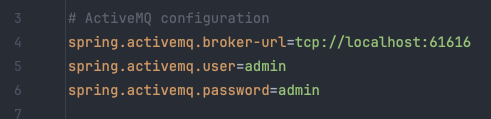

# Task 4 - ActiveMQ

This task will walk you through the process of setting up ActiveMQ in a production ready enterprise application. After that,
we'll look at setting up new consumer & a producer for the ActiveMQ queue.

### **Queues**

Queues are used for point-to-point communication. In this model, a message is sent from one producer to one consumer. In this project,
an upstream service that listens to events from frontend will send a message to our application via queue. Only our application
should be listening to this queue. This is a one-to-one communication model.

### **Virtual Topics**

Topics are used for publish-subscribe communication. In this model, a message is sent from one producer to multiple consumers.
In this project, our `Order Service` application will produce events to a Topic which will have multiple consumers downstream.

---

### **ActiveMQ Setup** 

Let's look at how ActiveMQ is configured in this project. First of all, you need to look at the [application-local.properties](../src/main/resources/application-local.properties) 
file. You'll see that we've defined the URL for ActiveMQ broker alongside the credentials. 

If you look at other property files in same directory, you'll see that the URL is different for each environment. This is because we are using
Spring Profiles to define different properties for different environments.

