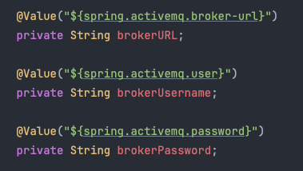

# Task 4 - ActiveMQ

This task will walk you through the process of setting up ActiveMQ in a production ready enterprise application. After that,
we'll look at setting up new consumer & a producer for the ActiveMQ queue.

---

## **Why use ActiveMQ?**
ActiveMQ is an open-source message broker written in Java. It is widely used in enterprise applications for decoupling
components and enabling **asynchronous** communication. It is a popular choice for implementing the publish-subscribe 
pattern and point-to-point messaging.

### **Asynchronous Communication**
I'll illustrate asynchronous communication with a simple mermaid diagram below.

**Producer**

Producing application simply sends a message to the ActiveMQ broker with a destination queue. Once ActiveMQ receives the message,
the transaction is complete and producer does not wait for the consumer to process the message. From this point on, the message 
is stored in the queue until a consumer is available to process it.

**Consumer**

The consumer application listens to the queue and processes the message. Note that, one application can have multiple consumers,
with each consumer processing messages from the different queues. 

---

## **Queues**

Queues are used for point-to-point communication. In this model, a message is sent from one producer to one consumer. In this project,
an upstream service that listens to events from frontend will send a message to our application via queue. Only our application
should be listening to this queue. This is a one-to-one communication model.

## **Virtual Topics**

Topics are used for publish-subscribe communication. In this model, a message is sent from one producer to multiple consumers.
In this project, our `Order Service` application will produce events to a Topic which will have multiple consumers downstream.

---

## **ActiveMQ Setup** 

### **Properties File**
Let's look at how ActiveMQ is configured in this project. First of all, you need to look at the [application-local.properties](../src/main/resources/application-local.properties) 
file. You'll see that we've defined the URL for ActiveMQ broker alongside the credentials. 

If you look at other property files in same directory, you'll see that the URL is different for each environment. This is because we are using
Spring Profiles to define different properties for different environments.

### **Configuration in Java**
Once we've got the properties defined, we need to create a configuration class that will set up the ActiveMQ connection 
factory and the JmsTemplate. We already have a class called [ActiveMQConfig](../src/main/java/com/springboot/learning/kit/config/ActiveMQConfig.java) 
in the `config` package. This class is annotated with `@Configuration` which tells Spring that this class contains 
configuration information. This class is also annotated with `@EnableJms` which enables the JMS support in Spring.

The broker configs are read from the property file using `@Value` annotation. 

You can also look at two other beans in the same file. These define the `ConnectionFactory` and the `JmsTemplate`. The 
`ConnectionFactory` is used to create connections to the ActiveMQ broker and the `JmsTemplate` is used to send messages to the broker.

### **ActiveMQ Routes Configuration**

Now, let's look at how the routes between the broker & the application are defined. There are different ways to achieve this.
SpringBoot provides different annotations that you can use to bind a consumer to queue. But we have used **Apache Camel** in this 
project. 

Apache Camel is an open-source integration framework that provides a wide range of components for integrating different systems. 
In context of ActiveMQ, it provides a way to define routes between the broker and the application.

