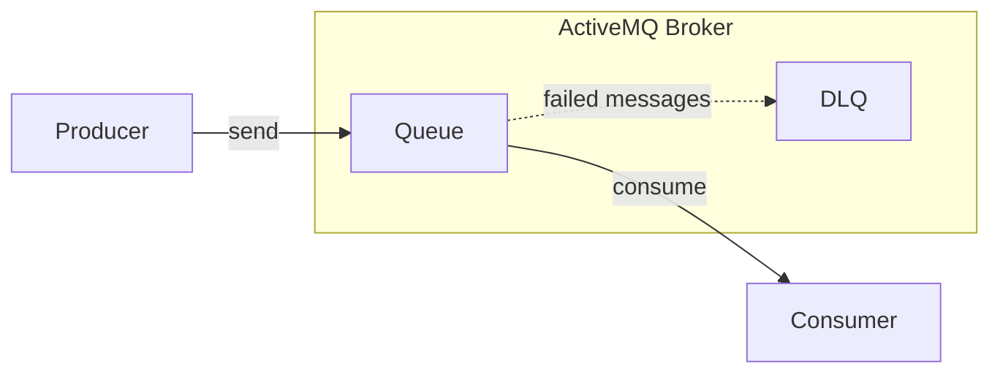
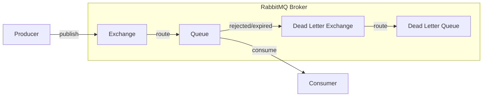
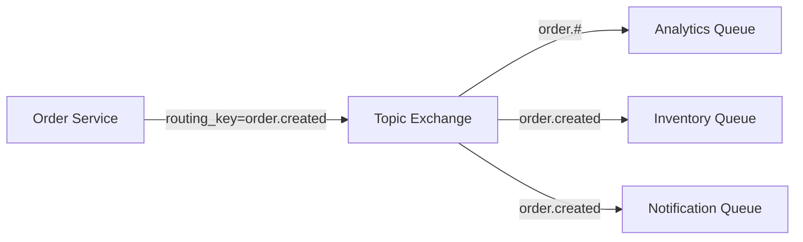
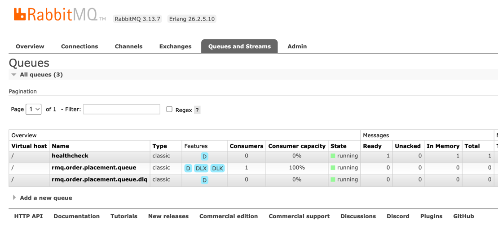
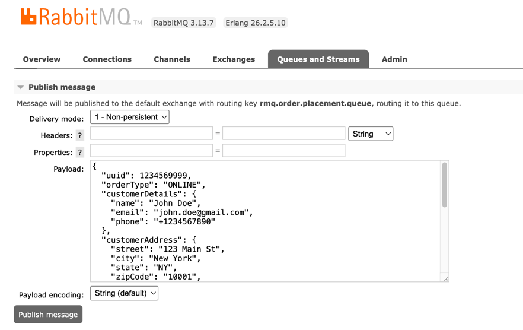

# Task 5 ~ Working with RabbitMQ

This task will walk you through the process of setting up RabbitMQ in a production ready enterprise application. After that,
we'll look at setting up new consumer & a producer for the RabbitMQ.

---

## ActiveMQ vs RabbitMQ

**Conceptual Difference**
- **ActiveMQ** follows a JMS-style model — queues for point-to-point, topics for pub-sub. Routing is simpler and abstracted.
- **RabbitMQ** uses Exchanges, which allow precise control over how messages are routed to queues.

Here's a simple diagram to illustrate the difference:

**ActiveMQ**


**RabbitMQ**



### **Why Exchanges are used in RabbitMQ?**

- **Flexibility**: Exchanges allow you to define complex routing rules. You can have multiple queues bound to the same 
exchange with different routing keys.
- **Decoupling**: Producers and consumers can be decoupled. Producers send messages to exchanges without knowing about the queues.
- **Multiple Routing Options**: RabbitMQ supports different types of exchanges (direct, topic, fanout, headers) for various routing needs.
- **Load Balancing**: Multiple consumers can consume from the same queue, allowing for load balancing.

---



## **RabbitMQ Setup**

In previous task, we went through ActiveMQ setup with Apache Camel. RabbitMQ can also be
configured using Apache Camel. But for RabbitMQ, it has been configured using SpringBoot. The [RabbitMQConfig](../src/main/java/com/springboot/learning/kit/config/RabbitMQConfig.java) class is responsible for 
configuring RabbitMQ Connection. 

You can now look at [RabbitMQRoutes](../src/main/java/com/springboot/learning/kit/routes/RabbitMQRoutes.java) 
class to see how RabbitMQ is configured.  Currently, we've got one queue that is used by our application for HealthCheck purpose & another queue that is configured
for receiving new orders. Look at processRabbitMQOrder() method in [NewOrderConsumer](../src/main/java/com/springboot/learning/kit/consumer/NewOrderConsumer.java) 
class to see how the queue is configured with the method.

## **Consuming Order from RabbitMQ**

Now boot up the application and head over to the [RabbitMQ Management Console](http://localhost:15672/). You should be able
to see a single active consumer next to `rmq.order.placement.queue` queue. 



Click on the order placement queue to open the queue details. You should be able to see `Publish Message` section.
Paste the order json in the `Payload` and click on `Publish Message` button. This will publish the message to the queue.



You should be able to see following logs in your console. Your application should have consumed the message from the queue
and persist it into the Database. The consumer directs the message to same Order Processor that is used by the ActiveMQ
consumer.

```
2025-05-23T19:34:27.616+01:00 ERROR 66821 --- [SpringBootLearningKit] [ntContainer#0-1] c.s.l.kit.consumer.NewOrderConsumer      : Received new RabbitMQ order message
Validating UUID: 1234569999
2025-05-23T19:34:27.647+01:00  INFO 66821 --- [SpringBootLearningKit] [ntContainer#0-1] c.s.l.k.processor.OnlineOrderProcessor   : Processing online order: 1234569999
```

