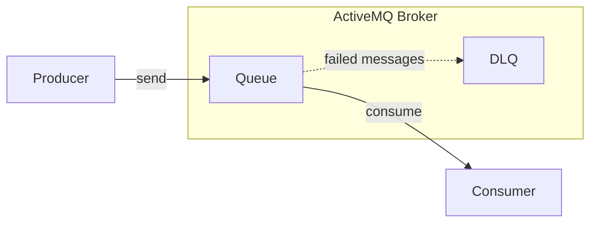
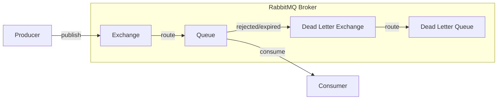
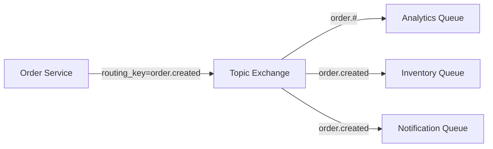

# Task 5 ~ Working with RabbitMQ

This task will walk you through the process of setting up RabbitMQ in a production ready enterprise application. After that,
we'll look at setting up new consumer & a producer for the RabbitMQ.

---

## ActiveMQ vs RabbitMQ

**Conceptual Difference**
- **ActiveMQ** follows a JMS-style model — queues for point-to-point, topics for pub-sub. Routing is simpler and abstracted.
- **RabbitMQ** uses Exchanges, which allow precise control over how messages are routed to queues.

Here's a simple diagram to illustrate the difference:

**ActiveMQ**

**RabbitMQ**

### **Why Exchanges are used in RabbitMQ?**

- **Flexibility**: Exchanges allow you to define complex routing rules. You can have multiple queues bound to the same 
exchange with different routing keys.
- **Decoupling**: Producers and consumers can be decoupled. Producers send messages to exchanges without knowing about the queues.
- **Multiple Routing Options**: RabbitMQ supports different types of exchanges (direct, topic, fanout, headers) for various routing needs.
- **Load Balancing**: Multiple consumers can consume from the same queue, allowing for load balancing.

---

## **RabbitMQ Setup**

In previous task, we went through ActiveMQ setup with Apache Camel. RabbitMQ can also be
configured using Apache Camel. But for RabbitMQ, it's been configured using Spring Boot.

### **Spring Boot Configuration**

